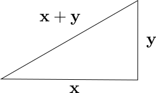

## Week Summary

- Starting a two week block on applications to stats/ML
  - Chapter 6, 7 of `cvxbook`
- Finish off convex optimization with duality
- Lab 5 due this Sunday at midnight


## Norm Approximation

- Find coefficients $\mathbf{x}$ that minimize: $\|A\mathbf{x}-\mathbf{b}\|$
- Here $\|\cdot\|$ is any norm
- Can have convex constraints on $\mathbf{x}$


## A norm is a mathematical measure of distance


- Several ways to do it, share key properties
  - Shortest distance is straight line (triangle inequality):
  $$
  \|\mathbf{x} + \mathbf{y}\| \leq \|x\| + \|y\|
  $$
  


## A norm is a mathematical measure of distance

- Several ways to do it, share key properties
  - Shortest distance is straight line (triangle inequality):
  $$
  \|\mathbf{x} + \mathbf{y}\| \leq \|x\| + \|y\|
  $$
  - Positive $\|\mathbf{x}\|\geq 0$
  - Homogeneous $\|s\mathbf{x}\| = |s|\|\mathbf{x}\|$
- Norms are convex

## Important Norms

- Euclidean or 2-Norm: $\|\mathbf{x}\|_2 = \left(\sum_i x_i^2\right)^{1/2}$
- $L_1$ Norm: $\|\mathbf{x}\|_1 = \sum_i |x_i|
- $L_{\infty}$ Norm: $\|\mathbf{x}\|_{\infty} = \mathrm{\max}_i \{x_i\}$


## Level Sets of Norms

:::: {.columns}

::: {.column width=50%}

- $L_1$ norm sometimes called __taxicab distance__
- Dark Lines on Axes cause sparsity in applications
:::

::: {.column width=50%}

```{python}

import matplotlib.pyplot as plt
import numpy as np

p = 1
xx, yy = np.meshgrid(np.linspace(-3, 3, num=101), np.linspace(-3, 3, num=101))
fig, ax = plt.subplots(ncols=1,
                     nrows=1, figsize=(5, 5))

zz = ((np.abs((xx))**p) + (np.abs((yy))**p))**(1./p)
ax.contourf(xx, yy, zz, 30, cmap='viridis')
ax.contour(xx,yy,zz, [1], colors='black', linewidths = 2) 

plt.show()

```

:::
::::


## Level Sets of Norms

:::: {.columns}

::: {.column width=50%}

- Euclidean Distance
- Least Squares

:::

::: {.column width=50%}


```{python}


p = 2
xx, yy = np.meshgrid(np.linspace(-3, 3, num=101), np.linspace(-3, 3, num=101))
fig, ax = plt.subplots(ncols=1,
                     nrows=1, figsize=(5, 5))

zz = ((np.abs((xx))**p) + (np.abs((yy))**p))**(1./p)
ax.contourf(xx, yy, zz, 30, cmap='viridis')
ax.contour(xx,yy,zz, [1], colors='black', linewidths = 2) 

plt.show()
```

:::
::::

## Level Sets of Norms

:::: {.columns}

::: {.column width=50%}

- $L_{\infty}$ measures maximum element

:::

::: {.column width=50%}
 
```{python}


fig, ax = plt.subplots(ncols=1,
                     nrows=1, figsize=(5, 5))

zz = np.maximum(np.abs(xx),np.abs(yy))
        
ax.contourf(xx, yy, zz, 30, cmap='viridis')
ax.contour(xx,yy,zz, [1], colors='black', linewidths = 2) 

plt.show()

```

:::
::::


## Penalty Functions

- Can generalize this further to sum of convex penalty functions
$$
\min_{x} \sum_{i} \phi\left((A\mathbf{x}-b)_i\right)
$$
- penalty function $\phi \geq 0$
- $\phi(0)=0$
- $\phi$ increasing for argument larger than $0$, decreasing when it is smaller than $0$

## Important Penalty Functions

- $\phi(x) = |x|$, $\phi(x) = x^2$ lead to norm problems
- $\phi(x) = \mathrm{\max}\{0,|x|-a\}$ dead-zone linear
  - If you are close enough no penalty, otherwise linear
- $\phi(x) = -\log(1-x^2)$, `log-barrier` penalty
  - Blows up at $x=\pm 1$


## Visualizing Penalties

```{python}

xvec = np.linspace(-1.5, 1.5, num=101)
y1vec = np.abs(xvec)
y2vec = xvec**2
ylog_vec = -np.log(1-y2vec)
y_dz_vec = np.maximum(0,np.abs(xvec)-0.5)

plt.plot(xvec,y1vec,color = '#E69F00',label = '$|x|$')
plt.plot(xvec,y2vec,color = '#56B4E9',label = '$x^2$')
plt.plot(xvec,y_dz_vec, color = '#009E73',label = 'Deadzone')
plt.plot(xvec,ylog_vec,color = '#F0E442',label = 'Barrier')
plt.legend()


```


## Robustness to Outliers

- An outlier is a data point that was generated by a different process than the other points in the dataset
  - Could be due to an interesting phenomenon
  - Could be due to a mistake, in which case it is called a __spurious value__
- Problem: Stats based on Gaussian Distribution (and thus quadratic penalty) are not robust to outliers


## Linear Regression Examples

```{python}
import cvxpy as cv
x = np.random.uniform(low=-10,high=10,size=50)
x = np.sort(x)
y = x + np.random.randn(50)*0.5

y[3] = 35.0
y[47] = -25.0

m = cv.Variable()
b = cv.Variable()

expr = cv.norm2(m*x+b*np.ones(50)-y)

prob = cv.Problem(cv.Minimize(expr))
sol = prob.solve()

y_pred = m.value*x + b.value

plt.scatter(x,y)
plt.plot(x,y_pred)


```

## Robust Regression

- Quadratic penalty squares residuals
- Penalizes large errors much more than small ones
- Absolute value penalizes residuals equally, so less sensitive to outliers
- Robust Regression is $L_1$ penalized linear regression


## Robust Regression

```{python}

m2 = cv.Variable()
b2 = cv.Variable()

expr = cv.norm1(m2*x+b2*np.ones(50)-y)

prob = cv.Problem(cv.Minimize(expr))
sol = prob.solve()

y_rob_pred = m2.value*x + b2.value

plt.scatter(x,y)
plt.plot(x,y_rob_pred,color = '#E69F00', label = 'Robust')
plt.plot(x,y_pred, color = '#56B4E9',label = 'Regression')

```

## Huber Penalty

- Quadratic penalty is optimal when we have Gaussian errors
- Huber function is a compromise between quadratic and absolute value:
$$
\phi_h(x) = \begin{cases}
x^2 & \mathrm{if}\quad |x|< M \\
M\left(2|x|-M\right) & \mathrm{if}\quad |x|\geq M
\end{cases}
$$

## Huber Penalty


```{python}

def huber(x,c):
  if np.abs(x)< c:
    return(x**2)
  else:
    return(c*(2*np.abs(x)-c))
  
x1 = np.linspace(-1.5,1.5,num=100)
y1 = np.array([huber(x,1.0) for x in x1])

plt.plot(x1,y1)
plt.legend()

```

## Huber Regression

- Huber Penalty also leads to robust fits
- Should pick $M$ based on a robust estimate of the standard deviation $\sigma$
- Want the quadratic part to be in force when errors produced by Gauassian
- Want linear part for larger errors

## Huber Regression


```{python}

m2 = cv.Variable()
b2 = cv.Variable()

expr = cv.sum(cv.huber(m2*x+b2*np.ones(50)-y,0.5))

prob = cv.Problem(cv.Minimize(expr))
sol = prob.solve()

y_rob_pred = m2.value*x + b2.value

plt.scatter(x,y)
plt.plot(x,y_rob_pred,color = '#E69F00', label = 'Huber')
plt.plot(x,y_pred, color = '#56B4E9',label = 'Regression')

```


## Least Norm Problems

$$
\mathrm{min} \|\mathbf{x}\| \\
A\mathbf{x} - \mathbf{b} = 0
$$

- Equivalent to norm approximation
  - System is underdetermined
  - $\mathbf{x} = \mathbf{x}_0 + Z\mathbf{u}$
  - $\mathrm{min}_{\mathbf{u}}\|\mathbf{x}_0 + Z\mathbf{u}\|$


## Regularization and Sparsity

- Least Norm lets you "solve" underdetermined linear systems
- We have also discussed regularization:
$$
\mathrm{min}_{\mathbf{x}} \|f(\mathbf{x})\| + \lambda\|\mathbf{x}\|
$$
- What are the trade-offs between different penalties?


## $L_1$ induces sparsity and bias

- Big difference between quadratic and abs penalty when coefficients are small:
- $|x| \gg x^2$
- Lasso induces sparsity- actually zeros out coefficients with small effect
- Sparsity can give big computational efficiency advantage and improve interpretability
- Can lead to bias (inaccuracy)


## Comparison On Diabetes Dataset

- Predictor variables: age, sex, bmi, bp, and six blood test values taken at baseline
- Target variable: Measure of diabetes progression one year later


## Comparisons on Diabetes Dataset

```{python}
import pandas as pd
from sklearn.datasets import load_diabetes
df = load_diabetes(as_frame=True)

data = pd.DataFrame(df["data"])


#sns.pairplot(pd.DataFrame(df["data"]))
pd.plotting.scatter_matrix(data.drop(columns = ["sex"]));

```

## Ridge Regression

```{python}

from sklearn.model_selection import train_test_split
from sklearn.preprocessing import scale

data["target"] = scale(np.array(df['target']))

train, test = train_test_split(data, test_size=0.2)

train_target =np.array(train["target"])
test_target = np.array(test["target"])


train_data = np.array(train.drop(columns = ["target"]))
test_data = np.array(test.drop(columns = ["target"]))

x = cv.Variable(10)
lambda_vec = np.logspace(-3,1,num=100)
x_Mat_ridge = np.zeros([100,10])
test_error_vec_ridge = np.zeros(100)
train_error_vec_ridge = np.zeros(100)


for i, lam in enumerate(lambda_vec):
  expr_ridge = cv.norm2(train_data @ x - train_target) + lam*cv.norm2(x)
  prob = cv.Problem(cv.Minimize(expr_ridge))
  sol = prob.solve()
  x_Mat_ridge[i,:] = x.value

  train_error_vec_ridge[i] = np.linalg.norm(train_data @ x_Mat_ridge[i,:] - train_target)
  test_error_vec_ridge[i] = np.linalg.norm(test_data @ x_Mat_ridge[i,:] - test_target)


plt.plot(np.log10(lambda_vec),test_error_vec_ridge/np.sqrt(89),label="Test Error")
plt.plot(np.log10(lambda_vec),train_error_vec_ridge/np.sqrt(353),label = "Train Error")

plt.legend()


```

## Ridge Regression

- In ridge regression the coefficients shrink together

```{python}

plt.plot(np.log10(lambda_vec),x_Mat_ridge)
plt.title("Value of Coefficients")
plt.xlabel("log(lambda)")


```


## Lasso Regression

```{python}


x = cv.Variable(10)
lambda_vec = np.logspace(-3,1,num=100)
x_Mat_lasso = np.zeros([100,10])
test_error_vec_lasso = np.zeros(100)
train_error_vec_lasso = np.zeros(100)


for i, lam in enumerate(lambda_vec):
  expr_lasso = cv.norm2(train_data @ x - train_target) + lam*cv.norm1(x)
  prob = cv.Problem(cv.Minimize(expr_lasso))
  sol = prob.solve()
  x_Mat_lasso[i,:] = x.value

  train_error_vec_lasso[i] = np.linalg.norm(train_data @ x_Mat_lasso[i,:] - train_target)
  test_error_vec_lasso[i] = np.linalg.norm(test_data @ x_Mat_lasso[i,:] - test_target)


plt.plot(np.log10(lambda_vec),test_error_vec_lasso/np.sqrt(89),label="Test Error")
plt.plot(np.log10(lambda_vec),train_error_vec_lasso/np.sqrt(353),label = "Train Error")

plt.legend()


```


## Lasso Regression

- Coefficients forced to 0 one at a time

```{python}

plt.plot(np.log10(lambda_vec),x_Mat_lasso)
plt.title("Value of Coefficients")
plt.xlabel("log(lambda)");


```


## Stochastic Robust Approximation

- Start off with a problem where we are minimizing a convex
objective
- Could be least squares type like the one we write below, but doesn't have to be:
$$
\mathrm{min}_x\|A\mathbf{x}-\mathbf{b}\|
$$
- Suppose that $A$ and $\mathbf{b}$ are actually uncertain
- Could correspond to things like measurement error

## Stochastic Robust Approximation

- Reformulate problem, minimize expected value of objective:
$$
\min_{x}\int dA d\mathbf{b}\left( p(A,\mathbf{b})\|A\mathbf{x}-\mathbf{b}\| \right)
$$
- This is convex, but viciously hard 
- Generally will have to approximate the integral
- Equivalent to discretizing distribution


## Discrete Version

- Consider Discrete Version
$$
\mathrm{min}_{\mathbf{x}} \sum_{i}\sum_j p_{ij}\|A_i\mathbf{x}-\mathbf{b}_j\|
$$
- Could be a lot of terms but is convex


## Worst Case Robust Optimization

- Idea: Instead of minimizing expected value, minimize worst case error
$$
\mathrm{min}_{\mathbf{x}} \mathrm{sup}_{A} \|A\mathbf{x}-\mathbf{b}\|
$$
- Convex, but still can be viciously hard

## Problem 3 on Homework

- Start with logistic regression:
$$
l(\theta) = \sum_{i=1}^n \log\left(1 + \exp\left(-y_i\theta^T\mathbf{x}_i\right)\right)
$$
- $y_i = \pm 1$
- $\theta$ coefficients
- $\mathbf{x}_i$ is $i$th data point

## Problem 3 Tips

- Now we assume that each $\mathbf{x}_i$ has an error 
$\delta_i$ which has maximal element of $\epsilon$
- New Convex Optimization Problem:

$$
l_{wc}(\theta) = \sum_{i=1}^n \sup_{\|\delta_i\|_{\infty}\leq\epsilon}\log\left(1+\exp\left(-y_i\theta^T\left(\mathbf{x}_i+\delta_i\right)\right)\right)
$$

## How to deal with this?

$$
l_{wc}(\theta) = \sum_{i=1}^n \sup_{\|\delta_i\|_{\infty}\leq\epsilon}\log\left(1+\exp\left(-y_i\theta^T\left(\mathbf{x}_i+\delta_i\right)\right)\right)
$$


## Thanks!
