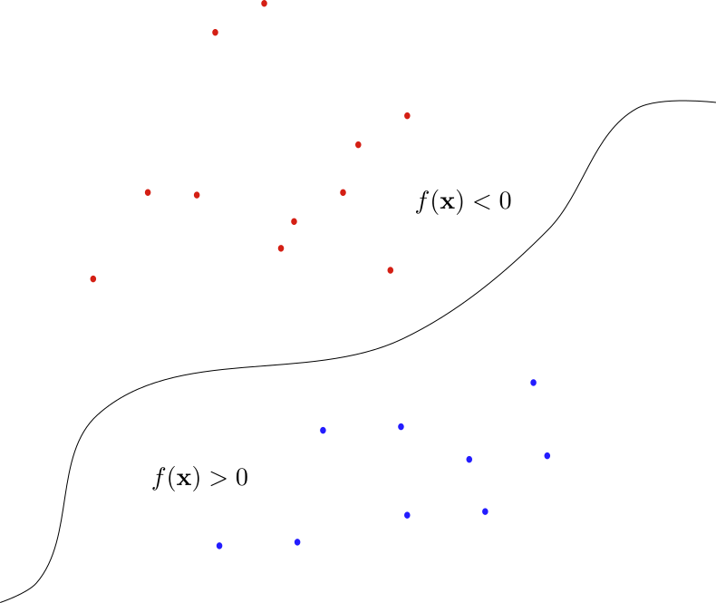
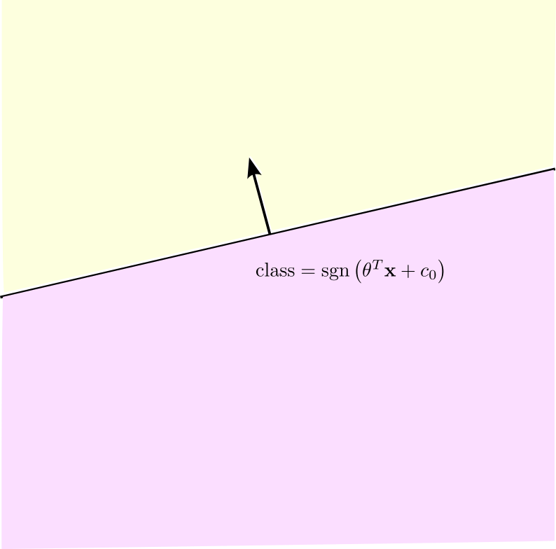
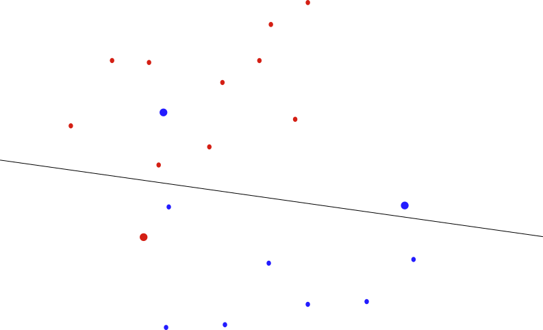
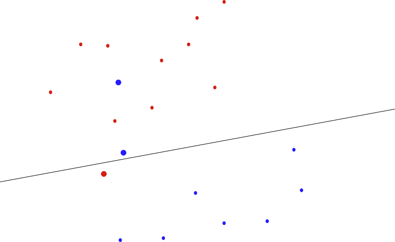
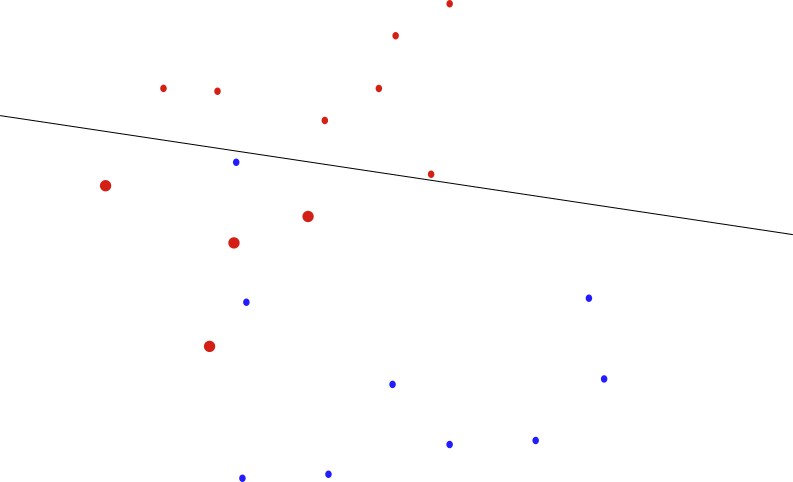
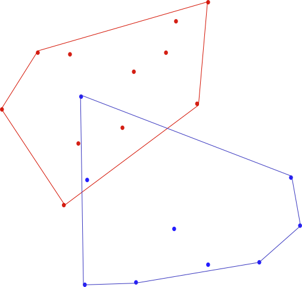
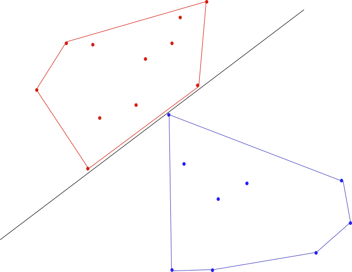
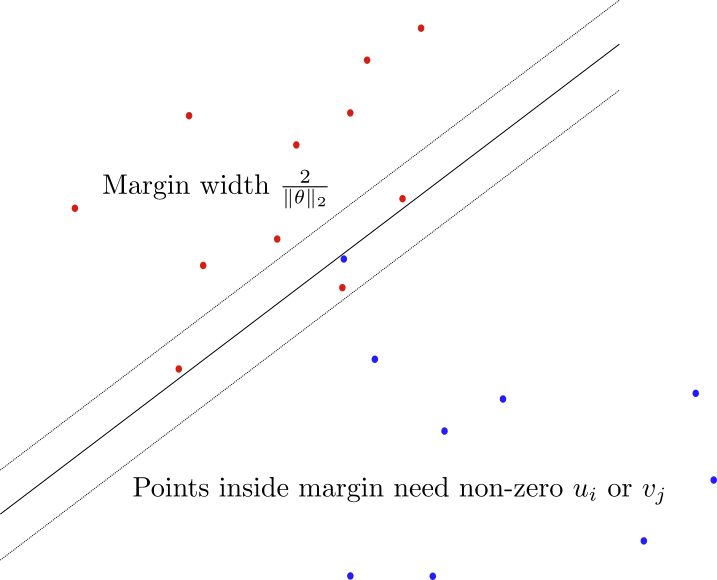

## Week Summary

- Spring Break Next week
- HW Due in the week after spring break
- Reading: 7.1, 7.2, 8.6
- I'll read your proposals and give some quick feedback


## NY Open Statistical Computing Meetup

- April 8th 6:30-8:30+
- Great Networking/Learning Opportunity


## Parametric Statistics

- __Parametric__ statistical models assume data generated by a probability distribution that depends on parameters
  - Linear regression:
$$ 
y_i| \sim \mathrm{Normal}(\theta^T\mathbf{x}_i + y_0,\sigma)
$$
  - Here the parameters are $\theta$, $y_0$, and $\sigma$
  
## Maximum Likelihood

- Likelihood is probability of observations given model coefficients
$$
p(\mathbf{y}|\theta,\mathbf{x}) = \prod_{i=1}^n p(y_i|\theta,\mathbf{x}_i)
$$
- Usually work with $l(\mathbf{y},\mathbf{\theta}) = \log(p(\mathbf{y}|\theta,\mathbf{x}))$:
$$
l(\mathbf{y},\theta) = \sum_{i=1}^n \log(p(y_i|\theta,\mathbf{x}_i))
$$

## Maximum Likelihood

- If $p$ is a `log-concave` in $\theta$ for fixed $\mathbf{y}$, $\mathbf{x}$, maximum likelihood is a convex optimization problem:

$$
\mathrm{min}_{\theta}\,  -\sum_{i=1}^n \log(p(y_i|\theta,\mathbf{x}_i))
$$

- If $p$ is a `log-concave` function of $\theta$, MLE problem is convex


## Link to Penalty Functions

- Last lecture:
$$
\min_{\theta} \sum_{i=1}^n \phi(x,\theta)
$$
- Here $\phi(\theta) = \log(p(y_i|\theta,\mathbf{x}_i))$

- Each penalty corresponds to a probability model
$$
p(x|\theta)  = \frac{e^{-\phi(x,\theta)}}{\int dx' e^{-\phi(x',\theta)}}
$$


## Probability and Penalty

- Squared Residuals corresponds to Gaussian Noise
  - $p(y) = \frac{e^{-y^2/(2\sigma^2)}}{\sqrt{2\pi\sigma^2}}$ 
- Sum of absolute value of residuals ($L_1$) corresponds to Laplace noise:
  - $p(y) = \frac{e^{-|y|/a}}{2a}$


## Convexity of MLE

- For Gaussian:
$$
-l(\theta) = \left(\frac{n}{2}\right)\log(2\pi\sigma^2) + \frac{\| \theta^T X -\mathbf{y}\|^2}{2\sigma^2} 
$$
- Not convex except if $\sigma$ fixed
- If $\theta$ is fixed is convex in $1/\sigma^2$
- Can generalize to covariance estimation


## Covariance Estimation

- Hard example in 7.1
- Have many $\mathbf{x}_i$ of variables, want to estimate covariance under a normal model
$$
-l(\Sigma) = \frac{N}{2}\log(\mathrm{det}\Sigma) + \frac{1}{2}\sum_{i=1}^N \mathbf{x}_i^T\Sigma^{-1}\mathbf{x}_i
$$
- Only convex in variable $S = \Sigma^{-1}$


## Prior Knowledge

-  Can incorporate constraints on parameters as a type of prior
knowledge
- For example, if the parameters had been previously estimated to within a given accuracy
- For example, trying to learn if a coin is fair or not, $p_1$ is probability of heads
  - $p_1 \sim \mathrm{Beta}(5,5)$
  - You think coin might not be fair


## MAP Estimation

- Can take prior idea even further and start with a Bayesian model
- Observations $y$ and model parameters $\theta$
- $p(\theta|y)$ is probability of parameters $\theta$ given observations $y$
- Probability model: $p(y|\theta)$
- Also have prior beliefs $p(\theta)$
- Bayes Theorem:
$$
p(x|y) = \frac{p(y|\theta)p(\theta)}{p(y)}
$$

## MAP Estimation

- Harder problem: Calculate samples of posterior $p(\theta|y)$
- Simpler problem: Find value of $\theta$ that maximimizes $p(\theta,y)$
- Maximum a-Posteriori Probability:
$$
\mathrm{max}_{\theta}\, p(y|\theta)p(\theta)
$$

## MAP Estimation

- Can take `log`
$$
\mathrm{max}_{\theta}\,\, \log\left(p(y|\theta)\right) +\log\left(p(\theta)\right)
$$
- If $p(y|\theta)$ and $p(\theta)$ are log-concave, can solve
- Equivalent to maximum likelihood if prior is flat
- Prior looks like a regularization term


## Non-Parametric Discrete

- Consider an unknown probability distribution $p_i$ over 
random variable $X$ with values $x_i$
- Observable/Feature is a function $f$ of $x_i$
- $Ef(X) = \sum_i f(x_i)p_i$ describes a convex set
  - Mean, Variance, probability greater than a threshold


## Entropy

- Entropy of a distribution/RV is defined as:
$$
H(X) = E(-\log(p(x))) = \sum_i -p_i\log(p_i) 
$$
- Convex in $p_i$s
- Entropy stands for the amount of uncertainty contained in the random variable $X$

## Maximum Entropy

- Suppose you have some measurements/knowledge about a random variable $X$
  - Could be from expected values of observables
  - $Ef_k(X) = y_k$
- Maximum Entropy probability distribution:

$$
\mathrm{min}_{p_i} \sum_i p_i\log(p_i) \\
\sum_{i} f_k(x_i)p_i = y_k
$$

## Maximum Entropy in Practice

- Enormously useful modeling framework
- Application uses ideas from convex optimization
- Converts from measurements to prediction while adding least additional information
$$
p(x) = \exp\left(\sum_{i} \lambda_i f_i(x)\right) \\
\mathrm{min}_{\lambda} -\sum_i a_i \lambda_i + \int dx p(x|\lambda)
$$


## KL Divergence

- Suppose you have two probability distributions $p$ and $q$
- The "surprise" we experience when we use $q$ as a model for a process driven by $p$ is given by the KL-Divergence:
$$
DL(p||q) = \sum_i p_i \log(p_i/q_i)
$$

- Common tool used for model comparison
  - Imagine $p_i$ is true distribution
- Convex loss function used in machine learning


## Classification

- Have two sets of points $A = \{\mathbf{x}_{a1}, \mathbf{x}_{a2}, \mathbf{x}_{a3}, \dots\}$ and $B = \{\mathbf{x}_{b1}, \mathbf{x}_{b2}, \mathbf{x}_{b3}, \dots\}$
- Want to find a function $f:\mathbb{R}^n\to\mathbb{R}$ that satisfies:
$$
f(\mathbf{x}) < 0\,\, \mathrm{if}\,\, \mathbf{x} \in A \\
f(\mathbf{x}) > 0\,\, \mathrm{if}\,\, \mathbf{x} \in B
$$

## Classification

- Such an $f$ __classifies__ or __discriminates__ the points of $A$ and $B$




## Classification

- To solve classification problem you need a hypothesis set $\mathcal{H}$ of functions $f$
- If $\mathcal{H}$ too complex for dataset you cannot generalize
  - Imagine a family of functions which you can just specify to have any values
- Leads us to consider simple families $f$ initially

## Linear Discrimination

:::: {.columns}

::: {.column width=50%}

- Linear discrimination: 
- $f(\mathbf{x}) = \theta^T\mathbf{x} + c_0$

:::

::: {.column width=50%}


:::
::::


## Linear Discrimination Fails

- Sets not always linearly separable



## Linear Discrimination Fails

- Sets not always linearly separable




## Linear Discrimination Fails

- Sets not always linearly separable




## Linear Discrimination Fails

- Need Convex Hull of sets to be disjoint




## Linear Discrimination Fails

- Need Convex Hull of sets to be disjoint




## Support Vector Machines

- What to do if can't separate?
- Look for approximate separation
  - Minimize misclassified points directly is too hard
- Instead look to see how bad misclassifications are:
$$
\theta^T\mathbf{x}_{ai} + c_0 \geq 1 - u_i \\
\theta^T\mathbf{x}_{bj} + c_0 \leq -(1-v_j)
$$
- If the $u_i$ or $v_j$ are 0, classification successful


## SVM Margin

- Inequalities create marginal region
- Support vectors are points inside



## SVM Optimization Problem

- Maximize width of slab $\frac{2}{\|\theta\|_2}$
  - Separates points
- Penalize misclassified points
  - $L_1$ norm of $\mathbf{u}$ and $\mathbf{v}$

$$
\mathrm{min}_{\mathbf{u},\mathbf{v},\theta,c_0} \|\theta\|_2+\gamma\left(\mathbf{1}^T\mathbf{u} +\mathbf{1}^T\mathbf{v}\right) \\
\theta^T\mathbf{x}_{ai} + c_0 \geq 1 - u_i\ \\
\theta^T\mathbf{x}_{bj} + c_0 \leq -(1 - v_j)\ \\
\mathbf{u} \succeq 0\,\, \mathbf{v} \succeq 0
$$

## SVM Optimization Problem


$$
\mathrm{min}_{\mathbf{u},\mathbf{v},\theta,c_0} \|\theta\|_2+\gamma\left(\mathbf{1}^T\mathbf{u} +\mathbf{1}^T\mathbf{v}\right) \\
\theta^T\mathbf{x}_{ai} + c_0 \geq 1 - u_i\ \\
\theta^T\mathbf{x}_{bj} + c_0 \leq 1 - v_j\ \\
\mathbf{u} \succeq 0\,\, \mathbf{v} \succeq 0
$$

- $\gamma$ balances objective of slab width and misclassified points
- Affine plus norm and linear inequalities so convex


## Implementation

- Reformulate a little
- Either $u_i=0$ or $u_i = 1-\theta^T\mathbf{x}_{ai}-c_0$
- Either $v_j=0$ or $v_j = 1-\theta^T\mathbf{x}_{bj}-c_0$

$$
\mathrm{min}_{\theta,c_0} \|\theta\|_2 + \gamma\left(\sum_i\mathrm{max}(0,1-\theta^T\mathbf{x}_{ai}-c_0) +\\
\sum_j\mathrm{max}(0,1-\theta^T\mathbf{x}_{bj}-c_0)\right)
$$

## Implementation


```{python}
# code from cvxpy website that generates data

from __future__ import division
import numpy as np
np.random.seed(1)
n = 20
m = 1000
TEST = m
DENSITY = 0.2
theta_true = np.random.randn(n,1)
idxs = np.random.choice(range(n), int((1-DENSITY)*n), replace=False)
for idx in idxs:
    theta_true[idx] = 0
offset = 0
sigma = 45
X = np.random.normal(0, 5, size=(m,n))
Y = np.sign(X.dot(theta_true) + offset + np.random.normal(0,sigma,size=(m,1)))
X_test = np.random.normal(0, 5, size=(TEST,n))
Y_test = np.sign(X_test.dot(theta_true) + offset + np.random.normal(0,sigma,size=(TEST,1)))


```


```{python}
#| echo: true
import cvxpy as cp
n = 20
m = 1000
theta = cp.Variable((n,1)) # coefficients
c0 = cp.Variable() # offset
loss = cp.sum(cp.pos(1 - cp.multiply(Y, X @ theta - c0))) # u and v
reg = cp.norm(theta, 1) # width
lambd = cp.Parameter(nonneg=True) # tradeoff
prob = cp.Problem(cp.Minimize(loss/m + lambd*reg)) #


```

- Rescaled loss by number of points
- `cp.sum(cp.pos(1 - cp.multiply(Y, X @ theta - c0)))` is called
`hinge-loss`
- $Y = \pm 1$ is the class


## Testing Regularization

```{python}
#| echo: true

# Compute a trade-off curve and record train and test error.
TRIALS = 100
train_error = np.zeros(TRIALS)
test_error = np.zeros(TRIALS)
lambda_vals = np.logspace(-2, 0, TRIALS)
theta_vals = []
for i in range(TRIALS):
    lambd.value = lambda_vals[i]
    prob.solve()
    train_error[i] = (np.sign(X.dot(theta_true) + offset) != np.sign(X.dot(theta.value) - c0.value)).sum()/m
    test_error[i] = (np.sign(X_test.dot(theta_true) + offset) != np.sign(X_test.dot(theta.value) - c0.value)).sum()/TEST
    theta_vals.append(theta.value)


```

- Here test/train errors are percentage of points classified correctly


## Train/Test Error

```{python}

import matplotlib.pyplot as plt


plt.plot(lambda_vals, train_error, label="Train error")
plt.plot(lambda_vals, test_error, label="Test error")
plt.xscale('log')
plt.legend(loc='upper left')
plt.xlabel(r"$\lambda$", fontsize=16)
plt.show()


```


## Regularization Paths


```{python}
#| echo: true
for i in range(n):
    plt.plot(lambda_vals, [wi[i,0] for wi in theta_vals])
plt.xlabel(r"$\lambda$", fontsize=16)
plt.xscale("log")


```


## Do more with SVMs

- SVMs not restricted to linear separation
- Can use nonlinear functions to generate additional features
- Leads to higher dimensional space in which sometimes linear separator is more effective


## Thanks!

