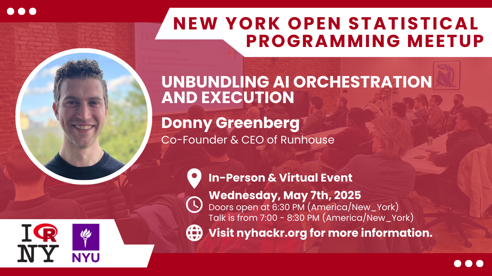
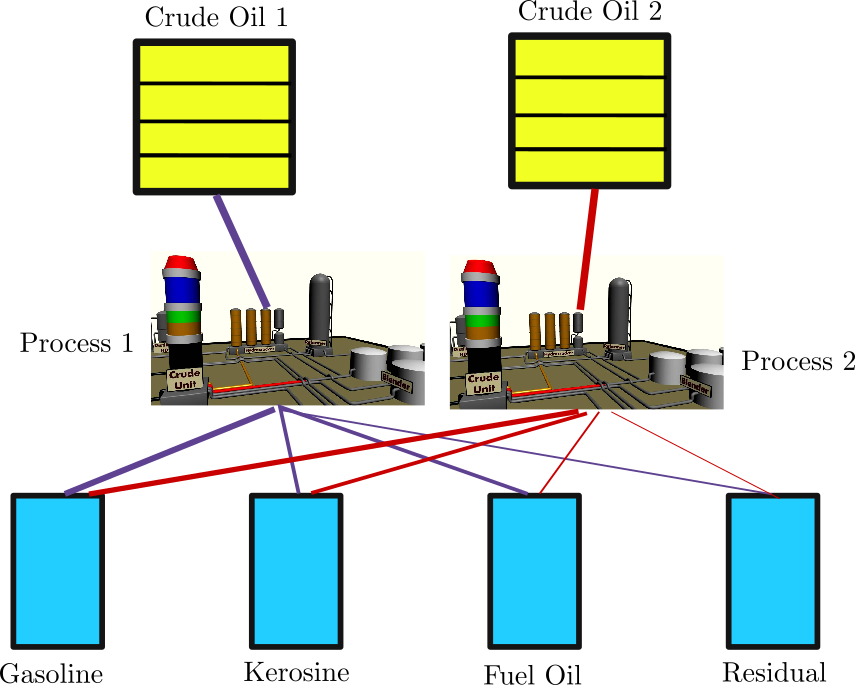
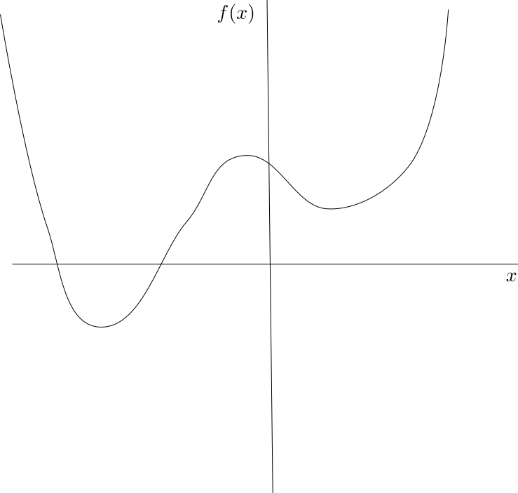
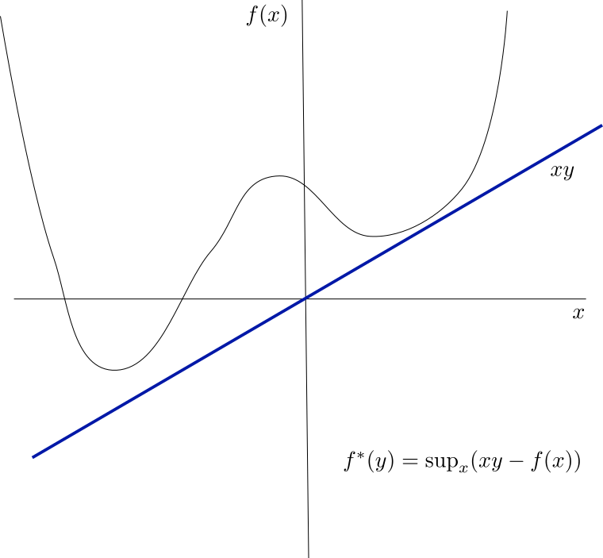
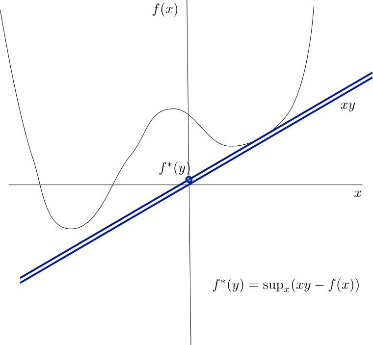
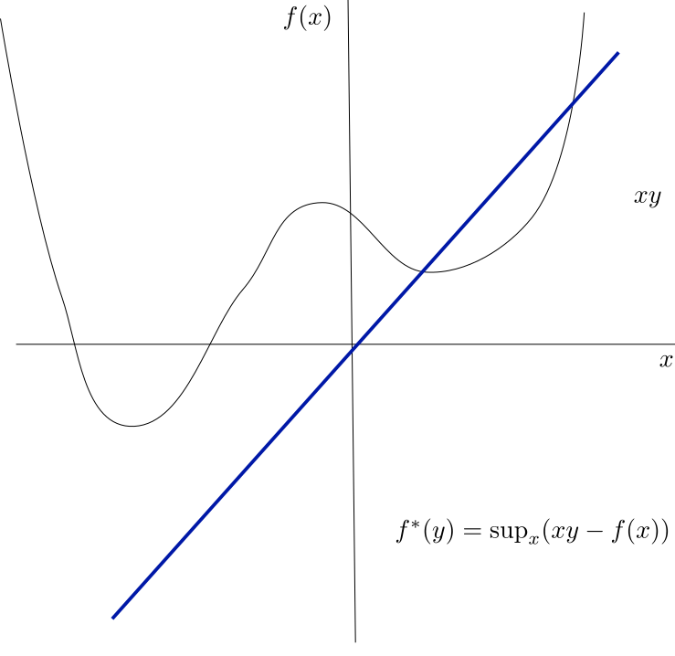
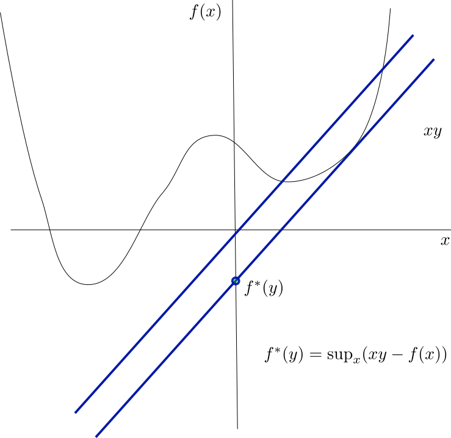

## Week Summary

- This week is about duality
  - Let's you perform a sensitivity analysis of your optimization problem
  - Enables solution of more difficult problems
- Lab 6 is Due this week at midnight
- Reading is parts of Chapter 5: 5.1, 5.2, 5.4.3, 5.4.4, 5.5.2, 5.6
- If you want, Section 3.3

## May 9th Meetup!




## What is Duality?

- For every optimization problem (not necessarily convex):
$$
\mathrm{min}_{\mathbf{x}} f(\mathbf{x}),\quad g_i(\mathbf{x}) \leq 0,\quad h_j(\mathbf{x}) = 0
$$
- There is a "dual" optimization problem:
$$
\min_{(\lambda,\nu)} f_d(\lambda,\nu),\quad \lambda_i \geq 0
$$
- The dual variables correspond to constraints and have interpretation as prices
- $f_d$ depends on original objective and constraints


## Why do we care about duality?

- The dual problem is always convex!
- The dual will provide a lower bound on the original objective
- For convex problems, the dual problem is equivalent*
- The dual tells us how the solution changes when we change our problem


## Economic perspective on dual

- Consider original problem with inequality constraints:
$$
\mathrm{min}_{\mathbf{x}} f(\mathbf{x}),\quad g_i(\mathbf{x}) \leq 0
$$
- Suppose $f(\mathbf{x})$ was the "profit" of our organization
- $g_i(\mathbf{x})$ constraint represents capacity constraint:
  - $g$ could be our available warehouse space
  - $g$ could be how many employees we have
  - $g$ could be our freight capacity
  
## Attach a cost to constraint

- Suppose we could pay a cost $\lambda$ to get more warehouse space/freight capacity/employees:
$$
\mathrm{min}_{\mathbf{x}} f(\mathbf{x}) + \lambda g(\mathbf{x})
$$

## Attach a cost to constraint

- Alternative optimization problem

$$
\mathrm{min}_{\mathbf{x}} f(\mathbf{x}) + \lambda g(\mathbf{x})
$$

- Suppose that if we don't use all capacity, we can get some money back
  - renting unused warehouse space,
  - selling freight capacity 
  - reducing headcount

## Multiple Constraints

- If we have multiple constraints, each one has a lambda:
$$
\min_{x}f(\mathbf{x}) + \sum_{i}\lambda_i g_i(\mathbf{x})
$$
  
## Lagrange Dual

- Let $f_d(\lambda) = \min_{\mathbf{x}}f(\mathbf{x}) + \lambda g(\mathbf{x})$
- $f_d(\lambda)$ is the optimal profit for a given cost $\lambda$ 
- $f_d(\lambda)$ is a concave function of $\lambda$
- $f_d(\lambda)$ is called the __Lagrange Dual__ function of the optimization problem  
- Soon will generalize it to equality constraints

## Lower bound on original problem

- Let $p^{\star}$ be the solution of original problem:
$$
p^{\star} = \mathrm{min}_{\mathbf{x}} f(\mathbf{x}),\quad g(\mathbf{x})\leq 0
$$
- Let $\mathbf{x}^{\star}$ be the value of the decision variables at the minimum
$$ p^{\star} = f(\mathbf{x}^{\star}) \geq \cdots\\
f(\mathbf{x}^{\star}) + \lambda g(\mathbf{x}^{\star}) \geq f_d(\lambda)  
$$

- Lagrange dual for any value of $\lambda$ is a lower bound on original (aka primal) problem


## Generalization to equality constraints

- For inequality constraints, $\lambda \geq 0$
- For equality constraints, multiply by $\nu$:
$$
f_d(\lambda,\nu) = \min_{\mathbf{x}} f(\mathbf{x}) +\sum_{i}\lambda_i g_i(\mathbf{x}) + \sum_j
\nu_j h_j(\mathbf{x})
$$
- Intuition: equality constraint is like inequality constraint for $h$ and $-h$.
- $\nu$ can have either sign


## Lagrangian Function

- Theory of Lagrange Multipliers:
$$
L(\mathbf{x},\lambda,\nu) = f(\mathbf{x}) +\sum_{i}\lambda_i g_i(\mathbf{x}) + \sum_j
\nu_j h_j(\mathbf{x})
$$
- This is called the Lagrangian function


## Dual Optimization Problem

- If $f_d(\lambda,\nu)$ provides a lower bound on the optimal value of the primal problem, makes sense to find the greatest lower bound
- Dual optimization problem:
$$
p^{\star}_d = \max_{(\lambda,\nu)} f_d(\lambda,\nu) \\
\lambda_i \geq 0
$$
- $f_d$ concave, taking max is analogous to solving a convex optimization problem


## Game Interpretation

- Suppose we have a two player game
- Player 1 will choose prices $\lambda$ and $\nu$
- Player 2 then picks action $x$
- Goal of Player 2 is to maximize their own profit
- Goal of Player 1 is to minimize Player 2s profit

## Game Interpretation

- Consider the following optimization problem
$$
\min_{(x,y)} (x+2)^2+(y-1)^2\,\\
x-y \leq 0
$$

## Game Interpretation

- Player 2 picks price $\lambda$
- Player 1 picks action $x$ to minimize
$$
\min_{(x,y)} ( (x+2)^2 + (y-1)^2 + \lambda(x-y))
$$
- Player 1 wants this function as big as possible
- Player 2 wants this function as small as possible

## Game Interpretation

```{python}

# For those following along, in this code chunk (and the subsequent code chunks)
# I am going to use cvx to find the optimal value for different values of the
# lambda parameter
import pandas as pd
import numpy as np
import matplotlib.pyplot as plt
import cvxpy as cvx

def f_obj(x,y):
    return (x+2)**2 + (y-1)**2


def cline(x,y):
    return x-y

L = 100
xmin = -5
xmax = 5
ymin = -5
ymax =5
xx = np.linspace(xmin, xmax, L)
yy = np.linspace(ymin, ymax, L)
X, Y = np.meshgrid(xx, yy)

f_Z = f_obj(X,Y)

Z_Reg = X > Y
Z_Reg_nan = np.where(Z_Reg, np.nan, Z_Reg)
plt.contourf(X, Y, f_Z, levels=20, cmap='magma_r')
plt.colorbar(extend="both")
plt.plot(xx,yy)

plt.pcolormesh(X,Y,Z_Reg_nan,alpha=0.5)
plt.xlabel('x',fontsize=20)
plt.ylabel('y',fontsize=20)
plt.title('Objective and Constraint Function',fontsize=20)
plt.show()


```


## Game Interpretation

```{python}
x_var = cvx.Variable()
y_var = cvx.Variable()

obj = cvx.square(x_var+2) + cvx.square(y_var-1)
constr = -x_var+y_var

prob = cvx.Problem(cvx.Minimize(obj),[constr<=0])

val = prob.solve()

plt.contourf(X, Y, f_Z, levels=20, cmap='magma_r',fontsize=18)
plt.colorbar(extend="both")
plt.plot(xx,yy)

plt.pcolormesh(X,Y,Z_Reg_nan,alpha=0.5)
plt.scatter(x_var.value,y_var.value,s=100,marker="*",color="Red")
plt.text(x_var.value+0.5,y_var.value,"p = "+str(val),fontsize=20)

plt.xlabel('x')
plt.ylabel('y')
plt.title('Optimal Solution')
plt.show()


```

## Game Interpretation

:::: {.columns}

::: {.column width=70%}
```{python}
l = 0.0
x_var = cvx.Variable()
y_var = cvx.Variable()

obj = cvx.square(x_var+2) + cvx.square(y_var-1)
constr = -x_var+y_var

prob = cvx.Problem(cvx.Minimize(obj+l*constr))

val = prob.solve()


f_Z_tilt = f_obj(X,Y) + l*(X-Y)
plt.contourf(X, Y, f_Z, levels=20, cmap='magma_r',fontsize=20)
plt.colorbar(extend="both")
plt.plot(xx,yy)

#plt.scatter(x_var.value,y_var.value,s=100,marker="*",color="Red")


plt.xlabel('x',fontsize=20)
plt.ylabel('y',fontsize=20)
#plt.text(x_var.value+0.5,y_var.value,"p = "+str(val),fontsize=20)

plt.title('Game: $\lambda=0$',fontsize=20)
plt.show()


```
:::
::: {.column width=30%}
- $\lambda = 0$

:::
::::


## Game Interpretation

:::: {.columns}

::: {.column width=70%}
```{python}
l = 0.0
x_var = cvx.Variable()
y_var = cvx.Variable()

obj = cvx.square(x_var+2) + cvx.square(y_var-1)
constr = -x_var+y_var

prob = cvx.Problem(cvx.Minimize(obj+l*constr))

val = prob.solve()


f_Z_tilt = f_obj(X,Y) + l*(X-Y)
plt.contourf(X, Y, f_Z, levels=20, cmap='magma_r',fontsize=20)
plt.colorbar(extend="both")
plt.plot(xx,yy)

plt.scatter(x_var.value,y_var.value,s=100,marker="*",color="Red")


plt.xlabel('x',fontsize=20)
plt.ylabel('y',fontsize=20)
plt.text(x_var.value+0.5,y_var.value,"p = "+str(val),fontsize=20)

plt.title('Game: $\lambda=0$',fontsize=20)
plt.show()


```
:::
::: {.column width=30%}
- $\lambda = 0$
- $p=0$

:::
::::


## Game Interpretation

:::: {.columns}

::: {.column width=70%}
```{python}
l = 5.0
x_var = cvx.Variable()
y_var = cvx.Variable()

obj = cvx.square(x_var+2) + cvx.square(y_var-1)
constr = -x_var+y_var

prob = cvx.Problem(cvx.Minimize(obj+l*constr))

val = prob.solve()


f_Z_tilt = f_obj(X,Y) + l*(X-Y)
plt.contourf(X, Y, f_Z, levels=20, cmap='magma_r',fontsize=20)
plt.colorbar(extend="both")
plt.plot(xx,yy)

plt.scatter(x_var.value,y_var.value,s=100,marker="*",color="Red")


plt.xlabel('x',fontsize=20)
plt.ylabel('y',fontsize=20)
plt.text(x_var.value+0.5,y_var.value,"p = "+str(val),fontsize=20)

plt.title('Game: $\lambda=5$',fontsize=20)
plt.show()


```
:::
::: {.column width=30%}
- $\lambda = 5$
- $p=2.5$

:::
::::


## Game Interpretation

:::: {.columns}

::: {.column width=70%}
```{python}
l = 2.0
x_var = cvx.Variable()
y_var = cvx.Variable()

obj = cvx.square(x_var+2) + cvx.square(y_var-1)
constr = -x_var+y_var

prob = cvx.Problem(cvx.Minimize(obj+l*constr))

val = prob.solve()


f_Z_tilt = f_obj(X,Y) + l*(X-Y)
plt.contourf(X, Y, f_Z, levels=20, cmap='magma_r',fontsize=20)
plt.colorbar(extend="both")
plt.plot(xx,yy)

plt.scatter(x_var.value,y_var.value,s=100,marker="*",color="Red")


plt.xlabel('x',fontsize=20)
plt.ylabel('y',fontsize=20)
plt.text(x_var.value+0.5,y_var.value,"p = "+str(val),fontsize=20)

plt.title('Game: $\lambda=2$',fontsize=20)
plt.show()


```
:::
::: {.column width=30%}
- $\lambda =2$
- $p=4$

:::
::::


## Game Interpretation

:::: {.columns}

::: {.column width=70%}
```{python}
l = 3.0
x_var = cvx.Variable()
y_var = cvx.Variable()

obj = cvx.square(x_var+2) + cvx.square(y_var-1)
constr = -x_var+y_var

prob = cvx.Problem(cvx.Minimize(obj+l*constr))

val = prob.solve()


f_Z_tilt = f_obj(X,Y) + l*(X-Y)
plt.contourf(X, Y, f_Z, levels=20, cmap='magma_r',fontsize=20)
plt.colorbar(extend="both")
plt.plot(xx,yy)

plt.scatter(x_var.value,y_var.value,s=100,marker="*",color="Red")


plt.xlabel('x',fontsize=20)
plt.ylabel('y',fontsize=20)
plt.text(x_var.value+0.5,y_var.value,"p = "+str(np.round(val,2)),fontsize=20)

plt.title('Game: $\lambda=3$',fontsize=20)
plt.show()


```
:::
::: {.column width=30%}
- $\lambda = 3$
- $p=4.5$
- Maximum
- Min of original prob

:::
::::


## Strong Duality

- When original problem is convex, primal and dual problems have same minimum
  - Some rare cases when not true
  - See section on Slater's Condition
- CVX is a primal/dual solver
  - Simultaneously solves both the primal and dual problem


## How to find the dual

- Consider previous problem
- After solving, `prob.solution.dual_vars`

```{python}
#| echo: true
x_var = cvx.Variable()
y_var = cvx.Variable()

obj = cvx.square(x_var+2) + cvx.square(y_var-1)
constr = -x_var+y_var
prob = cvx.Problem(cvx.Minimize(obj),[constr<=0])
print(prob.solve())
print(prob.solution.dual_vars)

```


## Meaning of Dual: Shadow Prices

- Economic Interpretation:
  - Prices $\mu$ and $\lambda$ where the firm doesn't gain from violating constraints
  - Gain in objective from relaxing the constraints:
$$
\min_{\mathbf{x}} f(\mathbf{x}) \\
g_i(\mathbf{x}) - u_i \leq 0 \\
h_j(\mathbf{x}) - v_j = 0 
$$

## Shadow Prices

- Then:
$$
\lambda_i = \frac{\partial p^{\star}}{\partial u_i} \\
\mu_j = \frac{\partial p^{\star}}{\partial v_j}
$$
- The shadow prices tell us the sensitivity to constraints
- Complimentary Slackness: 
  -$\lambda_i = 0$ means inequality is inactive


## Oil Refining Example




## Oil Refining Example

- Two types of crude oil feedstock exist
- Each can be refined
  - Process yields 4 products
  - Process has limit
  - Each product has a limit
- Products and Crude have prices


## Oil Refining Example

$$
\max_{\mathbf{c}} \left(\underbrace{\mathbf{p}_{\mathrm{prod}}^T Y\mathbf{c}}_{\mathrm{profit}}
 -\underbrace{\left(\mathbf{p}_{\mathrm{proc}}^T+\mathbf{p}_{\mathrm{crude}}^T\right)\mathbf{c}}_{\mathrm{costs}} 
 \right) \\
 0\preceq\mathbf{c}\preceq \mathbf{c}_{\mathrm{max}},\quad \mathrm{crude\,\, capacity} \\
 0 \preceq Y\mathbf{c} \preceq \mathbf{L}_{\mathrm{prod}}
$$

## Oil Refining Products


```{python}
import pandas as pd

# Here we are definining the problem. This example was taken from a tutorial/
# example on the amlp modeling website: 
#https://ampl.com/mo-book/notebooks/05/refinery-production.html

# Some modifications to the example are made to link it more closely to the 
# flux balance homework problem

# Start with defining some data. Here the capacity refers to the maximum
# capacity for producing each of the four product types. The price refers to
# the open market price for each product type

products = pd.DataFrame(
    {
        "gasoline": {"capacity": 24000, "price": 108},
        "kerosine": {"capacity": 2000, "price": 72},
        "fuel oil": {"capacity": 6000, "price": 63},
        "residual": {"capacity": 2500, "price": 30},
    }
).T

# The two crudes are the feedstocks for the refinery. Each must be purchased,
# and there is a limit on the amount that is available for purchase. The process
# by which each is refined also has a cost

crudes = pd.DataFrame(
    {
        "crude 1": {"available": 28000, "price": 72, "process_cost": 1.5},
        "crude 2": {"available": 15000, "price": 45, "process_cost": 3},
    }
).T


# The yields are like the chemical formula which describes how much product
# is generated from refining each crude

# note: volumetric yields may not add to 100%
yields = pd.DataFrame(
    {
        "crude 1": {"gasoline": 80, "kerosine": 5, "fuel oil": 10, "residual": 5},
        "crude 2": {"gasoline": 44, "kerosine": 10, "fuel oil": 36, "residual": 10},
    }
).T

display(products)

```


## Oil Refining Examples

- Crude prices and constraints

```{python}

display(crudes)

```

- Process Yields and Costs

```{python}

display(yields)

```


## Solving the Problem

```{python}
#| echo: true

# decision variables, this is a vector of length 2
x = cvx.Variable(len(crudes.index), pos=True, name="crudes")

# the objective will be the revenue minus costs

# The production is the amount of each crude times the yield matrix
prods = yields.to_numpy().T @ x / 100.0

# To find revenue we sum up the production times the price of each crude

revenue = products["price"].to_numpy().T @ prods

# Feed costs are the crude prices times the decision variable, summed up
feed_cost = crudes["price"].to_numpy().T @ x

# Ditto for the process costs

process_cost = crudes["process_cost"].to_numpy().T @ x

# profit 

profit = revenue - feed_cost - process_cost
objective = cvx.Maximize(profit)

# constraints: can't use more crude than you have
feeds = x <= crudes["available"].to_numpy()

# Can't produce more of each product than the capacity

capacity = prods <= products["capacity"].to_numpy()

# put them together to get all the constraints

constraints = [feeds, capacity]

# solve using cvx

problem = cvx.Problem(objective, constraints)
problem.solve()


```

## Results {.smaller}

- Crude Consumption

```{python}

results_crudes = crudes
results_crudes["consumption"] = x.value

# Get the shadow prices

results_crudes["shadow price"] = feeds.dual_value

display(results_crudes.round(1))
```

- Product Capacity

```{python}
results_products = products
results_products["production"] = yields.to_numpy().T @ x.value / 100.0
results_products["unused capacity"] = products["capacity"] - yields.to_numpy().T @ x.value / 100.0
results_products["shadow price"] = capacity.dual_value

display(results_products.round(1))


```

## Kerosine Shadow Price

```{python}


fig, ax = plt.subplots(figsize=(8, 6))
ylim = 24000
xlim = 32000

ax.axvline(crudes["available"][0], linestyle="--", label="Crude 1")
ax.axhline(crudes["available"][1], linestyle="--", label="Crude 2")

xplot = np.linspace(0, xlim)
for product in products.index:
    b = 100 * products.loc[product, "capacity"] / yields[product][1]
    m = -yields[product][0] / yields[product][1]
    line = ax.plot(xplot, m * xplot + b, label=product)
    ax.fill_between(xplot, m * xplot + b, 30000, color=line[0].get_color(), alpha=0.2)

ax.plot(x.value[0], x.value[1], "ro", ms=10, label="max profit")
ax.set_title("Feasible operating regime")
ax.set_xlabel(crudes.index[0])
ax.set_ylabel(crudes.index[1])
ax.legend()
ax.set_xlim(0, xlim)
ax.set_ylim(0, ylim)


```


## Improving Profits

- In current environment, improve Kerosine capacity
  - Every unit increase in Kerosine adds $262.6 in profit
- What if we doubled Kerosine capacity?
  - Linear estimate is a global upper bound on profit
  - Would be a lower bound for convex
  - Gain is at most 525000
  
## Double Capacity {.smaller}

```{python}

# Updating the products data frame to reflect the doubled kerosine capacity
products = pd.DataFrame(
    {
        "gasoline": {"capacity": 24000, "price": 108},
        "kerosine": {"capacity": 4000, "price": 72},
        "fuel oil": {"capacity": 6000, "price": 63},
        "residual": {"capacity": 2500, "price": 30},
    }
).T


prods = yields.to_numpy().T @ x / 100.0
revenue = products["price"].to_numpy().T @ prods

feed_cost = crudes["price"].to_numpy().T @ x
process_cost = crudes["process_cost"].to_numpy().T @ x
profit = revenue - feed_cost - process_cost
objective = cvx.Maximize(profit)

# constraints
feeds = x <= crudes["available"].to_numpy()
capacity = prods <= products["capacity"].to_numpy()
constraints = [feeds, capacity]

# solution
problem = cvx.Problem(objective, constraints)
problem.solve()


results_crudes = crudes
results_crudes["consumption"] = x.value
results_crudes["shadow price"] = feeds.dual_value

display(results_crudes.round(1))

results_products = products
results_products["production"] = yields.to_numpy().T @ x.value / 100.0
results_products["unused capacity"] = products["capacity"] - yields.to_numpy().T @ x.value / 100.0
results_products["shadow price"] = capacity.dual_value

display(results_products.round(1))

print("Total Profit: ",str(np.round(problem.solve(),6)))


```
- Did not reach expected profit target

## Double Capacity


```{python}


fig, ax = plt.subplots(figsize=(8, 6))
ylim = 24000
xlim = 32000

ax.axvline(crudes["available"][0], linestyle="--", label="Crude 1")
ax.axhline(crudes["available"][1], linestyle="--", label="Crude 2")

xplot = np.linspace(0, xlim)
for product in products.index:
    b = 100 * products.loc[product, "capacity"] / yields[product][1]
    m = -yields[product][0] / yields[product][1]
    line = ax.plot(xplot, m * xplot + b, label=product)
    ax.fill_between(xplot, m * xplot + b, 30000, color=line[0].get_color(), alpha=0.2)

ax.plot(x.value[0], x.value[1], "ro", ms=10, label="max profit")
ax.set_title("Feasible operating regime")
ax.set_xlabel(crudes.index[0])
ax.set_ylabel(crudes.index[1])
ax.legend()
ax.set_xlim(0, xlim)
ax.set_ylim(0, ylim)


```


## Robustness to Shocks

- What if Crude 1 wasn't available?
```{python}
#| echo: true

crudes = pd.DataFrame(
    {
        "crude 1": {"available": 0, "price": 72, "process_cost": 1.5},
        "crude 2": {"available": 15000, "price": 45, "process_cost": 3},
    }
).T

# constraints
feeds = x <= crudes["available"].to_numpy()
capacity = prods <= products["capacity"].to_numpy()
constraints = [feeds, capacity]

# solution
problem = cvx.Problem(objective, constraints)
problem.solve()
```

## Robustness to Shocks {.smaller}

- We are left with tons of spare capacity

```{python}


results_crudes = crudes
results_crudes["consumption"] = x.value
results_crudes["shadow price"] = feeds.dual_value

display(results_crudes.round(1))

results_products = products
results_products["production"] = yields.to_numpy().T @ x.value / 100.0
results_products["unused capacity"] = products["capacity"] - yields.to_numpy().T @ x.value / 100.0
results_products["shadow price"] = capacity.dual_value

display(results_products.round(1))


```


## Capacity Limits?

- If any capacity is cut to 0, profit cut to 0 as well 

```{python}

crudes = pd.DataFrame(
    {
        "crude 1": {"available": 28000, "price": 72, "process_cost": 1.5},
        "crude 2": {"available": 15000, "price": 45, "process_cost": 3},
    }
).T

products = pd.DataFrame(
    {
        "gasoline": {"capacity": 24000, "price": 108},
        "kerosine": {"capacity": 2000, "price": 72},
        "fuel oil": {"capacity": 6000, "price": 63},
        "residual": {"capacity": 0, "price": 30},
    }
).T

# constraints
feeds = x <= crudes["available"].to_numpy()
capacity = prods <= products["capacity"].to_numpy()
constraints = [feeds, capacity]

# solution
problem = cvx.Problem(objective, constraints)
problem.solve()

```

- Instead we will see what happens with 80% declines in capacity
- Loop over the four products and study the impact


## Resilience to Capacity Shocks

```{python}

# Reset the old data

# Here we are going to loop through the capacities and reduce them
# each to 20% of the original value in sequence.

crudes = pd.DataFrame(
    {
        "crude 1": {"available": 28000, "price": 72, "process_cost": 1.5},
        "crude 2": {"available": 15000, "price": 45, "process_cost": 3},
    }
).T

products = pd.DataFrame(
    {
        "gasoline": {"capacity": 24000, "price": 108},
        "kerosine": {"capacity": 2000, "price": 72},
        "fuel oil": {"capacity": 6000, "price": 63},
        "residual": {"capacity": 2500, "price": 30},
    }
).T
feeds = x <= crudes["available"].to_numpy()
capacity = prods <= products["capacity"].to_numpy()
constraints = [feeds, capacity]
# solution
problem = cvx.Problem(objective, constraints)
original_obj = problem.solve()

```

```{python}
#| echo: true
# Initialize products data frame with decline
products["obj_loss"] = 0.0

# Start with a loop over each crude product

for product in products.index:   
  # Make a deep copy of the data
  # This lets us change elements without 
  # overwriting the original data
  products_2 = products.copy()

  # Now we are going to reduce the capacity by 80%
  products_2["capacity"].at[product] = 0.2*products["capacity"].at[product]
  
  # We are ready to solve the optimization problem
  feeds = x <= crudes["available"].to_numpy()
  capacity = prods <= products_2["capacity"].to_numpy()
  constraints = [feeds, capacity]
  # solution
  problem = cvx.Problem(objective, constraints)
  obj = problem.solve()
  # Now we compute the relative decrease and save it
  products["obj_loss"].at[product] = obj/original_obj
  
```


## Resilience to Capacity Shocks


- Let's look at the objective declines:

```{python}

display(products["obj_loss"])

```

- Lots of resilience to gasoline capacity loss
  - Interesting since the inequality was active
- Very little resilience to kersoine capacity loss
  - Decrease almost linear in capacity


## Can duals be computed?

- So far the dual problem has been abstract
- Involves a minimum function:
  $$
  \max_{(\lambda,\nu)} \min_{\mathbf{x}} L(\mathbf{x},\lambda,\nu)
  $$
  - Can we ever write out the dual problem explicitly?
    - Sometimes
    
## Dual with Linear Constraints

- Consider an optimization problem with linear constraints:
$$
\min_{\mathbf{x}} f(\mathbf{x}) \\
A\mathbf{x} \preceq \mathbf{b} \\
C\mathbf{x} = \mathbf{d}
$$
- Dual Objective:
$$
\max_{(\lambda,\nu)} \min_{\mathbf{x}}\left( f(\mathbf{x}) + \lambda^T(A\mathbf{x}-\mathbf{b}) + \nu^T\left(C\mathbf{x}-\mathbf{d}\right)\right)
$$

## Dual and Convex Conjugate

- Can regroup the dual objective:
$$
\max_{(\lambda,\nu)}\left( -\lambda^T\mathbf{b} -\nu^T\mathbf{d} +\min_{\mathbf{x}}\left((\lambda^TA+\nu^TC)\mathbf{x}+f(\mathbf{x}) \right) \right)
$$
- For some functions $f$ we can calculate the term inside the minimum
- It is called the __convex conjugate__ of $f$:
$$
f^*(\gamma) = \max_{\mathbf{x}} \gamma^T\mathbf{x} - f(\mathbf{x})
$$

## Dual and Convex Conjugate

- In terms of Convex Conjugate
$$
\max_{(\lambda,\nu)}-\lambda^T\mathbf{b} -\nu^T\mathbf{d} - f^*(-A^T\lambda-C^T\nu) \\
\lambda \succeq 0 \\
$$

- So if we can compute convex conjugate of objective, can actually write dual problem


## Meaning of Convex Conjugate




## Meaning of Convex Conjugate

  


## Meaning of Convex Conjugate




## Meaning of Convex Conjugate




## Meaning of Convex Conjugate




## Properties of Convex Conjugate

- It is a convex function
- If $f$ is convex, $(f^*)^*=f$
- If function is concave, it is undefined


## Convex Conjugate of Some Functions

- Affine Function:
- $f(x) = ax + b$
- $\mathrm{sup}_x (xy - ax - b)$ is infinity unless the $x$ cancels.
- $f^*(y)=b$, domain is $y\in\{a\}$


## Convex Conjugate of Some Functions

- Exponential Function:
- $f(x) = e^x$
- $\mathrm{sup}_x (xy - e^x)$ 
- if $y<0$ this goes to infinity for negative $x$
- if $y>0$ solve equation $y = e^x$ so $x=\log(y)$
- $f^*(y) = y\log(y) - y$
- $f^*(0) = 0$

## Thanks!

