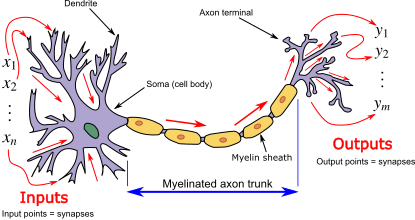
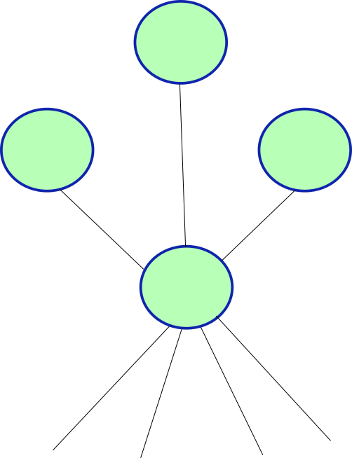
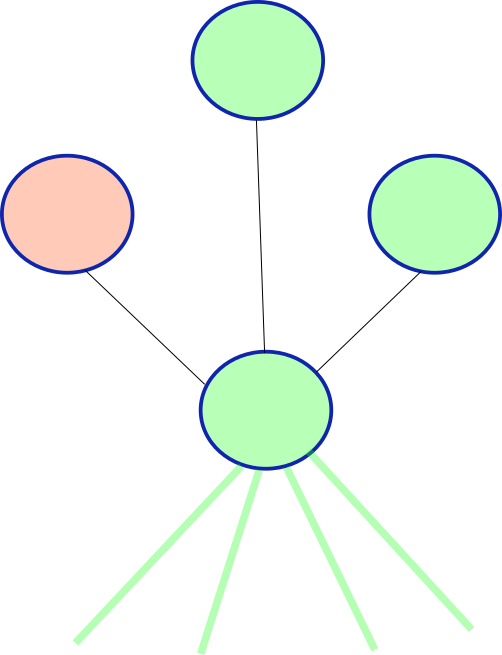
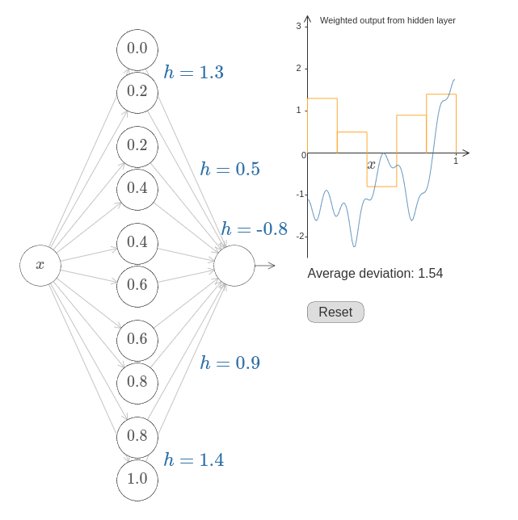

## Week Summary

- Lab 7 and Final Project 
- Motivation and Basics of Neural Networks
- Introduction to `pytorch`
  - `torch` also exists for `R`
- Reading:
  - [Neural Networks and Deep Learning, Chapter 1 and 3](http://neuralnetworksanddeeplearning.com/chap1.html)
  - [pytorch basics](https://pytorch.org/tutorials/beginner/basics/intro.html)
  - [pytorch recipes](https://pytorch.org/tutorials/recipes/recipes_index.html)

## NY Open Statistical Computing Meetup 

- This Wednesday!

## Introduction to Neural Networks

- Invented originally to understand how the brain works

{width=50%}

## Introduction to Neural Networks

- Was found to have an enormous number of applications
  - Classification
  - Pattern Recognition
  - Generative Models


  
  
## Introduction to Neural Networks

- Interesting objects in their own right
  - People study them as they would any other complex systems


## What is a Neuron?

- Neurons send and receive electrical signals




## Connected Neurons

:::: {.columns}


::: {.column width=50%}

- They are connected to other neurons


:::

::: {.column width=50%}
{width=50%}
:::

::::


## Connected Neurons

:::: {.columns}

::: {.column width=50%}


- They are connected to other neurons
- They respond to stimulus from senses and other neurons

:::

::: {.column width=50%}

:::

::::


## Connected Neurons

:::: {.columns}


::: {.column width=50%}

- They are connected to other neurons
- They respond to stimulus from senses and other neurons


:::

::: {.column width=50%}

:::

::::


## Connected Neurons

:::: {.columns}


::: {.column width=50%}

- They are connected to other neurons
- They respond to stimulus from senses and other neurons
- Cross a threshold before firing

:::

::: {.column width=50%}

:::

::::


## Connected Neurons

:::: {.columns}


::: {.column width=50%}

- They are connected to other neurons
- They respond to stimulus from senses and other neurons
- Cross a threshold before firing


:::


::: {.column width=50%}

:::

::::


## Connected Neurons

:::: {.columns}


::: {.column width=50%}

- They are connected to other neurons
- They respond to stimulus from senses and other neurons
- Cross a threshold before firing
- Neuronal Cascade is part of cognition

:::

::: {.column width=50%}

:::

::::


## Single Neuron 

- Single Neuron converts several inputs into an output:


## Single Neuron

- Integrates over the input signals using weights:
$$
x_{\mathrm{out}} = \phi\left(\sum_{i=1}^n w_ix_i + c\right)
$$

## Single Neuron

- Integrates over the input signals using weights:
$$
x_{\mathrm{out}} = \phi\left(\sum_{i=1}^n w_ix_i + c\right)
$$

- $\phi$ is called the activation function
- $w_i$ are the weights
- $c$ is the bias

## Activation Functions

- Biology intuition: 
  - $\phi=1$ when integrated inputs positive
  - $\phi=0$ or $\phi=-1$ (doesn't matter) when integrated input negative
- Leads to step/sigmoid functions:

```{python}
import matplotlib.pyplot as plt
import numpy as np
xvec = np.linspace(-10,10,100)
yvec = np.tanh(xvec)

plt.figure(figsize=(6, 3))
plt.plot(xvec, yvec, color='dodgerblue', linewidth=2)
plt.title('Activation Function', fontsize=16)
plt.xlabel('x', fontsize=14)
plt.ylabel('$\phi(x)$', fontsize=14)
plt.grid(True, which='both', linestyle='--', linewidth=0.5, alpha=0.7)
plt.axhline(0, color='gray', linewidth=1)
plt.axvline(0, color='gray', linewidth=1)
plt.legend()
plt.tight_layout()
plt.show()


```

## Activation Functions to Know

- Perceptron
$$
\phi(x) = \cases{1& \text{if} \quad x\geq 0 \\
                0& \text{if} \quad x<0}
$$
```{python}
xvec = np.linspace(-10,10,100)
yvec = np.heaviside(xvec,0)

plt.figure(figsize=(8, 4))
plt.plot(xvec, yvec, color='dodgerblue', linewidth=2)
plt.title('Perceptron', fontsize=16)
plt.xlabel('x', fontsize=14)
plt.ylabel('$\phi(x)$', fontsize=14)
plt.grid(True, which='both', linestyle='--', linewidth=0.5, alpha=0.7)
plt.axhline(0, color='gray', linewidth=1)
plt.axvline(0, color='gray', linewidth=1)
plt.tight_layout()
plt.show()


```


## Activation Functions to Know

- Sigmoid Function

$$
\phi(x) = \frac{1}{1+e^{-x}}
$$

```{python}

xvec = np.linspace(-10,10,100)
yvec = 1.0/(1+np.exp(-xvec))

plt.figure(figsize=(8, 4))
plt.plot(xvec, yvec, color='dodgerblue', linewidth=2)
plt.title('Sigmoid', fontsize=16)
plt.xlabel('x', fontsize=14)
plt.ylabel('$\phi(x)$', fontsize=14)
plt.grid(True, which='both', linestyle='--', linewidth=0.5, alpha=0.7)
plt.axhline(0, color='gray', linewidth=1)
plt.axvline(0, color='gray', linewidth=1)
plt.tight_layout()
plt.show()


```


## Activation Functions to Know

- Hyperbolic Tangent

$$
\phi(x) = \frac{e^x - e^{-x}}{e^x +e^{-x}}
$$


```{python}
xvec = np.linspace(-10,10,100)
yvec = np.tanh(xvec)

plt.figure(figsize=(8, 4))
plt.plot(xvec, yvec, color='dodgerblue', linewidth=2)
plt.title('Hyperbolic Tangent', fontsize=16)
plt.xlabel('x', fontsize=14)
plt.ylabel('$\phi(x)$', fontsize=14)
plt.grid(True, which='both', linestyle='--', linewidth=0.5, alpha=0.7)
plt.axhline(0, color='gray', linewidth=1)
plt.axvline(0, color='gray', linewidth=1)
plt.tight_layout()
plt.show()

```


## Activation Functions to Know

- Rectified Linear Unit (ReLU)

$$
\phi(x) = \cases{0& \text{if} \quad x\geq 0 \\
                x& \text{if} \quad x<0}
$$

```{python}

xvec = np.linspace(-10,10,100)
yvec = np.heaviside(xvec,0)*xvec

plt.figure(figsize=(8, 4))
plt.plot(xvec, yvec, color='dodgerblue', linewidth=2)
plt.title('ReLU', fontsize=16)
plt.xlabel('x', fontsize=14)
plt.ylabel('$\phi(x)$', fontsize=14)
plt.grid(True, which='both', linestyle='--', linewidth=0.5, alpha=0.7)
plt.axhline(0, color='gray', linewidth=1)
plt.axvline(0, color='gray', linewidth=1)
plt.tight_layout()
plt.show()


```

## Feedforward Neural Networks

- Input layer, one neuron per input variable
- One neuron per target function
- Neurons organized in layers


## Feedforward Examples

- Image Recognition
  - Input Neurons are pixels
  - Output neurons correspond to each category
  - Inner Layers Represent Features
  - Can use a softmax layer at the end to determine category


## Feedforward Examples

- Image Recognition
  - Input Neurons are pixels
  - Output neurons correspond to each category
  - Inner Layers Represent Features
  - Can use a softmax layer at the end to determine category


## Universal Function Approximation

- Chapter 3 of Nielson
- Can Represent any function to arbitrary accuracy with a neural network
```{python}
def f_s(x):
  return 0.2 + 0.4*x**2 + 0.3*x*np.sin(15*x) + 0.05*np.cos(50*x)

xvec = np.linspace(0,1,100)
yvec = f_s(xvec)

plt.figure(figsize=(8, 4))
plt.plot(xvec, yvec, color='dodgerblue', linewidth=2)
plt.title('Challenging Function', fontsize=16)
plt.xlabel('x', fontsize=14)
plt.ylabel('$f(x)$', fontsize=14)
plt.grid(True, which='both', linestyle='--', linewidth=0.5, alpha=0.7)
plt.legend()
plt.tight_layout()
plt.show()


```


## Universal Function Idea

:::: {.columns}

::: {.column width=40%}
- Hidden Layer Represents Intervals on x-axis
- Pairs of neurons implement step functions
- Match Amplitude
- Increase Intervals 
:::
::: {.column width=60%}

:::
::::


## How would you train one?

- Have set of training data $\mathbf{x}_i$ and target $y_i$
- Have settled on an architecture:
  - $n_i$ neurons in layer $i$
  - $m$ total layers
  - $w_{jk,i}$ is weight of neuron $j$ in layer $i-1$ on neuron $k$ in layer $i$
  - $b_{ki}$ is bias of neuron $k$ in layer $i$
  
## How would you train one?

- Overall neural network generates a function:
$$
y_{\mathrm{pred}} = F(\mathbf{x})
$$
- Evaluate function by stepping through the layers in order
- Can define a loss minimization problem:
$$
\min_{\mathbf{w},\mathbf{b}} \sum_{l=1}^N \Phi(y_l,F(\mathbf{x},\mathbf{w},\mathbf{b}))
$$


## Backpropagation

- In order to optimize, compute the gradient
- Repeated application of the chain rule
- NN packages use the network structure to efficiently compute the gradients
- Referred to as backpropagation
- Related technique of automatic differentiation

## `pytorch`

- Open Source Machine Learning Library from Meta/FB
- PyTorch optimizes usability while maintaining good performance
  - No small task when dealing with GPUs
- PyTorch favors simple over easy
  - A little bit harder at first when working with GPUs
  - But easier to debug when you build complex models
- Python First

## `tensors`

- Primary data object in `pytorch` is called a `tensor`

```{python}
#| echo: true

import torch
import numpy as np

data = [[1, 2],[3, 4]]
x_data = torch.tensor(data)
x_data


```

## `tensors`

- Tensors are like magic numpy arrays
  - They live on a particular device:
```{python}
#| echo: true
print(f"Device tensor is stored on: {x_data.device}")

```

- When programming with GPUs, you must manually control the movement of tensor data across the cluster


## `tensors`

- Tensors are like magic numpy arrays
  - They come with automatic gradient tracking
  - When you perform a computation with a tensor, `pytorch` stores the computational graph
  - `*.backward()` computes gradient

```{python}
#| echo: true

x = torch.ones(5)  # input tensor
y = torch.zeros(3)  # expected output
w = torch.randn(5, 3, requires_grad=True)
b = torch.randn(3, requires_grad=True)
z = torch.matmul(x, w)+b
loss = torch.nn.functional.binary_cross_entropy_with_logits(z, y)

loss.backward()

```

## `tensors`

- `loss.backward()` updated the tensors `w` and `b` to include the
gradient with respect to `loss`
$$
\frac{\partial \mathrm{loss}}{\partial \mathbf{w}},\quad \frac{\partial \mathrm{loss}}{\partial \mathbf{b}},
$$
```{python}
#| echo: true
print(w.grad)
print(b.grad)

```

## Dataloaders

- `pytorch` is written to separate model building/training and dataset management
- `torch.utils.data.Dataset` enables built in datasets
- `torch.utils.data.DataLoader` is for managing and iterating over datasets


## DataLoaders

- This code will download the fashion-mnist dataset and prep it for use:

```{python}
#| echo: true
import torch
from torch.utils.data import Dataset
from torchvision import datasets
from torchvision.transforms import ToTensor
import matplotlib.pyplot as plt


training_data = datasets.FashionMNIST(
    root="data",
    train=True,
    download=True,
    transform=ToTensor()
)

test_data = datasets.FashionMNIST(
    root="data",
    train=False,
    download=True,
    transform=ToTensor()
)

```

## Constructing a Neural Network {.smaller}

- Neural Network architectures are constructed using the nn.Module class

```{python}
#| echo: true

import torch.nn as nn
import torch.nn.functional as F
import torch.optim as optim


# The network class contains the intializer and some methods for our neural network
# You create a network by calling Network([Nodes_Input,Nodes_2,Nodes_3,...,Nodes_Output]) 

class Network(nn.Module):
    def __init__(self, sizes):
        super(Network, self).__init__()
        self.sizes = sizes
        self.num_layers = len(sizes)
        
        self.layers = nn.ModuleList()
        for i in range(self.num_layers - 1):
            layer = nn.Linear(sizes[i], sizes[i+1])
            nn.init.xavier_normal_(layer.weight)   # Good initialization for shallow/sigmoid nets
            #nn.init.kaiming_normal_(layer.weight, mode='fan_out', nonlinearity='relu') initialization for relus
            #nn.init.kaiming_uniform_(layer.weight, mode='fan_out', nonlinearity='relu') initialization for relus and deep nets

            nn.init.zeros_(layer.bias)               # initialize the bias to 0
            self.layers.append(layer)
    
    # Forward is the method that calculates the value of the neural network. Basically we recursively apply the activations in each
    # layer
    
    def forward(self, x):
        for layer in self.layers[:-1]:
            x = F.sigmoid(layer(x))   # sigmoid layers
            #x = F.relu(layer(x)) # You will try the relu layer in the last problem
        x = self.layers[-1](x) 
        return x

```

## Initializing a Network

- Can call the constructor to make your network:

```{python}
#| echo: true
Network([784,100,10])

```

## Training a network 

- Define Training Function

```{python}
def train(network, train_data, epochs, eta, test_data=None):
 
    optimizer = optim.SGD(network.parameters(),momentum=0.8,nesterov=True, lr=eta,weight_decay=1e-5)
    loss_fn = nn.CrossEntropyLoss()
    
    loss_history = []      
    accuracy_history = []  
    train_accuracy_history = []

    # We are going to loop over the epochs
    for epoch in range(epochs):
        # This puts the network into training mode
        network.train()
        running_loss = 0.0
        batch_count = 0

        # Now we loop through the batches to train
        for data, target in train_data:
            optimizer.zero_grad() # This clears the internally stored gradients
            output = network(data) # evaluate the neural network on the minibatch, we will compare this to the target
            # Here we calculate the loss function and then use backpropagation
            # to calculate the gradient
            loss = loss_fn(output, target) 
            loss.backward()
        
            # Update the weights
            optimizer.step()
            
            running_loss += loss.item()
            batch_count += 1
            
        # Track our metrics
        avg_loss = running_loss / batch_count
        loss_history.append(avg_loss)
        # Compute our training set accuracy
        train_acc = evaluate(network,train_data)
        train_accuracy_history.append(train_acc)
        
        # Compute our test set accuracy
        acc = evaluate(network, test_data)
        accuracy_history.append(acc)
        
        # Update the status of our run at this epoch
        print(f"Epoch {epoch+1}: Avg loss: {avg_loss:.4f} | Test Accuracy: {acc:.4f} | Train Accuracy: {train_acc:.4f} ")
    
    return loss_history, train_accuracy_history, accuracy_history


def evaluate(network, test_data):
    network.eval()
    correct = 0
    total = 0
    # We have the "with torch.no_grad()" line for efficiency purposes
    with torch.no_grad():
        for data, target in test_data:
            output = network(data)
            pred = output.argmax(dim=1, keepdim=True)
            correct += pred.eq(target.view_as(pred)).sum().item()
            total += data.size(0)
    acc = correct / total
    return acc


```

```{python}
#| echo: true
#| eval: false
def train(network, train_data, epochs, eta, test_data=None):
 
    optimizer = optim.SGD(network.parameters(),momentum=0.8,nesterov=True, lr=eta,weight_decay=1e-5)
    loss_fn = nn.CrossEntropyLoss()
    
    loss_history = []      
    accuracy_history = []  
    train_accuracy_history = []

    # We are going to loop over the epochs
    for epoch in range(epochs):
        # This puts the network into training mode
        network.train()
        running_loss = 0.0
        batch_count = 0


```

## Training a Network 

- Loop over batches of training examples

```{python}
#| echo: true
#| eval: false

        # Now we loop through the batches to train
        for data, target in train_data:
            optimizer.zero_grad() # This clears the internally stored gradients
            output = network(data) # evaluate the neural network on the minibatch, we will compare this to the target
            # Here we calculate the loss function and then use backpropagation
            # to calculate the gradient
            loss = loss_fn(output, target) 
            loss.backward()
        
            # Update the weights
            optimizer.step()
            
            running_loss += loss.item()
            batch_count += 1


```


## Loading Data

```{python}
#| echo: true
from torchvision import datasets, transforms
from torch.utils.data import DataLoader

transform = transforms.Compose([transforms.ToTensor(), transforms.Lambda(lambda x: x.view(-1))])


train_dataset = datasets.FashionMNIST('data/', train=True, download=True, transform=transform)
test_dataset = datasets.FashionMNIST('data/', train=False, transform=transform)

img, label = training_data[100]

plt.imshow(img.squeeze(),cmap="gray")

```

## Train

```{python}
#| echo: true
#| eval: false


train_loader = DataLoader(train_dataset, batch_size=10, shuffle=True)
test_loader = DataLoader(test_dataset, batch_size=10, shuffle=False)

# Initialize network
net = Network([784, 30, 10])

# Train
train(net, train_loader, epochs=1, eta=0.01, test_data=test_loader)


```

## Thanks