## Week Summary

- Last Week and Last Meetup
- Project and HW 7 Due Next Sunday
- Talk about Deep Learning today


## What is Deep Learning?

- Networks we implemented last week had one hidden layer
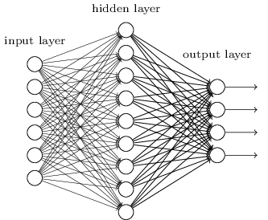

## What is Deep Learning?

- But you can use more layers


## Empirical Advantage

- Over time, networks have become deeper
- Empirically, they lead to higher accuracy

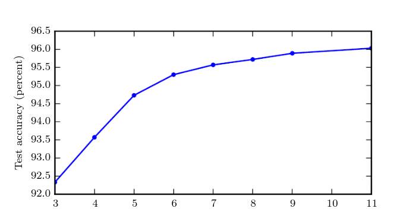

## Empirical Advantage

- Over time, networks have become deeper
- Empirically, they lead to higher accuracy


## Different than more neurons

- Scaling up neurons often doesn't help in shallow nets

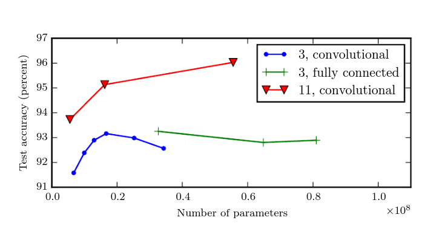


## Why is it better?

- We don't know for certain, but there are theories
  1. Hierarchical Features
  2. Increased Folds
  3. Easier to train (had problems)


## Hierarchical Features

- Deep networks enable hiearachical classification

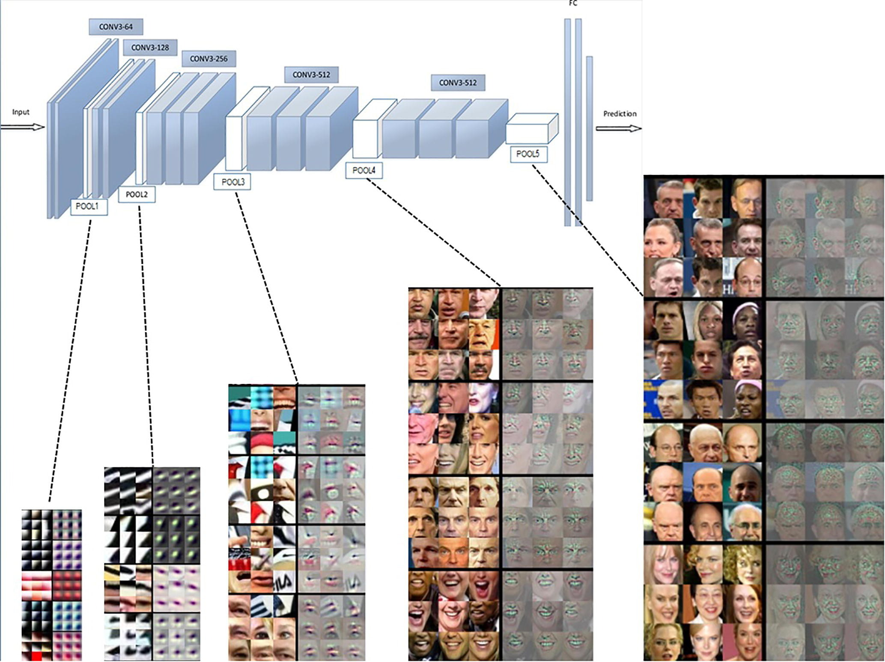


## Efficiency of Representing Certain Functions

- There are example of mathematical functions where shallow networks require "exponentially more" neurons compared with deeper networks
  - Computing the "parity" of a set of $n$ bits
- But generally, we want to think about how well a given architecture can approximate a function with a certain shape

  
  
## Folding 

- Can think about the graph of a neural network
- Each neuron adds a "fold" to graph


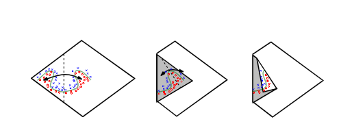


## Folding

- $k$ layers, width $n$
- Wide/Shallow net:
  - Regions per parameter is $R\sim k^c n^c$
- Deep/Narrow net:
  - Regions per parameter is $R\sim (n/c)^{k-1}$
- Exponentially more regions!

## Easier to Train Deep Networks?

- Turns out you can train a shallow network to "mimic" a deep one:
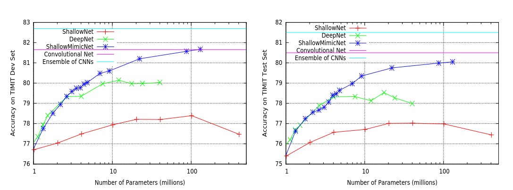

## Easier to train deep networks

- Suggests something stops shallow nets from converging well


## Vashing Gradients

- Landscape of deep network varies by layer:

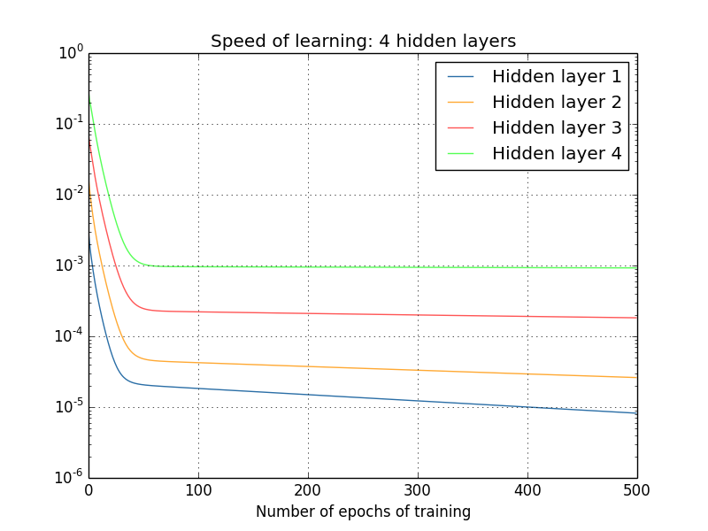{width=50%}

## Why Vanishing Gradients?

- Consider a deep network with one neuron per layer:
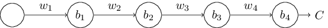
- If activation function is $\phi$ can write it as:
$$
f(x_1) = \phi \circ (w_n x + b_n) \circ \phi \circ (w_{n-1}x + b_{n-1}) \circ \\
\phi\circ \cdots\circ \phi \circ(w_1 x +b_1) (x_1)
$$

## Taking Derivatives

:::: {.columns}

::: {.column width=50%}
- The close to the output, the fewer "terms" in the derivative:
:::

::: {.column width=50%}

:::
::::


## Taking Derivatives

$$
\frac{\partial f}{\partial w_n} = \phi'(w_nx_n+b_n)x_n \\
\frac{\partial f}{\partial w_{n-1}} = \phi'(w_nx_n+b_n)w_n\phi'(w_{n-1}x_{n-1}+b_{n-1})x_{n-1} \\
\frac{\partial f}{\partial w_1} = \frac{x_1}{w_1}\prod_{i=1}^n\phi'(w_ix_i+b_i)w_i
$$

- We are multiplying by $\phi'$ and $w_i$ once for each layer


## Sigmoid Saturation

- Typical Activation functions are flat outside a narrow range

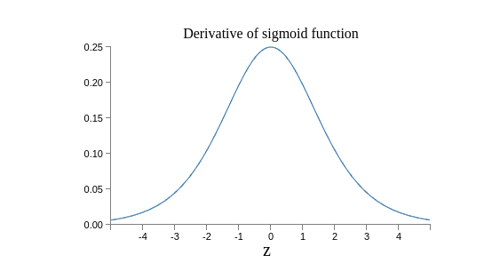

- Repeated multiplication by this derivative causes gradients to
shrink closer to the inputs

## Exploding Gradients?

- Gradients depend on the weights too:
  - Multiplication by $w_i\phi'(x_i)$
  - If $w_i$ are initialized big enough, gradients will explode towards inner layer
- This is rare because large weights typically saturate the $\phi$
function


## Condition Number of Hessian?

- When the Curvature of the objective varies, gradient based methods struggle
- It is possible/likely that all the tricks for deep learning are really about the Hessian condition number
- Hessian is sort of uncomputable for deep nets


## Condition Number of Hessian?

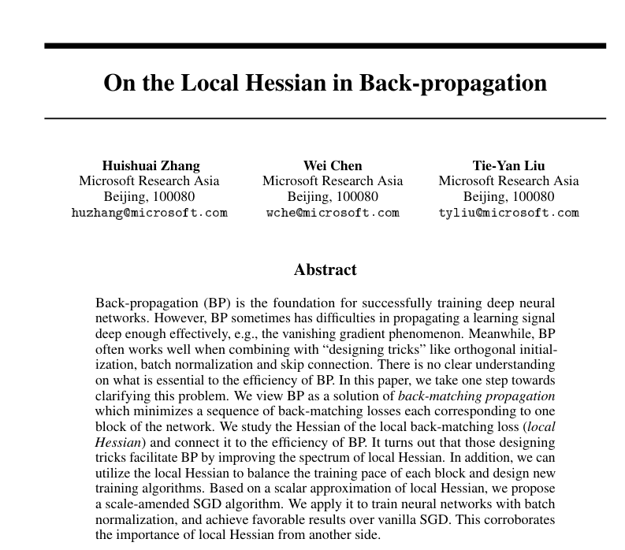


## Solutions: Initialization

- Gradient across layers depends on the weights
- By carefully choosing initial weights, gradients can
initially be uniform across all layers
- Xavier Glorot: 
$$
\mathrm{Var}(w_i) = \frac{2}{n_{i(i-1)}+n_{i(i+1)}} 
$$
- Have to turn the math cranks to see why


## Xavier Initialization

- Has a large effect on both activations and gradients

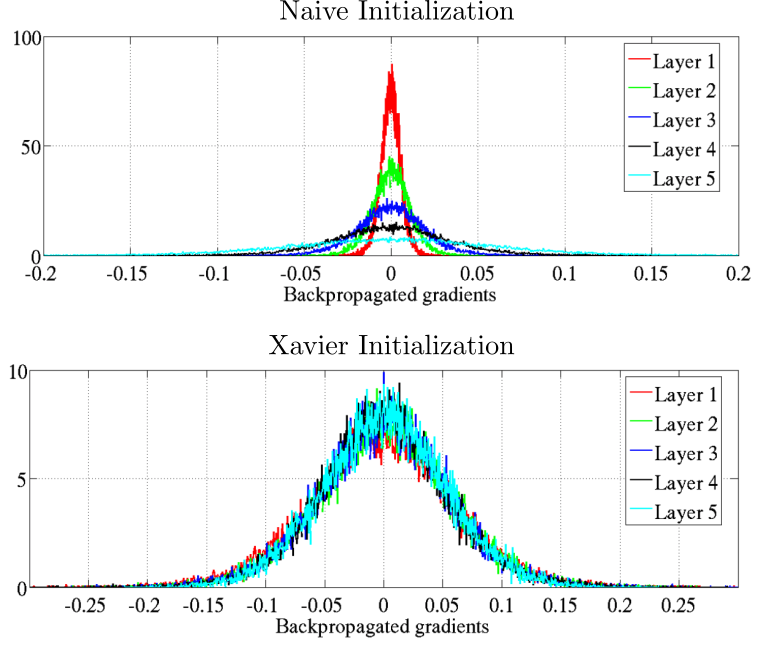{width=50%}

## Kaiming Normalization

- When training deep neural networks with ReLU neurons
$$
\mathrm{Var}(w_i) = \frac{2}{n_{i(i-1)}} 
$$

## Implementing Initializations

- In `pytorch`, default varies by layer type
- You have control:
```{python}
#| echo: true
#| eval: false

nn.init.xavier_normal_(layer.weight)
nn.init.xavier_uniform_(layer.weight)
nn.init.kaiming_normal_(layer.weight, nonlinearity='relu') 
nn.init.kaiming_uniform_(layer.weight,nonlinearity='relu')

```

- Normal versus Uniform? 
  - Unclear Theory, maybe normal for deeper nets

## Solution: Activations

- Rectified Linear Unit (ReLU)

$$
\phi(x) = \cases{0& \text{if} \quad x\leq 0 \\
                x& \text{if} \quad x>0}
$$

```{python}
import numpy as np
import matplotlib.pyplot as plt
xvec = np.linspace(-10,10,100)
yvec = np.heaviside(xvec,0)*xvec

plt.figure(figsize=(8, 4))
plt.plot(xvec, yvec, color='dodgerblue', linewidth=2)
plt.title('ReLU', fontsize=16)
plt.xlabel('x', fontsize=14)
plt.ylabel('$\phi(x)$', fontsize=14)
plt.grid(True, which='both', linestyle='--', linewidth=0.5, alpha=0.7)
plt.axhline(0, color='gray', linewidth=1)
plt.axvline(0, color='gray', linewidth=1)
plt.tight_layout()
plt.show()


```

## Why ReLU?

- Gradient either 0 (meaning path is dead) or 1
- Prevents Saturation
- Induces Sparsity
- Always piecewise linear function, no matter the depth
- Empirical observation


## What we didn't talk about...

- Convolutional Neural Networks, drop-out, early stopping, unsupervised learning, etc
- Residual Nets (ResNets)
  - Skip connections convexify!
  
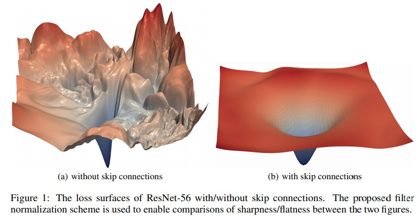{width=70%}

## Thanks!


