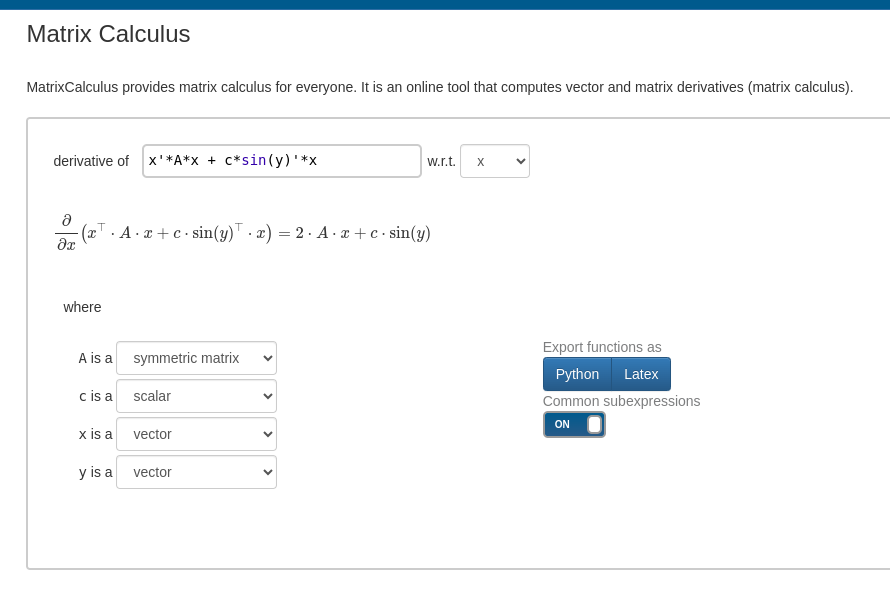
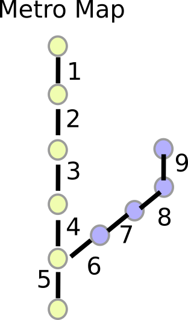
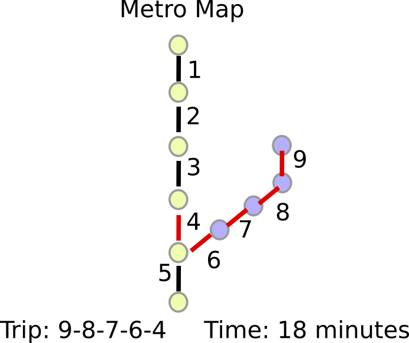
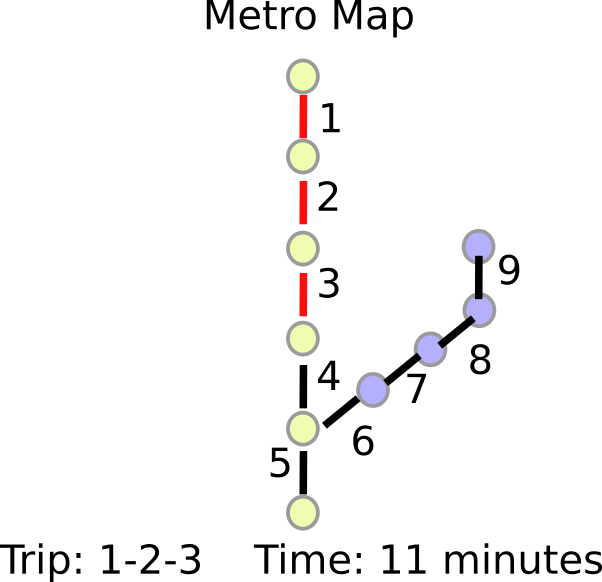
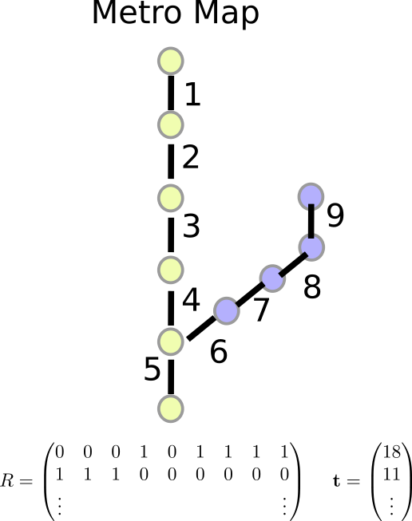

## Week Summary

-   Starting on Least Squares
-   Chapter 12 of VMLS
-   Keep working on Lab 1, due this Sunday at midnight

## System of Linear Equations

-   When can we solve: $$ A\mathbf{x} = \mathbf{b}\,?$$
-   $A$ is an $m\times n$ matrix
-   $\mathbf{x}$ is an $n$-vector
-   $\mathbf{b}$ is an $m$-vector

## Tall, Wide, and Square Matrices

-   $m=n$ **square**

-   Exact solution if rows/columns are independent
    $$ A = \begin{pmatrix} a_{11} & \cdots & \cdots & a_{1n} \\
                         \vdots &   \cdots     &    \cdots   & \vdots \\
                        \vdots & \cdots & \cdots & \vdots \\
                        a_{n1} & \cdots & \cdots & a_{nn}
                        \end{pmatrix} 
                        $$

-   $\mathbf{x} = A^{-1}\mathbf{b}$

## Tall, Wide, and Square Matrices

-   $m<n$ **wide**
-   Generally multiple solutions because dependent columns
    $$ A = \begin{pmatrix} a_{11} & \cdots & \cdots & \cdots & a_{1n} \\
                         \vdots &   \cdots     & \cdots &   \cdots   & \vdots \\
                        a_{m1} & \cdots & \cdots & \cdots & a_{mn}
                        \end{pmatrix} 
                        $$
-   Common ML situation (more parameters than data points)
-   Particular solution plus the null space

## Tall, Wide, and Square Matrices

-   $m>n$ **tall**
-   Generally no exact solution
    $$ A = \begin{pmatrix} a_{11} & \cdots &  a_{1n} \\
                         \vdots &   \cdots   & \vdots \\
                         \vdots &   \cdots   & \vdots \\
                         \vdots &   \cdots   & \vdots \\
                        a_{m1} & \cdots & a_{mn}
                        \end{pmatrix} 
                        $$

## Inspiration for Least Squares

-   Can't solve? Minimize the error
    $$ \mathbf{r} = A\mathbf{x}-\mathbf{b}$$
-   Optimization problem is:
    $$\textrm{Find:}\quad \min_{\mathbf{x}} \|A\mathbf{x} - \mathbf{b}\|^2$$
-   The $\mathbf{x}$ that minimizes this objective (the squared
    residual) is the least squares solution
-   Linear regression

## How to Solve It?

-   Take derivative and set to 0: $$
    \frac{\partial}{\partial \mathbf{x}}\|A\mathbf{x}-\mathbf{b}\|^2 = 
    2A^T A\left(\mathbf{x} - A^T\mathbf{b}\right)
    $$
-   Two ways to get that:
    {width="50%"}

## How to Solve It?

-   Take derivative and set
    to 0: $$
    \frac{\partial}{\partial \mathbf{x}}\|A\mathbf{x}-\mathbf{b}\|^2 = 
    2A^T A\left(\mathbf{x} - A^T\mathbf{b}\right)
    $$
-   Two ways to get that
    -   [matrixcalculus.org](https://www.matrixcalculus.org)
    -   Take derivatives, work with indices

## How to Solve It?

-   Get System of Linear Equations: $$ A^TA\mathbf{x} = A^T\mathbf{b} $$
-   $A^TA$ is an $n\times n$ symmetric matrix called the **Gram** matrix
-   Invertible if columns of $A$ are independent:

$$ \mathbf{x} = \left(A^T A\right)^{-1}A^T\mathbf{b}$$

-   This is the exact formula for the least squares solution

## Properties

-   Morse-Penrose Pseudoinverse: $$A^+ = (A^TA)^{-1}A^T$$
-   $n\times m$ matrix
-   If $A$ is invertible, $A^+ = A^{-1}$

## Applications: Linear Regression

-   Suppose you have $m$ observations, each with $n$ features
-   $\mathbf{a}_{i}$ is $i$th obs
-   Want to predict the variable $\mathbf{b}$ using an **Affine**
    function:
$$ \mathbf{a}_i^T\mathbf{x} +c = b_i $$
- or
    
    $$
    \sum_{j=1}^m a_{ij} x_j + c = b_i
    $$

## Linear Regression {.smaller}

-   Augmented matrix $A$ and coefficients $\mathbf{x}$: $$
    A = \begin{pmatrix} a_{11} & \cdots & a_{1n} & 1 \\
                      \vdots & \cdots & \vdots & 1 \\
                      a_{m1} & \cdots & a_{mn} & 1
                      \end{pmatrix}
    $$ $$
    \mathbf{x} = \begin{pmatrix} x_1 & x_2 & \cdots & x_n & c \end{pmatrix}^T
    $$
-   Now get standard least squares problem:

$$ \min_{\mathbf{x}}\|A\mathbf{x}-\mathbf{b}\|^2$$

## Applications: Marketing Budget {.smaller}

::::: columns
::: {.column width="50%"}
-   You are tasked with spending a marketing budget
-   There are $10$ different demographic groups to target
:::

::: {.column width="50%"}
|     |       Group        |
|:---:|:------------------:|
|  1  | 18-25, play sports |
|  2  | 26-30, play sports |
|  3  | 31-35, play sports |
|  4  | 36-40, play sports |
|  5  | 41-45, play sports |
|  6  |  18-25, no sports  |
|  7  |  26-30, no sports  |
|  8  |  31-35, no sports  |
|  9  |  36-40, no sports  |
| 10  |  41-45, no sports  |
:::
:::::

## Applications: Marketing Budget {.smaller}

::::: columns
::: {.column width="50%"}
-   You are tasked with spending a marketing budget
-   There are $10$ different demographic groups to target
-   4 different marketing channels
:::

::: {.column width="50%"}
|     |  Channel  |
|:---:|:---------:|
|  1  | Instagram |
|  2  | Wine Mag  |
|  3  | Facebook  |
|  4  |    UFC    |
:::
:::::

## Applications: Marketing Budget

-   Views: \$1 on channel $i$ gets $R_{ij}$ views in group $j$

```{python}
import numpy as np
import pandas as pd
import matplotlib.pyplot as plt
from plotnine import ggplot, geom_point, aes, stat_smooth, theme, facet_wrap, theme_set,     theme_gray, theme_bw, ylim


R = np.matrix([[3.0, 0.1, 0.4, 6.0],
               [2.5, 0.3, 0.6, 6.0],
               [2.3, 0.4, 1.0, 5.5],
               [1.8, 0.6, 1.3, 5.0],
               [1.0, 0.6, 2.0, 4.5],
               [3.3, 0.8, 0.5, 0.2],
               [2.6, 1.1, 0.8, 0.12],
               [2.2, 1.3, 1.1, 0.1],
               [1.4, 2.3, 1.3, 0.4],
               [1.2, 4.2, 1.7, 0.2],
               ])

R_data_frame = pd.DataFrame(R,
                columns = ['Instagram','Wine Mag','Facebook','UFC'])

R_data_frame['Demo'] = ["18-25 S","26-30 S", "31-35 S", "36-40 S", "41-45 S",
                        "18-25 NS","26-30 NS", "31-35 NS", "36-40 NS", "41-45 NS"]


print(R_data_frame)

R_data_frame[["Age","Activity"]] = R_data_frame["Demo"].str.split(" ",expand=True)

```

## Applications: Marketing Budget

-   Views: \$1 on channel $i$ gets $R_{ij}$ views in group $j$

```{python}
R_long = R_data_frame.melt(id_vars = ['Age','Activity','Demo'], value_vars = ["Instagram","Wine Mag", "Facebook", "UFC"])

(
  ggplot(R_long,aes(x="Age",y="value",color="Activity")) 
+ geom_point(size=5)
+ facet_wrap("variable") 
+ theme_bw(base_size = 14)
)

```

## Marketing Budget

-   Problem: spend money to get $\mathbf{v}_{dem}$ impressions
-   Decision variable $\mathbf{s}$ is spending in each channel
-   Solve least squares problem: $$
    \min_{\mathbf{s}} \|R\mathbf{s} - \mathbf{v}_{dem}\|^2
    $$
-   $R\mathbf{s}$ is views

## Marketing Budget

-   Suppose $\mathbf{v}_{dem}$ is uniform

```{python}
#| echo: true
#| eval: false
v_dem = np.ones(10)

s = np.linalg.lstsq(R,v_dem)[0]

s_dat = pd.DataFrame(s, columns = ["Spending"])
s_dat["Channel"] = ['Instagram','Wine Mag','Facebook','UFC'] 

(
  ggplot(s_dat,aes(x="Channel",y="Spending"))
  + geom_point(size=5) 
  + theme_bw(base_size=14)
)


```

## Marketing Budget

-   Suppose $\mathbf{v}_{dem}$ is uniform

```{python}
#| echo: false
#| eval: true
v_dem = np.ones(10)

s = np.linalg.lstsq(R,v_dem)[0]

s_dat = pd.DataFrame(s, columns = ["Spending"])
s_dat["Channel"] = ['Instagram','Wine Mag','Facebook','UFC'] 

(
  ggplot(s_dat,aes(x="Channel",y="Spending"))
  + geom_point(size=5) 
  + theme_bw(base_size=14)
)


```

## Marketing Budget

-   Suppose $\mathbf{v}_{dem}$ is uniform

```{python}
#| echo: false
#| eval: true


v_dat = pd.DataFrame(v_dem, columns = ["Target"])
#print(np.matmul(R,s).reshape(10,1))
v_dat["Views"] = np.matmul(R,s).reshape(10,1)
v_dat["Demo"] = R_data_frame['Demo']

v_dat = v_dat.melt(id_vars = "Demo", value_vars = ["Views","Target"])


(
  ggplot(v_dat,aes(x="Demo",y="value",color="variable"))
  + geom_point(size=5) 
  + theme_bw(base_size=14) 
  + ylim(0,1.2)
)


```

## Marketing Budget

-   Suppose we want to target only 41-45 Non-Sports Players

```{python}
#| echo: false
#| eval: true
v_dem = np.array([0,0,0,0,0,0,0,0,0,1])

s = np.linalg.lstsq(R,v_dem)[0]

s_dat = pd.DataFrame(s, columns = ["Spending"])
s_dat["Channel"] = ['Instagram','Wine Mag','Facebook','UFC'] 

(
  ggplot(s_dat,aes(x="Channel",y="Spending"))
  + geom_point(size=5) 
  + theme_bw(base_size=14)
)

```

## Marketing Budget

-   Suppose we want to target only 41-45 Non-Sports Players

```{python}
#| echo: false
#| eval: true


v_dat = pd.DataFrame(v_dem, columns = ["Target"])
#print(np.matmul(R,s).reshape(10,1))
v_dat["Views"] = np.matmul(R,s).reshape(10,1)
v_dat["Demo"] = R_data_frame['Demo']

v_dat = v_dat.melt(id_vars = "Demo", value_vars = ["Views","Target"])


(
  ggplot(v_dat,aes(x="Demo",y="value",color="variable"))
  + geom_point(size=5) 
  + theme_bw(base_size=14)
)

```

## Marketing Budget Issues

-   Need Constraints
    -   No negative money in adds: $\mathbf{s} \geq 0$
    -   No infinite budget: $\sum_{i}s_i \leq s_{max}$
-   Need a better objective function
    -   Weird to target precise $\mathbf{v}_{dem}$
    -   Better to have different value for each ad impression

## Network Tomography

::::: columns
::: {.column width="50%"}

:::

::: {.column width="50%"}
-   Urban Transit
-   Internet
-   Know when people enter and leave
-   Know path they took
-   How long does it take to cross each link?
:::
:::::

## Network Tomography



## Network Tomography



## Network Tomography



## Network Tomography

-   For trip $j$ vector $\mathbf{r}_j$
    -   $r_{ij} = 1$ if $i$th "link" traversed on $j$th trip
    -   $r_{ij} = 0$ otherwise
    -   Matrix $R$ contains $r_{ij}$
-   For $t_j$ is the time taken on trip $j$
-   Decision variables $d_i$ is the time taken on the $i$th link
-   Time is $\sum r_{ij}d_i$

## Network Tomography

-   Minimize Least Squares Error:

$$
\textrm{Find:}\quad \min_{\mathbf{d}} \|R\mathbf{d} - \mathbf{t}\|^2
$$

-   Many similar problems in optimization theory
-   This one is the simplest

## Numerical Issues With Least Squares

-   Suppose you need to solve a system of linear equations: $$ 
    A\mathbf{x} = \mathbf{b} 
    $$

-   Which of these is better?

    -   `np.linalg.inv(A) @ b`
    -   `np.linalg.solve(A, b)`

## Matrix Inverses

-   Consider Singular Value Decomposition of $A$: $$
    A = U\Sigma V^T
    $$
-   $U$ and $V$ are orthonormal matrices
-   $\Sigma$ contains the singular values $$
    \Sigma = \begin{bmatrix}
      \sigma_{1} & & \\
      & \ddots & \\
      & & \sigma_{n}
    \end{bmatrix}
    $$

## Condition Number and Accuracy

-   Accuracy of `np.linalg.inv(A) @ b` related to
    $\frac{\sigma_{max}}{\sigma_{min}}$
-   This is called the "condition number" of the matrix $A$

```{python}
import numpy as np
import timeit
n = 500
Q, _ = np.linalg.qr(np.random.randn(n, n))  
d = np.logspace(0, -10, n)  
A = Q @ np.diag(d) @ Q.T  
x = np.random.randn(n, 1)  
b = A @ x  

```

```{python}
#| echo: true

%timeit np.linalg.inv(A) @ b
%timeit np.linalg.solve(A,b)

x1 = np.linalg.inv(A) @ b
x2 = np.linalg.solve(A,b)

print("Matrix Inverse Error: ",np.linalg.norm(A @ x1 - b))
print("Linear Solve Error: ",np.linalg.norm(A @ x2 - b))

```

-   100 million times more accurate, 5 times faster

## Issue is worse for $A^TA$

-   What about $(A^TA)^{-1}$?
-   Let's look at SVD: $$ A^TA = V \Sigma^T\Sigma U^T$$
    $$ \Sigma^T\Sigma = \begin{bmatrix}
      \sigma_{1}^2 & & \\
      & \ddots & \\
      & & \sigma_{n}^2
    \end{bmatrix}
    $$
-   Condition number problems  💀 💀 💀 💀

## Do Ill-Conditioned Matrices Occur?

-   Very Common
-   Collinear predictors in linear regression
-   Main issue in Deep Learning
-   Noisy Inverse Problems
-   Some of the solutions are basically just regularization

## Alternatives

-   Software packages generally have routines to solve least squares
    without computing ill-conditioned matrix inverse
-   Good example is $A = QR$ factorization
-   Here $Q$ is orthogonal and $R$ is upper triangular
-   Then $$ 
    A^+ = (A^TA)^{-1}A^T = R^{-1} Q
    $$
-   In practice `np.linalg.linsolve(R,Q @ b)`

## What if $A$ is really big?

-   Constructing $A^TA$ costs $mn^2$ operations
-   Solving $A^TA\mathbf{x} = A^T\mathbf{b}$ costs $n^3$ operations
-   $A^TA$ could be a TB or larger.....
-   Solution 1- variety of iterative methods (HW)
-   Solution 2- Randomized Algorithms (Random Kaczmarz)

## Thanks!


