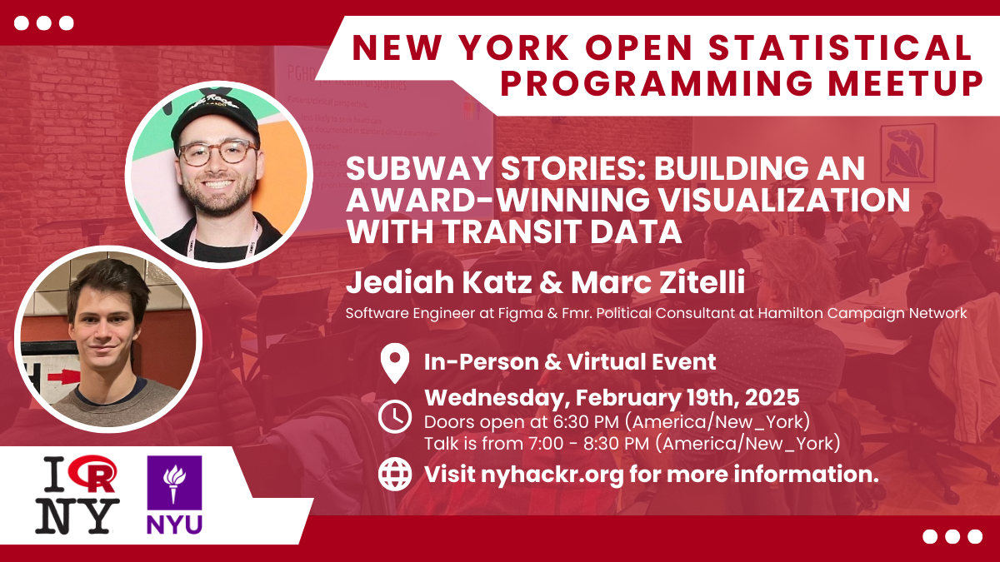
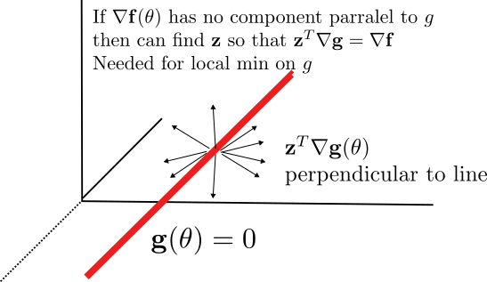
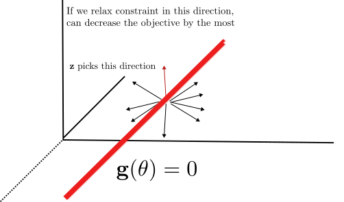
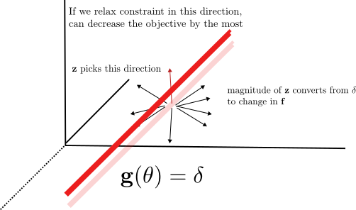
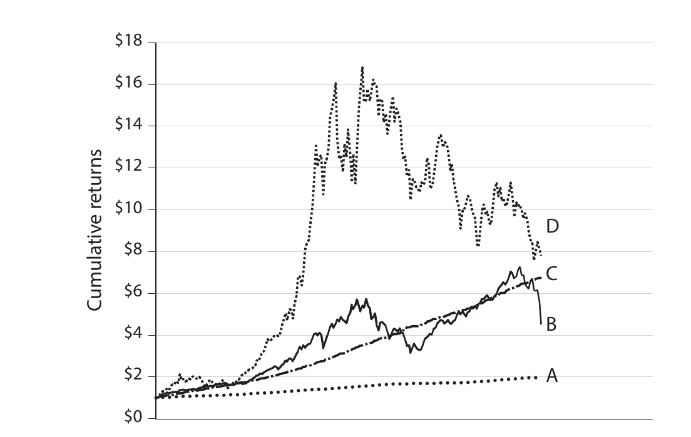
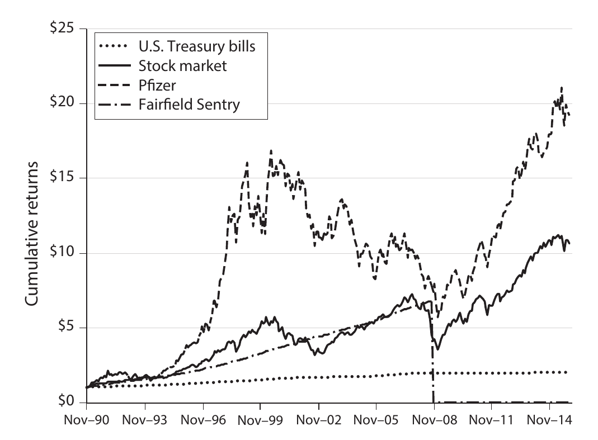

## Everything in life has constraints 

- Why can't you build a car with:
  - Speed of Ferrari
  - Practicality of minivan

{width="50%"}

## Everything in life has constraints

- Size brings weight and poor aerodynamics
- Power hurts durability
- Cost through the roof


{width="50%"}


## Everything in life has constraints

- This theme applies throughout life and is at the heart of optimization
- Your marketing team gives you a budget
- Your investors don't want to risk everything
- Your rocketship only has so much fuel


## Everything in life has constraints

- Without constraints, your optimization solution may be meaningless

- Figuring out the important constraints is a key part of modeling

- Today we will start to deal with a simple type of constraint in the context of least squares


## Weekly Summary

- Homework 2 due next Sunday 2/23 at midnight
- Readings for the week are Chapter 16 and 17 of VMLS
- We will talk about multi-objective problems later (skipped chapter 15)


## Events Happening this Week!


## Events Happening this Week

1. Career Readiness Bootcamp
  - Wednesday Februar 19th, Room 407 319 West 31st Street

[In person link](https://forms.office.com/pages/responsepage.aspx?id=s_BgbwZfCU6XFZiduozH2HbtHT07h8RHsqfEh3iJc1xUOFFYRzZLSk5MOEtVMFhXREpYR0ZQQTkyUy4u&route=shorturl)

[Virtual link](https://us02web.zoom.us/meeting/register/YOIAuEsQREmTrWa8KeGV4Q#/)


## Events Happening This Week!




## Events Happening this Week

2. New York Open Statistical Computing Meetup 
  - 6:30-8:30+, Pless Hall NYU
  - $7 tickets must RSVP
  - We have a group that attends these monthly meetups
  - I won't be there this week not sure how the attendance will be

[Register by Clicking Here](https://nyhackr.org/)


## Constrained Least Squares

- We will learn how to solve least squares with linear equality constraints today

$$
\min_{\mathbf{x}}\|A\mathbf{x} - \mathbf{b}\|^2 \\
C\mathbf{x} = \mathbf{d}
$$

- Here $C$ is a wide matrix
- $\mathbf{x}$ restricted to hyperplane

## Alternative Formulation

- Can also think of this as having $p$ linear constraints 

$$
\min_{\mathbf{x}}\|A\mathbf{x} - \mathbf{b}\|^2, \\
\mathbf{c}_i^T\mathbf{x} = d_i,\quad i=1,...,p
$$

- Here $C$ is a wide matrix
- $\mathbf{x}$ restricted to hyperplane


## Why Just Equality?

- Inequality constraints are useful too:

$$
\min_{\mathbf{x}}\|A\mathbf{x} - \mathbf{b}\|^2 \\
\mathbf{c}_i^T\mathbf{x} \leq d_i,\quad i=1,...,p
$$

- Could do it for one inequality constraint
- But for more than one you have a complicated region
- Need methods from later in the semester


## Example: B-Splines

- Suppose you have a noisy dataset and you want to fit it with a smoother curve
- Talked about polynomials last week
$$
f(x) = \sum_{i=0}^p \theta_i x^i
$$

## Polynomials are Bad Features

- Polynomials have strong symmetries
- Polynomials "blow-up" at edge of domain

```{r}
library(tidyverse)
library(ggplot2)
library(rethinking)
library(ggthemes)
library(ggokabeito)
polydat = tibble(x = seq(-1,1,length=100), p1 = 1, p2 = x^2, p3 = x^3, p4 = x^4, p5 = x^5, p6 = x^6)

polydat |> pivot_longer(cols = p1:p6, names_to = c("order")) |> mutate(order = as_factor(parse_number(order))) |> 
  ggplot(aes(x=x,y=value,color=order,group=order)) + geom_line(linewidth = 2) +
  theme_clean(base_size = 16) +
    theme( plot.background = element_rect(color = NA)) +
  labs(title = "Polynomial Features") +
  xlab("x") +
  ylab("y") +
  scale_color_okabe_ito()


```


## Polynomials are Bad Features

```{r}

data("cherry_blossoms")
cherry_blossoms |> filter(!is.na(doy)) |> ggplot(aes(x=year,y=doy)) + geom_point(color="red",alpha=0.5,size=2) +
    labs(title="Date of Cherry Blossom Flowering in Kyoto") +
    xlab("Year") +
    ylab("Day of Year") +
  theme_clean(base_size = 16) +   
  theme( plot.background = element_rect(color = NA)) 


```

- Wouldn't it make more sense to use features with more local structure?


  
## Example B-Splines

- Idea of B-Splines is to have local features
- Divide Domain into regions

```{r}
cherry_blossoms_2 = cherry_blossoms |> filter(!is.na(doy))

num_knots = 15
knot_list <- quantile(cherry_blossoms_2$year, probs = seq(from = 0, to = 1, length.out = num_knots))

num_spline = 4
knot_list[1] = knot_list[1]-3
knot_list[15] = knot_list[15] + 10

cherry_blossoms_2 = cherry_blossoms_2 |> mutate(region = cut(year,breaks = knot_list,right=FALSE,labels=FALSE)) |> mutate(region = if_else(is.na(region),num_knots,region))
regions = cherry_blossoms_2 |> pull(region) |> unique() |> max()


knot_df = tibble(knots = knot_list)

cherry_blossoms |> filter(!is.na(doy)) |> ggplot(aes(x=year,y=doy)) + geom_point(color="red",alpha=0.5) +
  geom_vline(data = knot_df,mapping = aes(xintercept=knots)) +
    labs(title="Date of Cherry Blossom Flowering in Kyoto") +
    xlab("Year CE") +
    ylab("Day of Year") +
  theme_clean(base_size = 16) +
    theme( plot.background = element_rect(color = NA)) 

```

## Do a fit within each region

- Have a small number of basis functions within each region
- Piecewise Constant: Basis is $1$

```{r}

A = matrix(0,nrow = nrow(cherry_blossoms_2),ncol = num_spline*(regions))

cherry_blossoms_2 = cherry_blossoms_2 |> mutate(adj_year = 2*(year - min(year))/(max(year)-min(year)) - 1)
AAlt = matrix(0,nrow = nrow(cherry_blossoms_2),ncol = (regions))

for (n in 1:nrow(cherry_blossoms_2)){
  region = cherry_blossoms_2$region[n]
  year = cherry_blossoms_2$year[n]
  adj_year = cherry_blossoms_2$adj_year[n]
  A[n,(4*(region-1) + 1):(4*(region))] = c(1,adj_year,adj_year^2,adj_year^3) 
  AAlt[n,region] = 1
  
}

x_Vec = cherry_blossoms_2$doy
x = cherry_blossoms_2$doy
theta_fit = lm(x_Vec ~ A - 1)
theta_alt = lm(x ~ AAlt - 1)
theta = theta_fit$coefficients

doy_fit = A %*% theta
doy_fit_constant = AAlt %*% theta_alt$coefficients
year_min = min(cherry_blossoms_2$year)
year_max = max(cherry_blossoms_2$year)


cherry_blossoms_2 |> mutate(doy_fit = doy_fit,doy_fit_constant = doy_fit_constant) |> ggplot(aes(x=year,y=doy)) + geom_point(color="red",alpha=0.2) +
  geom_vline(data = knot_df,mapping = aes(xintercept=knots)) +
  geom_line(mapping = aes(x= year, y = doy_fit_constant), color = "blue") +
    labs(title="Piecewise Constant Fit") +
    ylab("Day of Year") +
  theme_clean(base_size = 16) +
      theme( plot.background = element_rect(color = NA)) 


```


## Do a fit within each region

- B-Spline uses more polynomials
- Cubic is most common $1$, $x^2$, $x^3$, $x^4$

```{r}

cherry_blossoms_2 |> mutate(doy_fit = doy_fit ) |> ggplot(aes(x=year,y=doy)) + geom_point(color="red",alpha=0.2) +
  geom_vline(data = knot_df,mapping = aes(xintercept=knots)) +
  geom_line(mapping = aes(x= year, y = doy_fit), color = "blue") +
    labs(title="Piecewise Cubic Fit") +
    ylab("Day of Year") +
  theme_clean(base_size = 16) +
      theme( plot.background = element_rect(color = NA)) 


```

## Piecewise Cubic Fit

```{r}

cherry_blossoms_2 |> mutate(doy_fit = doy_fit) |> ggplot(aes(x=year,y=doy)) + geom_point(color="red",alpha=0.2) +
  geom_vline(data = knot_df,mapping = aes(xintercept=knots)) +
  geom_line(mapping = aes(x= year, y = doy_fit), color = "blue") +
    labs(title="Piecewise Cubic Fit") +
    ylab("Day of Year") +
  theme_clean(base_size = 16) +
      theme( plot.background = element_rect(color = NA)) 


```

- Not the jumps at each of the knots
- To make the fit function "smooth" we need to add constraints

## Problem that was Solved

- Problem so far:
  $$f_{ij}(x) = x^{i-1},\quad \mathrm{if: }\quad  \mathrm{knot}_j \leq x < \mathrm{knot}_{j+1},\\
  f_{ij}(x) = 0,\quad \mathrm{otherwise} $$
- $i \in 1\,...\,4$, $j \in 1\, ... \mathrm{number\, of\, knots}$
$$ A_{k,(4(j-1)+i)} = f_{ij}(x_k) $$ 
$$ \min_{\theta} \|A\mathbf{\theta} - \mathbf{x}\|^2$$

## Adding Constraints

- Want the predictions to match at each knot:
$$ \sum_{i=1}^{4} \theta_{ij}\left(\mathrm{knot}_j\right)^{i-1} = \sum_{i=1}^{4} \theta_{i,j+1}\left(\mathrm{knot_{j}}\right)^{i-1} $$
- Also want derivatives to match at each knot:
$$
\sum_{i=2}^{4} (i-1)\theta_{ij}\left(\mathrm{knot}_j\right)^{i-2} = \sum_{i=2}^{4} (i-1)\theta_{i,j+1}\left(\mathrm{knot_{j}}\right)^{i-2}
$$


## Full Problem

- Each knot produces two linear equations
- Can write overall as $C\mathbf{\theta} = \mathbf{d}$
- Full Problem:

$$\mathrm{find:}\quad \min_{\mathbf{\theta}}\|A\mathbf{\theta} - \mathbf{x}\|^2 \\
\mathrm{subject\, to:\quad C\mathbf{\theta} = \mathbf{d}}$$


## How to solve it?

- Brute force way
  - $C\mathbf{\theta} = \mathbf{d}$ can be solved
  - Get a "hyperplane" of solutions because underdetermined
  - Reformulate least squares and solve
- Or use Lagrange Multipliers


## Lagrange Multipliers {.smaller}

- Constrained problem into unconstrained

$$\mathrm{find:}\quad \min_{\mathrm{\theta}} \mathbf{f}(\mathbf{\theta}) \\
\mathrm{subject\, to:} \quad \mathbf{g}(\mathbf{\theta}) = 0 $$

- Lagrangian:
$$ L(\mathbf{\theta},\mathbf{z}) = f(\mathbf{\theta})-\mathbf{z}^Tg(\mathbf{\theta})$$

- Critical points of $L$ are potential minima of the constrained problem

## Why does it work?

- Critical points of $L$:
$$
\frac{\partial L(\mathbf{\theta},\mathbf{z})}{\partial\theta} = \nabla \mathbf{f}(\theta) - \mathbf{z}^T\nabla \mathbf{g}(\theta) = 0 \\
\frac{\partial L(\mathbf{\theta},\mathbf{z})}{\partial\theta} = \mathbf{g}(\theta) = 0
$$
- Get back the constraint equations
- First equation says that gradient of objective has to be made parallel to
gradients of constraints


## Geometric Explanation

- $\mathbf{g(\theta)} = 0$ defines a lower dimensional shape
  - The more equations the less dimensionality of the shape
  - $n$ equations gives points (0D)
  - $n-1$ equations gives curves (1D)
  - $n-2$ equations gives surfaces (2D)
- $\mathbf{z}^T\nabla\mathbf{g}(\theta)$ is a linear combination of constraint gradients

## Geometric Explanation


  
 


## Lagrange Multiplier For Least Squares

$$
L(\mathbf{\theta},\mathbf{z}) = \|A\mathbf{\theta}-\mathbf{x}\|^2 + \mathbf{z}^T\left(C\mathbf{\theta}-\mathbf{d}\right)
$$

- Gives us:

$$
\frac{\partial L(\theta,\mathbf{z})}{\partial \theta} = 
  2A^T\left(A\mathbf{\theta} - \mathbf{x}\right) + C^T\mathbf{z} = 0,\\
  \frac{\partial L(\theta,\mathbf{z})}{\partial \theta} = C\theta -\mathbf{d} = 0
$$


## KKT Matrix

- Lagrange multiplier equations are linear, can write a matrix equation:
$$
\begin{bmatrix}
2A^TA & C^T \\
C & 0 
\end{bmatrix} 
\begin{bmatrix} \mathbf{\theta} \\ \mathbf{z}  \end{bmatrix} 
= 
\begin{bmatrix} 2A^T\mathbf{x} \\ \mathbf{d} \end{bmatrix}
$$

- Bottom row implements the constraints
- Matrix is called _KKT_ matrix

## Conditions on A and C

- When is KKT matrix invertible?
- $n+p\times n+p$
- $C$ has indepdendent
  - Otherwise can't find $\mathbf{z}$
  - Implies $C$ is wide
- $\begin{bmatrix} A \\ C\end{bmatrix}$ has independent columns
  - Go wrong if not enough data

## $\mathbf{z}$ are Shadow Prices

- What is the meaning of the $\mathbf{z}$ from the solution?




## $\mathbf{z}$ are Shadow Prices

- What is the meaning of the $\mathbf{z}$ from the solution?




## Shadow Prices

- Let's say your constraint is negotiable
- Change your constraint to $C\theta = \mathbf{d}+\mathbf{\delta}$
- Objective changes by:
$$ \|A\theta_{new}-\mathbf{x}\|^2 - \|A\theta_{old} - \mathbf{x}\|^2 \approx \mathbf{z}^T\delta $$
- If your objective function was a _cost_ then $\mathbf{z}$ can be interpreted as a price per unit of constraint.


## Implementing the B-Splines: Knots

```{r}
#| echo: true
#| eval: false

num_knots = 15
knot_list <- quantile(cherry_blossoms_2$year,
                      probs = seq(from = 0, to = 1, 
                                length.out = num_knots))
regions = num_knots
num_spline = 4

cherry_blossoms_2 = cherry_blossoms_2 |> mutate(region = cut(year,breaks = knot_list,right=FALSE,labels=FALSE)) |> mutate(
  region = if_else(is.na(region),num_knots,region))

cherry_blossoms_2 = cherry_blossoms_2 |> mutate(
  adj_year = 2*(year - min(year))/(max(year)-min(year)) - 1)

```

- normalizing the year variable is important for the condition number of
resulting Gram matrix and constraints!


## Implementing the B-Splines: A

```{r}
#| echo: true


A = matrix(0,nrow = nrow(cherry_blossoms_2),ncol = num_spline*(regions))

for (n in 1:nrow(cherry_blossoms_2)){
  region = cherry_blossoms_2$region[n]
  year = cherry_blossoms_2$year[n]
  adj_year = cherry_blossoms_2$adj_year[n]
  A[n,(4*(region-1) + 1):(4*(region))] = c(1,adj_year,adj_year^2,adj_year^3) 
}

```

- For each data point, we find the corresponding `region`
- For each `region` for values of `theta`
- Calculate basis functions

## Implementing the B-Spline: C

```{r}
#| echo: true
C = matrix(0,nrow = 2*(regions-1),ncol = 4*regions)

min_year = min(cherry_blossoms_2$year)
max_year = max(cherry_blossoms_2$year)

adj_knot_list = 2*(knot_list-min_year)/(max_year-min_year) - 1

for (i in 1:(regions-1)){
  C[2*i-1,(4*(i-1)+1):(4*i+4) ] = c(1,adj_knot_list[i+1],
      adj_knot_list[i+1]^2, adj_knot_list[i+1]^3,
  -1, -adj_knot_list[i+1], -adj_knot_list[i+1]^2,
  -adj_knot_list[i+1]^3)

    C[2*i,(4*(i-1)+1):(4*i+4)] = c(0,1,2*adj_knot_list[i+1],
    3*adj_knot_list[i+1]^2, 0, -1, -2*adj_knot_list[i+1],
    -3*adj_knot_list[i+1]^2)
}

```


## Forming the KKT Matrix and RHS

```{r}
#| echo: true
n_thetas = ncol(A)
p_constraints = nrow(C)
KKT = matrix(0,nrow = n_thetas+p_constraints ,n_thetas+p_constraints)

KKT[1:n_thetas,1:n_thetas] = 2*t(A) %*% A
KKT[1:n_thetas,(n_thetas+1):(n_thetas+p_constraints)] = t(C)
KKT[(n_thetas+1):(n_thetas+p_constraints),1:n_thetas] = C

rhs_ext = matrix(0,nrow = n_thetas+p_constraints,ncol = 1)

doy = cherry_blossoms_2$doy

rhs_ext[1:n_thetas,1] = 2*t(A) %*% doy


```

## Solving the Problem

```{r}
#| echo: true
#| eval: false
theta_ext = solve(KKT,rhs_ext)
theta_sol = theta_ext[1:n_thetas]
z_sol = theta_ext[(n_thetas+1):(n_thetas+p_constraints)]

doy_pred = A %*% theta_sol

cherry_blossoms_2 |> mutate(doy_pred = doy_pred) |> 
  ggplot(aes(x=year,y=doy)) + geom_point(color="red",alpha=0.2) +
  geom_vline(data = knot_df,mapping = aes(xintercept=knots)) +
  geom_line(mapping = aes(x= year, y = doy_pred), color = "blue") +
    labs(title="B-Spline Fit") +
    ylab("Day of Year") +
  theme_clean(base_size = 16)

```

## Solving the Problem


```{r}

theta_ext = solve(KKT,rhs_ext)
theta_sol = theta_ext[1:n_thetas]
z_sol = theta_ext[(n_thetas+1):(n_thetas+p_constraints)]

doy_pred = A %*% theta_sol

cherry_blossoms_2 |> mutate(doy_pred = doy_pred) |> 
  ggplot(aes(x=year,y=doy)) + geom_point(color="red",alpha=0.2) +
  geom_vline(data = knot_df,mapping = aes(xintercept=knots)) +
  geom_line(mapping = aes(x= year, y = doy_pred), color = "blue") +
    labs(title="B-Spline Fit") +
    ylab("Day of Year") +
  theme_clean(base_size = 16) +
      theme( plot.background = element_rect(color = NA)) 


```

- Jumps are gone!

## Example: Portfolio Optimization

- You have a budget of $d$ dollars to invest in financial assets
- Portfolio allocation weights $\mathbf{w}$ describe how much you invest in each asset 
- You will hold the portfolio over some well defined period 


## Portfolio Terminology

- Short positions, $w_i < 0$ for some $i$
- Leverage = $\sum_{i=1}^n |w_i|$
  - Measures how much money you have borrowed
  - Have to pay interest in real world
- Risk Free Asset
  - Usually one asset is a cash or treasury equivalent with low to no risk and
  return

## Portfolio Returns {.smaller}

- On day $t$, value of asset $i$ changes by $R_{it}$
- $R_{it} = 1.05$ is a $5\%$ gain, $0.91$ a $9\%$ loss, $0$ a 100% loss, etc
- After an investment period of $T$ days, overall portfolio value:
$$
d_T = d\sum_{i=1}^n\Pi_{t=1}^T R_{it}w_i 
$$
- Note that returns are multiplicative over time
- Often annualize return: $\rho_{A} = \rho_T^{T_y/T}$, where $T_y$ trading days per year


## Portfolio Risk

- Day to day variability of portfolio is called risk
- Define $\bar{\rho} = \frac{1}{T}\sum_{t=1}^T \sum_{i=1}^n R_{it}w_t$
- Compute variance
$$
\mathrm{var}\left(\rho\right) = \frac{1}{T}\sum_{t=1}^T\left(\sum_{i=1}^n R_{it}w_i - \bar\rho \right)^2
$$
- Annualized risk defined as $\sqrt{T_{y}}\sqrt{\mathrm{var(\rho)}}$

## Covariance Formulation

- Can also measure risk based on covariance matrix between daily returns of each asset:
$$
\Gamma_{ij} = \frac{1}{T}\sum_{i=1}^T \left(R_{it} -\bar{\rho}_i\right)\left(R_{jt} - \bar{\rho}_j\right)
$$
- Then:
$$
\mathrm{var}(\rho) = \mathbf{w}^T\Gamma\mathbf{w} 
$$


## Markowitz Portfolio Optimization {.smaller}

- Goal: Use past data to estimate future returns $\rho_i$ and correlations $\Gamma$
- Calculate portfolio weights $\mathbf{w}$ to minimize risk while achieving a target return

$$
\mathrm{find:}\quad \min_{\mathbf{w}} \mathbf{w}^T\Gamma\mathbf{w} \\
\mathrm{subject\, to:}\quad \sum_{i=1}^n w_i = 1 \\
\sum_{i=1}^n \rho_i w_i = \rho_{g}
$$

- This is a least squares (actually least norm) problem with $\Gamma$ taking role of Gram matrix $A^TA$


## Risk Return Tradeoff

- Which asset would you pick?

  {width="60%"}

## Risk Return Tradeoff

- Medium reward "no risk" asset was Bernie Madoff

  {width="60%"}

## Risk Return Tradeoff

- Minimizing risk at a high return target leads to high leverage
- Risk to go bust out of sample

## Thanks!

