## Zoology of Optimization Problems

$$ \min_{\mathbf{x}} f(\mathbf{x}) \\
g_i(\mathbf{x}) \leq 0, i=1, \cdots, p
$$ 

- Different "names" for optimization problems based on what $f$ and
$g$ are

## Zoology: Linear Programs (LP)

$$ \min_{\mathbf{x}} \mathbf{c}^T\mathbf{x} \\
A\mathbf{x} \leq \mathbf{d}
$$

## Zoology: Quadratic Programming (QP)

$$ \min_{\mathbf{x}} \frac{1}{2} \mathbf{x}^T P \mathbf{x} + \mathbf{c}^T\mathbf{x} \\
A\mathbf{x} \leq \mathbf{d}
$$ 

- $P$ positive (semi)-definite

## Zoology: Quadratic Programming Quadratic Constraints (QCQP)

$$ \min_{\mathbf{x}} \frac{1}{2} \mathbf{x}^T P \mathbf{x} + \mathbf{c}^T\mathbf{x} \\
\frac{1}{2} \mathbf{x}^T P_i \mathbf{x} + \mathbf{c}_i^T\mathbf{x} \leq \mathbf{d}_i \\
A\mathbf{x} = \mathbf{b}
$$

## Zoology: Others...

-   Semidefinite Programming
-   Conic Optimization
-   Second Order Cone Programming

## Development

-   These problems were studied sequentially starting in the 1800s
-   Development of Computer in the 1940s led to wide application
-   Change in perspective:
    -   Pre 1970s, Linear problems are easy, linear hard
    -   Post 1970s, Convex problems are easy, non-convex hard
    
## Development

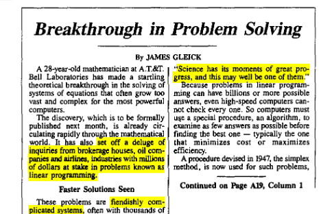

## Development

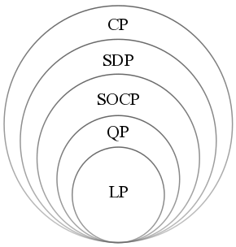

## Week(s) Ahead

-   We begin convex optimization today
-   We will learn how to recognize and formulate convex problems
-   At first it will seem weird, but stick with it
- Next two weeks: Understanding whether constraint sets are convex

## How will we solve Convex Problems?

- For us $f$ will be convex and so will be the constraint set

- The hard part is recognizing the convexity, algorithms are very well developed

```{python}
#| echo: true
#| eval: false

import cvxpy as cp
x = cp.Variable()
y = cp.Variable()

# DCP problems.
prob1 = cp.Problem(cp.Minimize(cp.square(x - y)),
                    [x + y >= 0,
                    x >= 4,
                    y <= 1])
prob1.solve()
```

## What is a Convex Set

-   If you draw a line between any two points in the set, the entire
    line will be in the set

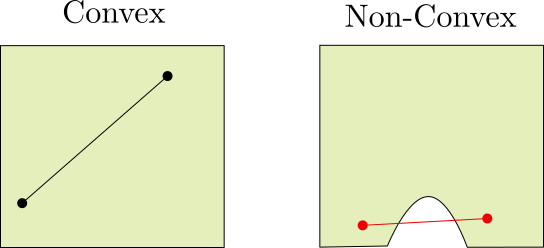

## What is a Convex Set

-   If even one pair of points exists where this fails, the set is not
    convex


## Why is Convexity Important?

-   Convex optimization: local minimum always coincides with global
    minimum
-   Local minimum is findable

## Why is Convexity Important?

::::: columns
::: {.column width="70%"}
```{python}
#| echo: false
import numpy as np
import matplotlib.pyplot as plt
from mpl_toolkits.mplot3d import Axes3D

def f(x,y):
  return -np.exp(-(x)**2 - (y+1.5)**2)

xx = np.linspace(-2,2,100)
yy = np.linspace(-2,2,100)
x, y = np.meshgrid(xx, yy)
fvals = np.zeros_like(x)

fvals = f(x,y)
fig, ax = plt.subplots(figsize=(8,6))

cplot = ax.contourf(x,y,fvals,cmap = "viridis")
plt.colorbar(cplot,extend="both")
ax.scatter(0,-1.5,s=30,color="red")
ax.legend()
plt.xlim([-2,2])
plt.ylim([-2,2])
```
:::

::: {.column width="30%"}
-   Convex region
-   Single Local Min
:::
:::::

## Why is Convexity Important?

::::: columns
::: {.column width="70%"}
```{python}
#| echo: false
import numpy as np
import matplotlib.pyplot as plt
from mpl_toolkits.mplot3d import Axes3D

def f(x,y):
  return -np.exp(-(x)**2 - (y+1.5)**2)

xx = np.linspace(-2,2,100)
yy = np.linspace(-2,2,100)
x, y = np.meshgrid(xx, yy)
fvals = np.zeros_like(x)

fvals = f(x,y)
fig, ax = plt.subplots(figsize=(8,6))

def yfunc(x):
  if abs(x)>0.5:
    return(-2)
  return(-1.0-4*x**2)
vyfunc = np.vectorize(yfunc)
yvec = -1.0-4*xx**2
yvec[yvec<-2]=-2

mask = y < -1.0-4*x**2

fvals[mask] = np.nan

fmin = np.where(fvals == np.nanmin(fvals))

cplot = ax.contourf(x,y,fvals,cmap = "viridis",vmin=-1.05,vmax=0)
plt.colorbar(cplot,extend="both")

xmin = [fmin[1],99-fmin[1]]
ymin = [fmin[0],fmin[0]]
ax.plot(xx,yvec,color="black",linewidth=6)
ax.scatter(x[ymin,xmin],y[ymin,xmin],s=50,color="red",zorder = 10)

ax.legend()
plt.xlim([-2,2])
plt.ylim([-2,2])
```
:::

::: {.column width="30%"}
-   Nonconvex
-   Many local min
:::
:::::

## Convex Combinations

-   If we have two points $\mathbf{x}_1$ and $\mathbf{x}_2$, a convex
    combination is: $$
    \theta_1\mathbf{x}_1 + (1-\theta_1)\mathbf{x}_2,
    $$

where $0\leq\theta_1\leq 1$

-   Genearlize to more points (weighted averages): $$
    \sum_i \theta_i\mathbf{x}_i, \quad 0\leq \theta_i, \quad
    \sum_i \theta_i = 1
    $$

## Math Definition of Convex Sets

-   A set is convex is for every pair of points $\mathbf{x}_1$ and
    $\mathbf{x}_2$ in the set, every convex combination of those two
    points is in the set.

```{python}

thetaVec = np.linspace(0,1,100)
x1 = np.reshape(np.array([-1,-1]),(2,1))
x2 = np.reshape(np.array([1,2]),(2,1))
line = x1*thetaVec + (1-thetaVec)*x2
fig, ax = plt.subplots(figsize=(6,4))

C = plt.Circle((0,0),3,color="red",alpha = 0.3)
plt.plot(line[0,:],line[1,:])
plt.gca().add_artist(C)
plt.xlim([-4,4])
plt.ylim([-4,4])
plt.text(x1[0]+0.2,x1[1],s="$x_1$, $\\theta=0$",fontsize=18)
plt.text(x2[0]-1.2,x2[1],s="$x_2$, $\\theta=1$",fontsize=18)
plt.text(x1[0]*0.5+x2[0]*0.5+0.2,x1[1]*0.5+x2[1]*0.5,s="$\\theta=0.5$",fontsize=18)
plt.scatter([x1[0],x2[0]],[x1[1],x2[1]],s=20,zorder=10,color="red")
```

## Definition Not Useful In Practice

-   Using the definition is a last resort
-   Instead, we will use a constructive approach
    1.  Have example convex sets
    2.  Have operations that preserve convexity
    3.  Write target set use operations on examples


## Affine Sets (Lines, Planes, Hyperplanes)

::::: columns
::: {.column widt="50%"}
-   $y = ax + b$
-   Solutions of: $$
    A\mathbf{x} = \mathbf{d}
    $$
-   Underdetermined Case
:::

::: {.column width="50%"}
```{python}

z = 0.5*x-0.2*y+1.5

zline = -xx+0.2*yy
fig, ax = plt.subplots(figsize=(8,6),subplot_kw={"projection": "3d"})
ax.plot_surface(x,y,z,cmap="viridis")
ax.plot(xx,yy,zline,color = "blue")


```
:::
:::::


## Convex Hull

-   Suppose you have a non-convex set
-   Define a new set to be the convex combination of all the points in
    the set

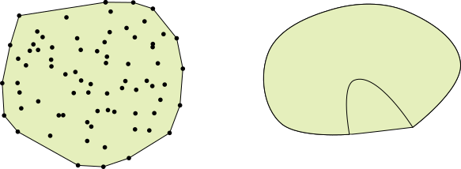

## Examples: Polyhedra

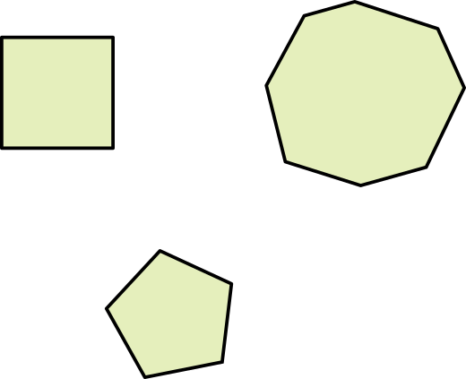

## What is a polyhedron?

-   Solution set of linear inequalities and equations

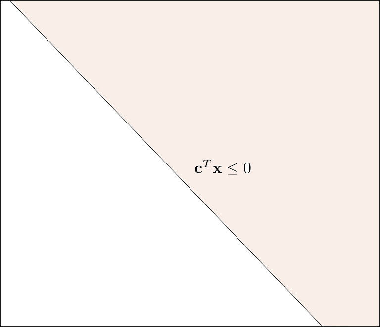

## What is a polyhedron?

-   Solution set of linear inequalities and equations

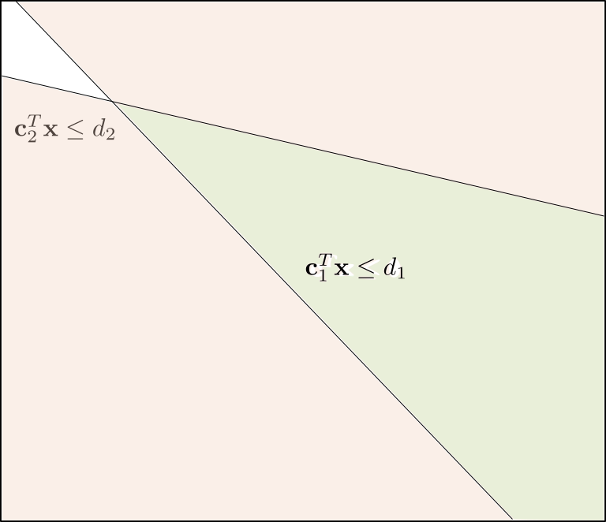

## What is a polyhedron?

-   Solution set of linear inequalities and equations

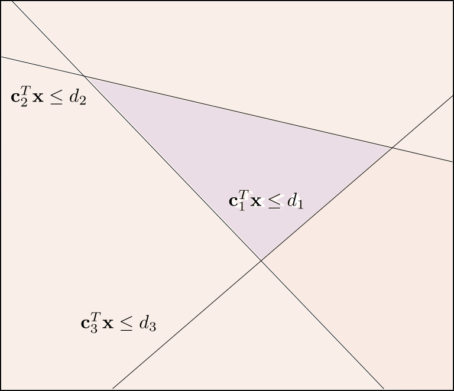

## What is a polyhedron?

-   Solution set of linear inequalities and equations

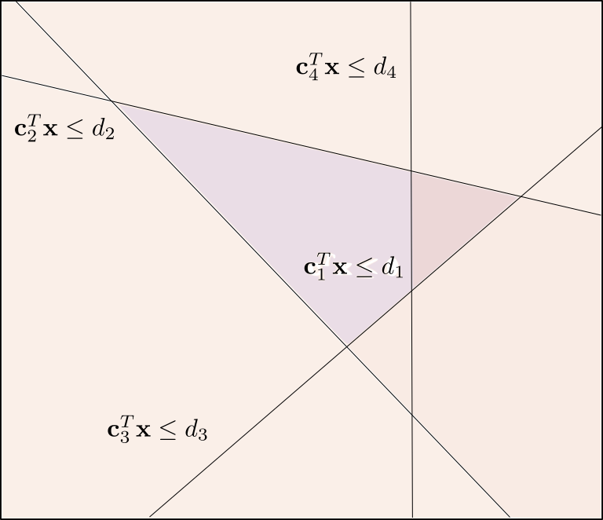

## What is a Polyhedron?

-   Solution set of linear inequalities and equations

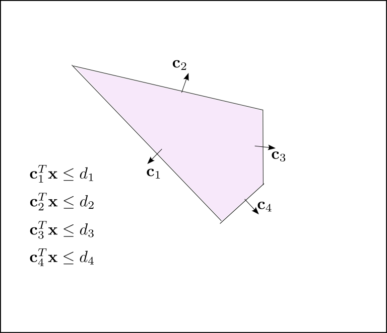

## What is a Polyhedron?

-   Solution set of linear inequalities and equations

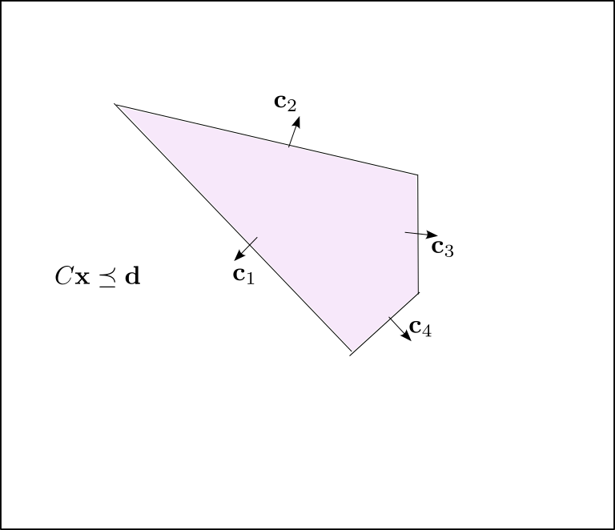

## What is a Polyhedron?

-   Solution set of linear inequalities and equations

$$\{x\, |\, C\mathbf{x}\preceq \mathbf{d},\, A\mathbf{x} = \mathbf{h} \}$$

-   $\preceq$ stands for componentwise inequality
-   True if every single entry satisfies inequality
-   Sometimes `polyhedron` stands for closed, `polytope` stands for open

## Example: Designing a Healthy Diet

::::: columns
::: {.column width="50%"}
-   You are in charge of buying food
- Large org
  - Army
  - School System
  - NGO/UN

-   Food $i$ has $V_{ij}$ of nutrient $j$
:::

::: {.column width="50%"}
        
| Nutrient        | Content |
|-----------------|---------|
| Calories (kCal) | 100     |
| Fat (g)         | 2       |
| Carbs (g)       | 20      |
| Protein (g)     | 2       |
| Vitamin C (mg)  | 90      |
| Fiber (g)       | 4       |
Oranges

:::
:::::

## Example: Designing a Healthy Diet

- Each nutrient has a minimum and/or maximum

| Nutrient | Minimum | Maximum |
|----      |------- | -------- |
| Calories | 2500   |         |
| Fat      | 50     |         |
| Carbs    | 200    |         |
| Protein  | 40     | 200     |
| Vitamin C| 100    | 1000    |
| Fiber    | 20     | 80      |

## Recommended Values Become Inequalities

- $\mathbf{w}$ is the diet vector, containing
how much of each food we buy per person
- Let $\mathbf{v}_j$ be the $j$th row of $V$  how much of nutrient $j$ each food contains
- Then for each nutrient get an inequalities:
$$
l_{min,j} \leq \mathbf{v}_j^T \mathbf{w} \leq l_{max,i} 
$$


## RDV Constraints

- Split the inequalities up:

$$
-\mathbf{v}_j^T\mathbf{w} \leq -l_{min,j} \\
\mathbf{v}_j^T\mathbf{w} \leq l_{max,j}
$$

## Constraints are a polyhedron

- Form matrix $U$ from rows $\mathbf{v}$
- If both positive and negative, include both
$-\mathbf{v}_j$ and $\mathbf{v}_J$.
- If only have a negative or positive, include just one
- $\mathbf{l}$ contains upper and lower bounds
- Add constraint that $-\mathbf{w}\preceq 0$
$$ U\mathbf{w} \preceq \mathbf{l}$$

## Each Food Has a Cost

- Each food has a cost $c_i$
- Describe with vector $\mathbf{c}$
- Objective function $\mathbf{c}^T\mathbf{w}$
- Optimization Problem:

$$ 
\min_{\mathbf{w}} \mathbf{c}^T\mathbf{w} \\
U\mathbf{w} \preceq \mathbf{l}
$$

## Simplex

:::: {.columns}

::: {.column width=50%}
- Simplex is set of points satisfying:
$$
\{\mathbf{p}\, |\, \sum_{i}p_i=1,\, p_i\geq 0\}
$$

- Discrete probability distribution
:::

::: {.column width=50%}
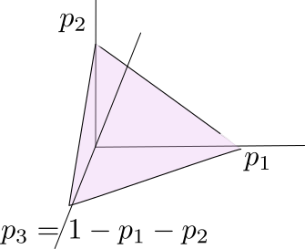
:::
::::
## Half-Planes

:::: {.columns}

::: {.column width=50%} 
- Special case of polyhedron (and also cone)
- $\mathbf{c}^T\mathbf{x} \leq d$
:::

::: {.column width=50%}
```{python}
fig, ax = plt.subplots(figsize=(5,5))

a = 1.
b = -1.
c = 0.

x = np.array([-1e13, 1e13])
y = c/b - a / b * x

# ax.set_autoscale_on(False)
ax.fill_between(x, y, -1e20,alpha=0.2)
ax.set_xlim([0, 10])
ax.set_ylim([0, 10])

plt.quiver(*[5,5], [-1], [1], scale=21)


plt.text(5.,5.5,s='$\\mathbf{c}$', fontsize=18)

plt.show()

```
:::
::::


## Balls and Ellipsoids

- Ball has center and radius
$$ 
B(\mathbf{x}_c,r) = \{\mathbf{x}\,|\, \|\mathbf{x}-\mathbf{x}_c\|\leq r\}
$$
```{python}

fig, ax = plt.subplots(figsize=(6,4))
xc = [1,-1]
r = 2
C = plt.Circle(xc,r,color="gray",alpha = 0.2)
plt.plot([1,1],[-1,1],color='k')
plt.gca().add_artist(C)
plt.xlim([-2,4])
plt.ylim([-4,2])
plt.text(xc[0]+0.2,xc[1],s="$\\mathbf{x}_c$",fontsize=18)
plt.text(xc[0]-0.3,xc[1]+1,s="$r$",fontsize=18)

plt.scatter(xc[0],xc[1],s=20,zorder=10,color="k")

```

## Balls and Ellipsoids

- Ellipsoid described by positive definite matrix $P$
$$ 
E(\mathbf{x}_c,P) = \{\mathbf{x}\,|\, (\mathbf{x}-\mathbf{x}_c)^TP^{-1}(\mathbf{x}-\mathbf{x}_x)\leq 1\}
$$

```{python}
from matplotlib.patches import Ellipse
fig, ax = plt.subplots(figsize=(6,4))
xc = [1,-1]
r = 2
C = Ellipse(
    xy=xc,
    width=3,
    height=1,
    angle=45,
    facecolor="gray",
    edgecolor="gray",
    alpha=0.2
)

plt.plot([1,1-.5/np.sqrt(2.0)],[-1,-1+.5/np.sqrt(2)],color='k')
plt.plot([1,1+1.5/np.sqrt(2.0)],[-1,-1+1.5/np.sqrt(2)],color='k')
plt.gca().add_artist(C)
plt.xlim([-1,3])
plt.ylim([-3,1])
plt.text(xc[0]-0.2,xc[1]-0.4,s="$\\mathbf{x}_c$",fontsize=18)
plt.text(xc[0]-0.2,xc[1]+0.3,s="$\\sqrt{\\lambda_2}$",fontsize=18)
plt.text(xc[0]+0.6/np.sqrt(2),xc[1]+0.2+0.75/np.sqrt(2),s="$\\sqrt{\\lambda_1}$",fontsize=18)

plt.scatter(xc[0],xc[1],s=20,zorder=10,color="k")

```
## Balls and Ellipsoids

- Ellipsoid described by positive definite matrix $P$
- Alternately:
$$ 
E(\mathbf{x}_c,P) = \{\mathbf{x}\,|\, \|A\mathbf{x}-\mathbf{x_c}  \|\leq 1  \},
$$
- Where $P = A^TA$, $A$ square, non-singular

## Examples:

- Limit on expected return variance in a portfolio:
  - $\mathbf{w}^T\Gamma\mathbf{w} \leq v_{max}$
- Limit on distance of an antenna from a transmitter:
  - $\|\mathbf{x}-\mathbf{x}_c\|< r$


## Cones

- Cone is a set which has the following property:
- If $\mathbf{x}$ is in the cone, then $\theta \mathbf{x}$ is also in the cone, for $\theta\geq 0$ 

```{python}
x1 = np.linspace(0,4,100)
y1 = 2*x1
y2 = 0.5*x1

fig, ax = plt.subplots()


ax.plot(x1, y1,color="gray" )
ax.plot(x1, y2,color = "gray")
ax.fill_between(x1, y1, y2, where=(y1 > y2), color='C0', alpha=0.3)


```

## Conic Combination

:::: {.columns}

::: {.column width=50%}
- Like convex combination, but $\theta$ can be large:
$$
\sum_{i}\mathbf{x}_i\theta_i,\, \theta_i \geq 0 
$$
:::

::: {.column width=50%}

```{python}
x1 = np.linspace(0,4,100)
y1 = x1
y2 = 0.0*x1

fig, ax = plt.subplots()
C = plt.Circle((2.0,0.81),0.82,color="red",alpha = 0.3)


ax.plot(x1, y1,color="gray" )
ax.plot(x1, y2,color = "gray")
ax.fill_between(x1, y1, y2, where=(y1 > y2), color='C0', alpha=0.3)
plt.gca().add_artist(C)
plt.gca().set_aspect('equal')


```

:::
::::


## Conic Combination

:::: {.columns}

::: {.column width=50%}
- Like convex combination, but $\theta$ can be large:
$$
\sum_{i}\mathbf{x}_i\theta_i,\, \theta_i \geq 0 
$$
:::

::: {.column width=50%}

```{python}
x1 = np.linspace(0,4,100)
y1 = x1
y2 = 0.0*x1

fig, ax = plt.subplots()

xp = np.zeros(12)
xp[0:10] =np.random.uniform(0,4,10)
xp[10] = 2
xp[11] = 2
yp= np.zeros(12)
yp[0:10]= xp[0:10]*np.random.uniform(0,1,10)
yp[10] = 0
yp[11] = 2

ax.plot(x1, y1,color="gray" )
ax.plot(x1, y2,color = "gray")
ax.fill_between(x1, y1, y2, where=(y1 > y2), color='C0', alpha=0.3)
plt.gca().set_aspect('equal')
plt.scatter(xp,yp,zorder=10)


```

:::
::::

## Norm Balls and Norm Cone

- For any norm $N$:
$$
B_N(r,\mathbf{x}_c) = \{\mathbf{x}\,|\, \|\mathbf{x}-\mathbf{x}_c\|_N < r\}
$$
- $B_N(r,\mathbf{x}_c)$ is Convex and called a "Norm Ball"

- Norm Cone:
$$
\{[\mathbf{x}\,, t]\,|\, \|\mathbf{x}\|_N \leq t\}
$$

## Norm Cone

- Here the $t$ is restricting how wide $\mathbf{x}$ is allowed to be

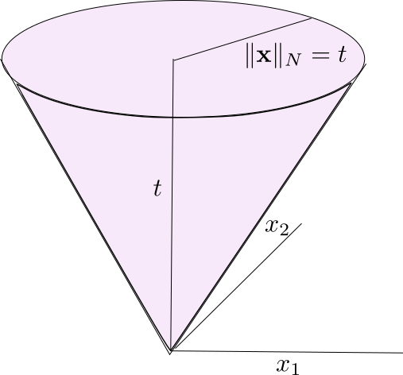


## Optimization Under Uncertainty

- Consider "uncertain" nutrition optimization problem
$$ 
\min_{\mathbf{w}} \mathbf{c}^T\mathbf{w} \\
U\mathbf{w} \preceq \mathbf{l}
$$
- The nutrient contents in $U$ are random
- Variance $\sigma_i$, for each nutrient, mean $\bar{U_i}$.
- Insist that:
$$
\bar{U_i}\mathbf{w} + k\|\sigma_i^T\mathbf{w}  \| \leq l_i
$$


## Thanks!

