## Week Summary
- Covering Section 2.3 of `cvxbook`
- Material is unusual, normal to feel confused
- We will use `cvx` for first time
  - [cvxpy](https://www.cvxpy.org/tutorial/dcp/)
  - [cvxr](https://cvxr.rbind.io/)
- Lab 3 Due this Sunday

## Start Thinking About Miniproject

- Over next month, start thinking about how your interests relate with something we have covered or are going to cover
- Least Squares, Convex Optimization, or Deep Learning/non-convex optimization
- Ask me if you want suggestions
- Target complexity is homework assignment


## Addendum on Cones

- Not all cones are convex!
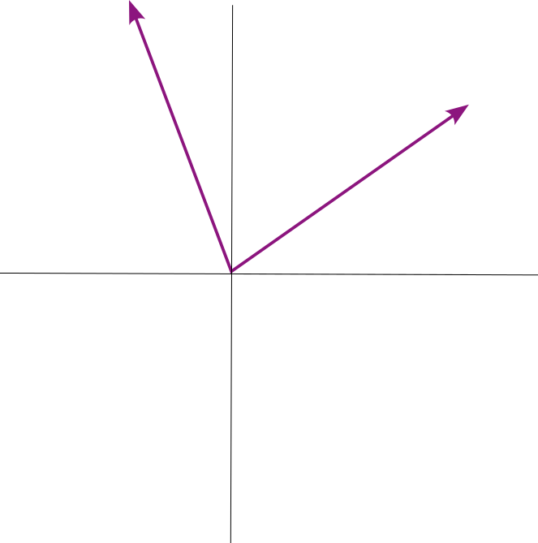{width=60%}

## When is a cone convex?

- Convex iff closed under addition 
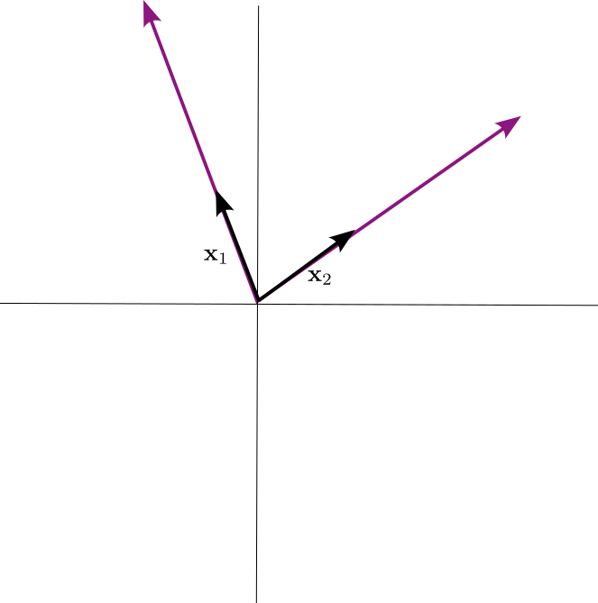{width=60%}

## When is a cone convex?

- Convex iff closed under addition 
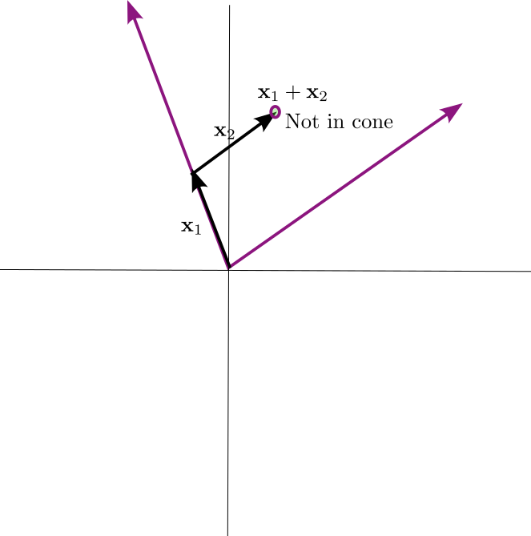{width=60%}

## When is a cone convex?

- Convex iff closed under addition 
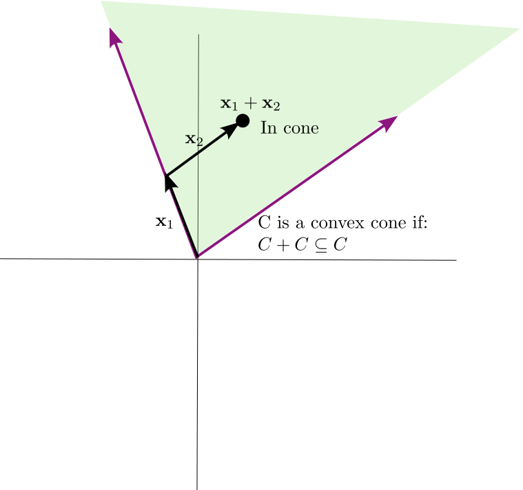

## How to show a set is convex?

- Suppose you have a problem and some constraints

1. Brute force math: 
- Try to prove that for every $\mathbf{x}_1$ and $\mathbf{x}_2$ in set, 
  $\theta\mathbf{x}_1+(1-\theta)\mathbf{x}_2$ is in the set, if $0\leq\theta\leq1$
- Only for simplest sets

## How to show a set is convex

2. Using convex functions (next weeks)
- Graph of a convex function
- Technically how `CVX` works


## How to show a set is convex
  
3. Show how to build your set from simpler convex sets
  - Intersection
  - Transformations: Linear/Affine, Perspective, Linear Fractional Mapping


## How to show a set is (not) convex

4. If you are stuck, brute force numerics
  - Generate random points in set
  - Check random convex combinations
  - Wait a long time

## Intersection

- Intersection is shared points


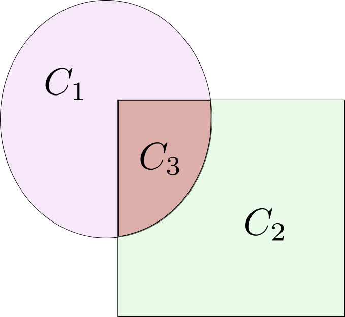{#fig-int width=30%}

$$ C_3 = C_1 \cap C_2 $$


## Intersections of Convex are Convex

:::: {.columns}

::: {.column width=50%}
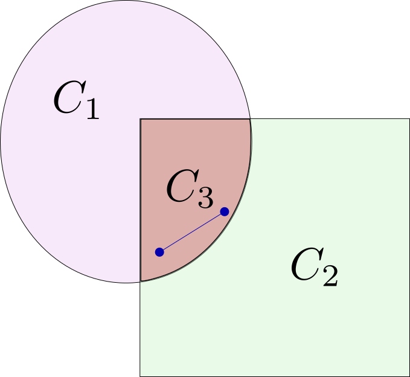

:::

::: {.column width=50%}
- Even an infinite intersection
:::
::::
  


## Infinite Constraints Example

- Suppose we can several locations where we are allowed to build some quantity of renewable energy plants. 

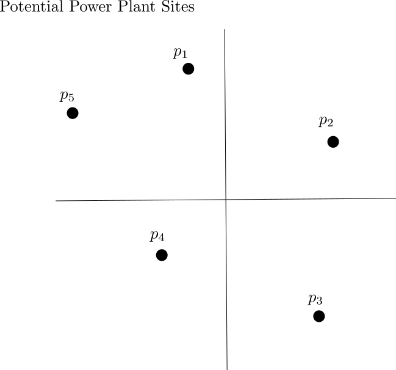

## Infinite Constraints Example

- $p_i(t)$ power function for each plant over a typical day


## Infinite Constraints Example

- $p_i(t)$ power function for each plant over a typical day

```{python}
import numpy as np
import matplotlib.pyplot as plt
cos = np.cos
sin = np.sin
pi = np.pi

def p1(t):
  return(1.0 + 0.4*np.sin(2*pi*(t-0.3)) + 0.1*np.cos(4*pi*t) + 0.3*np.sin(4*pi*t) + 0.2*np.cos(8*pi*t) + 0.1*np.sin(8*pi*t))

def p2(t):
  return(1.5 + 0.4*np.sin(2*pi*(t+0.3)) + 0.2*np.cos(4*pi*t) + 0.2*np.sin(4*pi*t) + 0.4*np.cos(8*pi*t) + 0.5*np.sin(8*pi*t))

def p3(t):
  if sin(2*pi*t)<0.0:
    return(0)
  return(4.0*sin(2*pi*t)*(1 + 0.1*np.sin(4*pi*t)-0.05*np.cos(6*pi*t)))

def p4(t):
  if sin(2*pi*(t-0.1))<0:
    return(0)
  
  return(3.0*np.sin(2*pi*(t-0.1))*(1+0.1*cos(8*pi*(t-0.1))+0.07*sin(6*pi*(t-0.1))))
  

def p5(t):
  if sin(2*pi*(t+0.1))<0:
    return(0)
  return(3.5*sin(2*pi*(t+0.1))*(1+0.1*cos(6*pi*(t+0.1))+0.03*sin(3*pi*(t+0.1))))


def p_func(t,i):
  if i==0:
    return(p1(t))
  if i==1:
    return(p2(t))
  
  if i==2:
    return(p3(t))
  
  if i==3:
    return(p4(t))
    
  if i==4:
    return(p5(t))

    
tvec = np.linspace(0,1,1000)

pvec = np.zeros([1000,5])
for i in range(5):
  for t in range(1000):
    pvec[t,i] = p_func(tvec[t],i)
    

plt.plot(tvec,pvec[:,0],label = "p_1")
plt.plot(tvec,pvec[:,1],label = "p_2")
plt.plot(tvec,pvec[:,2],label = "p_3")
plt.plot(tvec,pvec[:,3],label = "p_4")
plt.plot(tvec,pvec[:,4],label = "p_5")

plt.legend()
plt.title("Expected Power Production at Each Site")
plt.ylabel("Power")
plt.xlabel("Time of Day")
plt.show()

    


```


## Infinite Constraints Example


- Let $w_i$ stand for the size of renewable plant we build at location $i$.

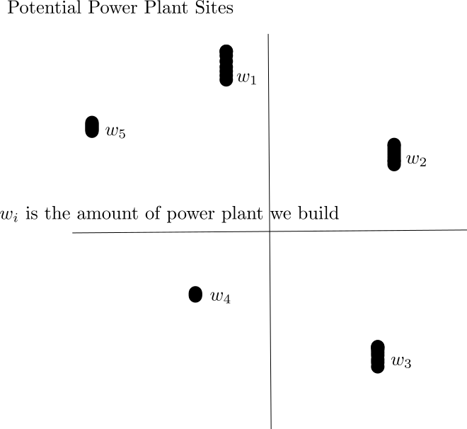


## Infinite Constraints Example

- The total power generated at time $t$:
$$
p_{tot}(t) = \mathbf{p}(t)^T\mathbf{w}
$$


## Infinite Constraints

- Guarantee that the level of power above demand level:

$$
\mathbf{p}(t)^T\mathbf{w} \geq d_{min}(t)
$$

```{python}


def dfunc(t):
  
  return (1+0.5*sin(2*pi*t))

dvec = dfunc(tvec)
plt.figure(figsize=(6,4))
plt.plot(tvec,dvec,label = "demand",linestyle="-")
plt.plot(tvec,np.sum(0.5*pvec,1),label="Test Supply")
plt.title("Demand versus Supply")
plt.ylabel("Power")
plt.legend()
plt.show()


```


## Infinite Constraints


- For each individual time point $t$, this inequality describes a convex set
- Because $\mathbf{p}(t)^T\mathbf{w} \geq d_{min}(t)$ linear in $\mathbf{w}$
- Take intersection over $t$
$$
C = \bigcap_t \{\mathbf{w}\,|\, \mathbf{p}(t)^T\mathbf{w} \geq d_{min}(t) \}
$$
- $C$ is a convex set


## Mapping a Set

- Can apply a function $f$ to an entire set to generate a new set
- Doesn't have to be in the same space: $f:\, \mathbb{R}^m \mapsto \mathbb{R}^n$

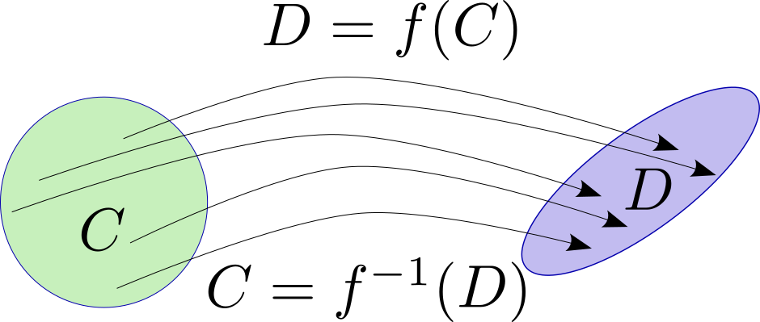{width=50%}


## Mapping a Set

- Image of $C$ under $f$:

$$f(C) = \{x\, |\, x = f(y)\, \mathrm{for}\, y \in C\}$$

{width=70%}


## Mapping a Set

- Other Direction: Preimage of $C$ under $f$:

$$ f^{-1}(C) = \{x\, |\, f(x) \in C\} $$
{width=70%}


## Linear/Affine Transformations

- If $C$ is convex, and $f$ is affine $f(\mathbf{x}) = A\mathbf{x} + \mathbf{b}$
  - $f(C)$ is convex
  - $f^{-1}(C)$ is convex

- Can scale and shift convex sets


## Implication: 

- Consider following set of constraints:

$$
A\mathbf{x} \leq \mathbf{d} \\
x_1^2 + x_2^2 \leq 4
$$

- First constraint is convex set
- Second one describes a set where $x_1$ and $x_2$ are inside a circle, but rest of coordinates unconstrained

## Implication:

- Define operator $P$ that is identity on $x_1$ and $x_2$ and ignores the rest:

$$
P = \begin{bmatrix} 1 & 0 & 0 & \cdots & 0 \\
                    0 & 1 & 0 & \cdots & 0 \end{bmatrix}
$$


- Circle of radius $2$ in $\mathbb{R}^2$ is convex 
- Preimage of circle under $P$ is also convex

## Cartesian Product

- Have two sets of variables $\mathbf{x}_1$ and $\mathbf{x}_2$.
- Have two convex sets $C_1$ and $C_2$, over each set of variables
- Cartesian product of $C_1$ and $C_2$ is convex:
$$
C_1\times C_2 = \{ \begin{bmatrix} \mathbf{x}_1 \\ \mathbf{x}_2 \end{bmatrix} \, | \, \mathbf{x}_1 \in C_1, \mathbf{x}_2 \in C_2 \}
$$
- Can freely combine convex sets in different groups of variables

## Intersection with an arbitrary line

- $C$ is convex if and only if $C \cap L$ is convex for every line $L$

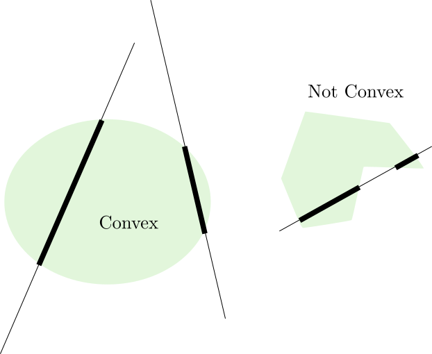

## Intersection with an arbitrary line

- $C$ is convex if and only if $C \cap L$ is convex for every line $L$
- If $C$ is convex, then it is true by intersection
- If all intersections are convex, then all intersections are segments so
$C$ is convex by the definition


## Application: Quadratic Inequality

- Consider $A\succeq 0$  
$$
\{\mathbf{x}\, |\, \mathbf{x}^T A \mathbf{x} + \mathbf{x}^T b \leq \alpha\}
$$
- Why intuitively should this be convex?
  - $\mathbf{x}^TA\mathbf{x} \leq \alpha$ is an ellipsoid 


## Quadratic Inequality

- Consider $A\succeq 0$  
$$
\{\mathbf{x}\, |\, \mathbf{x}^T A \mathbf{x} + \mathbf{x}^T b \leq \alpha\}
$$

- Define line $L = \{\mathbf{x}\, |\, \mathbf{x} = t\mathbf{v} + \mathbf{v}_0,\, t\in\mathbb{R} \}$
- Substitute:
$$
t^2 (\mathbf{v}^TA\mathbf{v} ) + t(2\mathbf{v}^TA\mathbf{v_0} + \mathbf{v}^T\mathbf{b}) \leq \alpha - \mathbf{v_0}^T A\mathbf{v_0} - \mathbf{v}_0^T\mathbf{b}
$$

## Quadratic Inequality

- Two possibilities:
- $\mathbf{v}^T A \mathbf{v} = 0$
  - Then it is convex because polyhedron
- $\mathbf{v}^TA\mathbf{v} \geq 0$
- $\mathbf{x}^T A \mathbf{x} + \mathbf{x}^T b \leq \alpha$ is convex
- Doesn't work if inequality is in other direction


## Quadratic Inequality

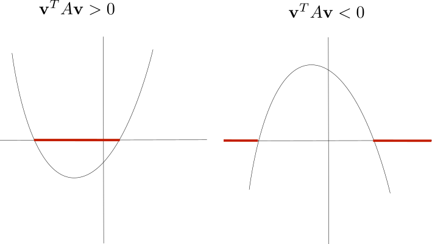


## Example Problem

- Suppose we have a variable $x$ which takes values $a_i$ for $i=1,\cdots,n$
- $p(x=a_i) = p_i$ is a probability distribution
- Is the set $\{\mathbf{p}\, |\, \mathrm{var}(x) \geq \alpha\}$ convex?

## How to approach?

- $\mathrm{var}(x) = \sum_{i} p_i(a_i - \bar{x})^2$
- Expand it out more:
$$
\mathrm{var}(x) = \sum_{i} \left(p_i a_i^2 \right) - \left(\sum_i p_i a_i\right)^2 \geq \alpha
$$
- This is a quadratic inequality with matrix $A=\mathrm{diag}(a_i^2)$
- Thus convex
- Then intersection with simplex also convex

## Example Problem

- What if we wanted variance lower than $\alpha$?
- Not convex in general


## Perspective Function

- $f(\mathbf{x},t) = \frac{\mathbf{x}}{t}$, for $t>0$
- Interpretation: Image taken through a pinhole camera with hole at origin, surface at $t=-1$
- $f(C)$ and $f^{-1}(C)$ both convex if $C$ is convex 

## Linear Fractional Function

- Perspective is special case
- $f(\mathbf{x}) = \frac{A\mathbf{x}+\mathbf{b}}{\mathbf{c}^T\mathbf{x}+\mathbf{d}}$
  - for $\mathbf{c}^T\mathbf{x} + \mathbf{d} \gt 0$
- $f(C)$ and $f^{-1}(C)$ both convex if $C$ is convex


## Example: Conditional Probability

- Consider discrete probability distribution over two variables:
$$p(i,j) = \mathrm{prob(x=i,y=j)}$$
- Conditional probability $p(i|j) = \frac{p(i,j)}{\sum_{i'}p(i',j)}$
- Linear fractional function of joint probabilities
- A convex set of joint probabilities becomes a convex set of conditional probabilities


## Intro to CVX

- `CVX` is software that solves convex optimization problems
- Based on `disciplined convex programming` or `DCP`
- Has library of functions with known curvature
- `CVX` verifies convexity of objectives and constraints

## Intro to CVX

- Build expressions out of variables and constants


```{python}
#| echo: true
import cvxpy as cvx

# 6 dimensional vector of unknowns
x = cvx.Variable(6)

# 12x6 dimensional matrix of unknowns
A = cvx.Variable((12,6))

# Scalar variable
y = cvx.Variable()

# Constants are numpy ndarrays

x_mean = np.random.randn(6)

```

## Intro to CVX

- `atomic functions` define objective and constraints

```{python}
#| echo: true
margin = 0.2

problem = cvx.Problem(
  cvx.Minimize(cvx.norm(x)), # Objective (this one is least squares)
  [x - x_mean >= -margin , # These are the constraints
  x - x_mean <= margin]
)

# Check convexity?
obj = cvx.Minimize(cvx.norm(x))
print(obj.is_dcp())


```

## Intro to CVX

- Use `atomic functions` to define objective and constraints

```{python}
#| echo: true
margin = 0.2

problem = cvx.Problem(
  cvx.Minimize(cvx.norm(x)), # Objective (this one is least squares)
  [x - x_mean >= -margin , # These are the constraints
  x - x_mean <= margin]
)

# Check convexity of constraints?

print((x - x_mean >= - margin).is_dcp())
print((x - x_mean <=   margin).is_dcp())


```


## Intro to CVX

- Use `atomic functions` to define objective and constraints

```{python}
#| echo: true
margin = 0.2

problem = cvx.Problem(
  cvx.Minimize(cvx.norm(x)), # Objective (this one is least squares)
  [x - x_mean >= -margin , # These are the constraints
  x - x_mean <= margin]
)

# Check everything at once?

print(problem.is_dcp())


```


## Intro to CVX

- Use `atomic functions` to define objective and constraints

```{python}
#| echo: true
margin = 0.2

problem = cvx.Problem(
  cvx.Minimize(cvx.norm(x)), # Objective (this one is least squares)
  [x - x_mean >= -margin , # These are the constraints
  x - x_mean <= margin]
)

# Check everything at once?

print(problem.is_dcp())


```

## Intro to CVX

- Solve using `problem.solve()`

```{python}
#| echo: true
margin = 0.2

problem = cvx.Problem(
  cvx.Minimize(cvx.norm(x)), # Objective (this one is least squares)
  [x - x_mean >= -margin , # These are the constraints
  x - x_mean <= margin]
)

# Solve the problem

sol = problem.solve()
print(sol) # objective
x.value # optimum


```

## Intro to CVX

- How about weighted least squares?

```{python}
#| echo: true
margin = 0.2
w = np.sqrt(np.random.random(6))
problem = cvx.Problem(
  cvx.Minimize(cvx.norm(np.diag(w) @ x)), # Objective (this one is least squares)
  [x - x_mean >= -margin , # These are the constraints
  x - x_mean <= margin]
)

```

$$ 
\min_{x} \|\mathrm{diag}(w_i)\mathbf{x}\| \\
\mathbf{x}-\mathbf{x}_0 \geq -\sigma \\
\mathbf{x} - \mathbf{x}_0 \leq \sigma
$$


## Intro to CVX

```{python}
#| echo: true
# Solve the problem

sol = problem.solve()
print(sol) # objective
x.value # optimum


```


## Thanks!