## Week Summary

- Operations that Preserve Convexity
- Application to Disciplined Convex Programming
- Keep Working on Lab 4
- Read Section 3.2, skim and 3.4, skim 3.5 if you have time/interest
- I will make `quasiconvex` part of of homework optional


## HW 2 Review Visualization

- Don't do this

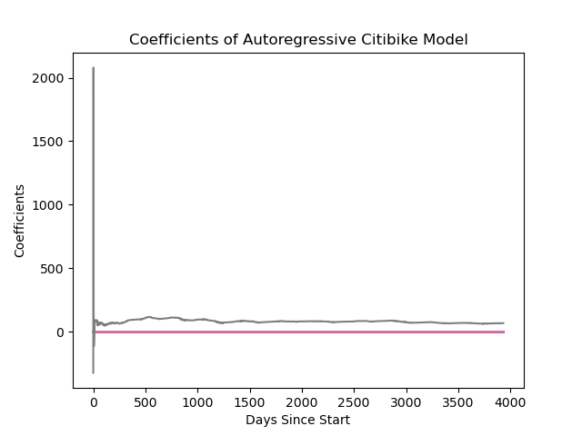

## HW 2 Review Visualization


:::: {.columns}

::: {.column width=50%}
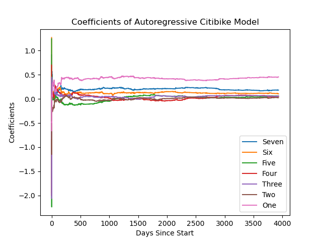
:::

::: {.column width=50%}

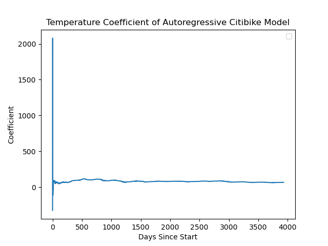

:::

::::

- Do this instead


## HW 2 Review Package versus Exact

- Packages versus Exact Formula
- Intended method

$$
\begin{bmatrix}
2A^TA & C^T \\
C & 0 
\end{bmatrix} 
\begin{bmatrix} \mathbf{\theta} \\ \mathbf{z}  \end{bmatrix} 
= 
\begin{bmatrix} 2A^T\mathbf{x} \\ \mathbf{d} \end{bmatrix}
$$

## HW 2 Review

- Packages versus Exact Formula
- Package methods had varying results
  - `CVX` successful
  - `quad_prog` successful
  - `scipy.minimize` unsuccessful
- `SLSQP` finicky

## Personal Story

- Was trying to replicate and build upon a modeling study
- Based on optimization problem:

$$
\max_{\nu,\mathrm{x}} \mu_{\nu,\mathrm{x}} \\
S\nu = 0\,\quad\mathrm{x} \in \mathrm{Simplex}
$$

- Find traits and fluxes that maximize growth rates of prochlorococcus

## Personal Story

:::: {.columns}

::: {.column width=50%}
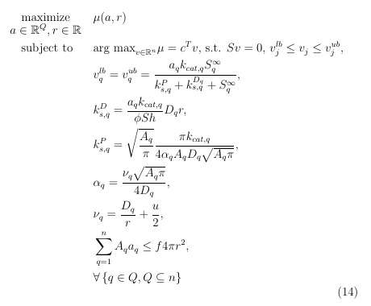
:::
::: {.column width=50%}
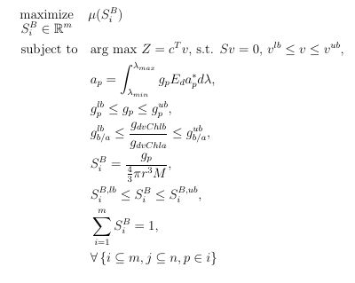
:::
::::


## Personal Story

- Author of study chucked problem into matlab without regard for the solver
- Solutions had pleasing levels of "noise"
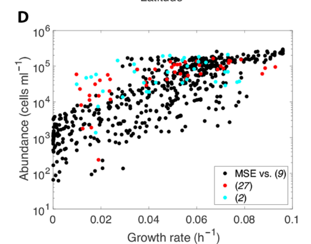

## Personal Story

- Author of study chucked problem into matlab without regard for the solver
- Solutions had pleasing levels of "noise"
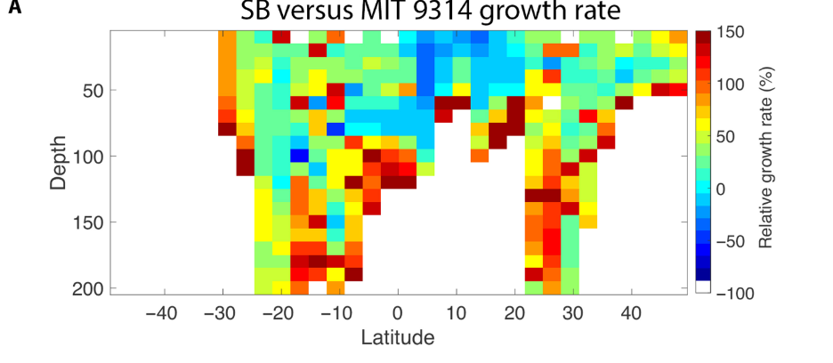

## Personal Story

- Turns out solver wasn't appropriate for problem
- Was failing to converge, introducing randomness

:::: {.columns}

::: {.column width=50%}
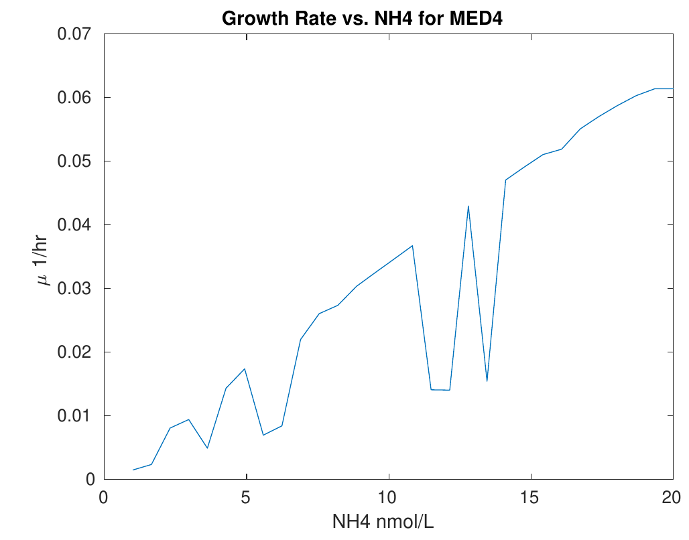
:::
::: {.column width=50%}
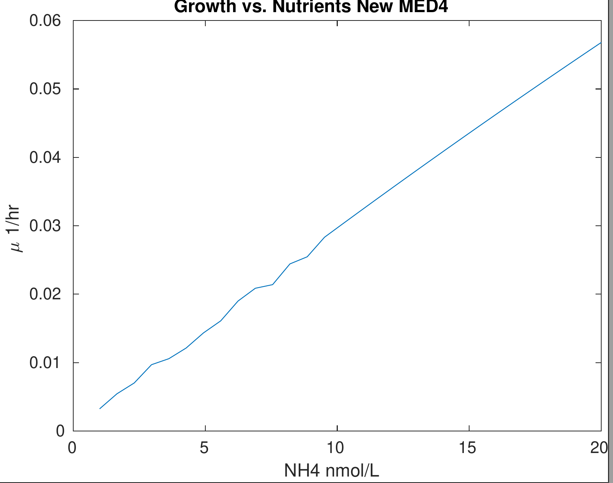
:::
::::


## How to show a function is convex?

- Apply the definition?
  - Rare, project onto line
- Check the Hessian
  - Rare, simple cases only
- Construct the function from simpler elements
  - 99+% of the time
  - Several fundamental rules
  - All are special cases of a single rule


## Scalar Multiplication

- If $f$ is convex and $\alpha\gt 0$, then:
  - $\alpha f$ is convex
- If $\alpha < 0$ the $\alpha f$ is concave


## Positive Weighted Sum

- If $f_i$ is convex, $\alpha_i$ positive, then

$$
F(x) = \sum_i f_i(x)
$$

- $F$ is convex
- Application: Regularize to your heart's content
$$
f(\mathbf{x}) + \lambda \|\mathbf{x}\|_1
$$


## Integration

- Suppose $g(\mathbf{x},\mathbf{y})$ convex in $\mathbf{x}$ for fixed $\mathbf{y}$
- Suppose $w(\mathbf{y}) > 0$
$$
G(\mathbf{x}) = \int_{Y} \mathbf{dy} w(\mathbf{y})g(\mathbf{x},\mathbf{y})
$$
- $G(\mathbf{x})$ is convex


## Example: Running Average

- Let $f$ be a convex function and define:
$$
F(x) = \frac{1}{x}\int_0^x dt f(t)
$$
- Can substitute $t=sx$ into integral:
$$
F(x) = \frac{1}{x}\int_0^1 ds x f(sx) = \int_0^1 ds f(sx)
$$
- $f(sx)$ is convex in $x$ for fixed $s$. Therefore $F(x)$ is convex


## Composition with Affine Function

- Suppose that $f(\mathbf{x})$ is convex
- Then $g(\mathbf{y}) = f(A\mathbf{y} + \mathbf{d})$ is convex
- This also preserves concavity
- Application: $\|A\mathbf{x}-b\|_p$ convex for any norm


## Pointwise Maximum

- Suppose we have a bunch of convex functions $f_1$, $f_2$, ...., $f_n$
$$
F(x) = \max\left(f_1(x),f_2(x),\cdots,f_n(x)\right)
$$
- $F(x)$ is convex


## Pointwise Maximum

```{python}
import numpy as np
import matplotlib.pyplot as plt

xvec = np.linspace(-1,1,1000)

y1vec = np.exp(xvec)
y2vec = np.exp(-2*xvec)
y3vec = 2*xvec
y4vec = 3*xvec**4


ymaxvec = np.array([np.max([y1vec[i],y2vec[i],y3vec[i],y4vec[i]]) for i in range(1000)])

plt.plot(xvec,y1vec,alpha=0.3,color="gray",label="$e^x$")
plt.plot(xvec,y2vec,alpha=0.3,color="#E69F00",label="$e^{-2x}$")
plt.plot(xvec,y3vec,alpha=0.3,color="#0072B2",label="$2x$")
plt.plot(xvec,y4vec,alpha=0.3,color="#D55E00",label="$3x^4$")

plt.plot(xvec,ymaxvec,color="#CC79A7",linewidth=4)

plt.legend()

```

## Example: Worst-Case Scenario

- Suppose $f_i$ is the cost function of $i$th people in your organization
- $f_i$ convex
- $x$ is a choice you are making
- Can define worst case cost function:
$$
f_W(x) = \max(f_1(x),f_2(x),\cdots,f_n(x))
$$
- $f_W(x)$ is convex


## Pointwise Supremum

- supremum is least upper bound (think of it like infinite max)
- if $f(x,\alpha)$ is convex in $x$ for all $\alpha \in A$, then:
$$
F(x) = \sup_{\alpha\in A} f(x,\alpha)
$$
- Then $F(x)$ is convex


## Pointwise Supremum examples

- Placing a transmitter at a location $x$
- Care about maximum distance from the transmitter to a region $S$
- $d(x) = \sup_{y\in S}\|x-y\|$ is convex

## Pointwise Supremum Examples

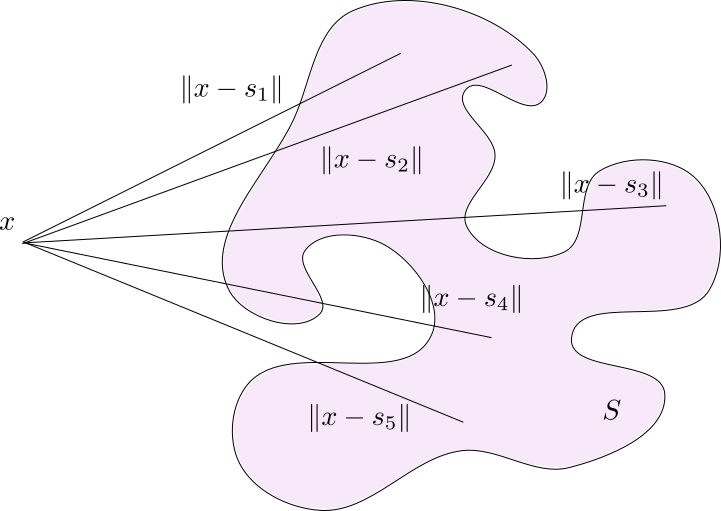

## Largest eigenvalue of a symmetric matrix

- Eigenvalue satisfies $Sv = \lambda v$
- $\sup_{\|v\|=1} v^T S v = \lambda_{\mathrm{max}}$
- Intuition: $S$ can be thought of according to its eigenvalues and eigenvectors
- Biggest eigenvalue corresponds to direction of maximum stretch
- $\lambda_{\mathrm{max}}(S)$ is a convex function of $S$


## Scalar Composition

- $f$ is a function from $\mathbb{R}^n\to\mathbb{R}$
- $g$ is a function from $\mathbb{R}\to\mathbb{R}$
- $g(f(x))$ is convex if
  - $g$ is convex and non-decreasing, $f$ is convex
  - $g$ is convex and non-increasing, $f$ is concave
- $g(f(x))$ is concave if
  - $g$ is concave and non-increasing, $f$ is convex
  - $g$ is concave and non-decreasing, $f$ is concave
  
## Scalar Composition

- Trick to remember, use chain rule
 $$(g(f(x)))'' = (g'(f(x))f'(x))' =\\
  g''(f(x))f'(x)^2 + g'(f(x))f''(x)$$
  
  - Sign of both needs to match for certainty over convexity
  - $g''\geq 0$ only convex is possible, need $g'f''\geq 0$
  - $g''\leq 0$ only concave is possible, need $g'f''\leq 0$
    
## Scalar Composition Examples


- $e^{f(x)}$ is convex if $f$ is convex (`exp` convex increasing)
- $\log(f(x))$ is concave if $f$ is concave (`log` concave increasing)
- $1/f(x)$ is convex if $f$ is concave (`1/x` convex decreasing)


## Vector Composition (One Rule to Rule them All)

- Let $h(x_1,x_2,\cdots,x_k):\, \mathbb{R}^k\to\mathbb{R}$
- Let $g(\mathbf{x}) = [g_1(\mathbf{x}),g_2(\mathbf{x}),\cdots,g_k(\mathbf{x})]^T: \mathbb{R}^n\to\mathbb{R}^k$ 
- Replacing "coordinates" $h$ by $g_i$'s

## Vector Composition

- $f(\mathbf{x}) = h(g_1(\mathbf{x}),g_2(\mathbf{x}),\cdots,g_k(\mathbf{x}))$ is convex if:
  - $h$ is convex
  - $g_i$ is convex and $h$ is non-decreasing in arg $i$
  - $g_i$ is concave and $h$ is non-increasing in arg $i$
- $f$ is concave if:
  - $h$ is concave
  - $g_i$ is concave and $h$ is non-increasing in arg $i$
  - $g_i$ is convex and $h$ is non-decreasing in arg $i$
  

## Examples

- $\log\left(e^{x_i} \right)$ is convex, increasing in all arguments
  - Therefore $\log\left(e^{g_i(\mathbf{x})}\right)$ is convex
- $f(x,y) = x^2/y$ (quadratic over linear)
  - $h(x) = \frac{p(x)^2}{q(x)}$ is convex if:
  - $p$ non-negative and convex
  - $q$ positive and concave


## Automatic Convexity Checking

- `CVX` works by building an evaluation tree for each function
- `CVX` starts at leaves and builds up, applying vector composition rule
- Each function is either convex, concave, or unknown
- Sign of each expression is tracked (+,-,unknown)
- Atoms are sometimes increasing/decreasing depending on sign

## Automatic Convexity Checking

- $2x^2+3$

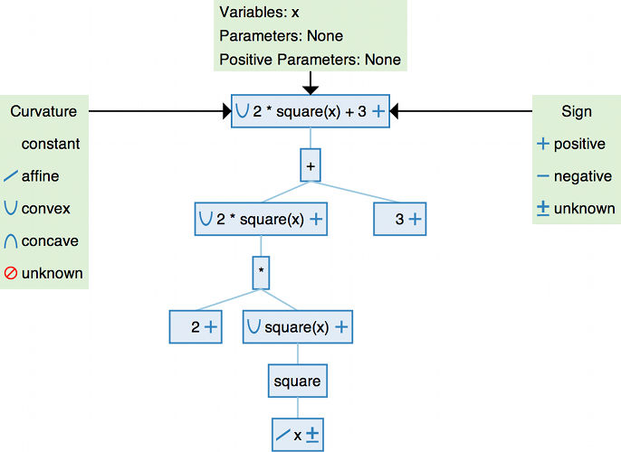

## Automatic Convexity Checking

- $\sqrt{1+x^2}$

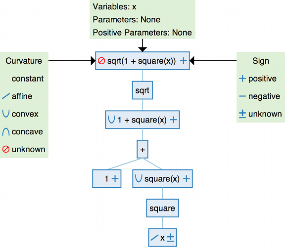

## Automatic Convexity Checking

- $\sqrt{1+x^2}$ is convex though.....
- $\sqrt{1+x^2} = \|[1,x]\|_2$
- Can use convexity of the norm:
  - `norm(hstack(1,x))` is DCP
  - Vector composition on Affine function $1$


## Thanks


