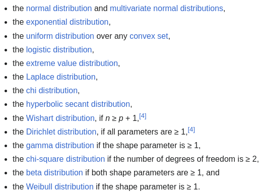
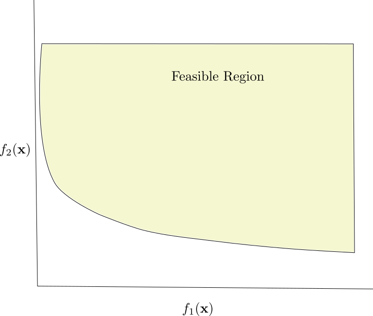
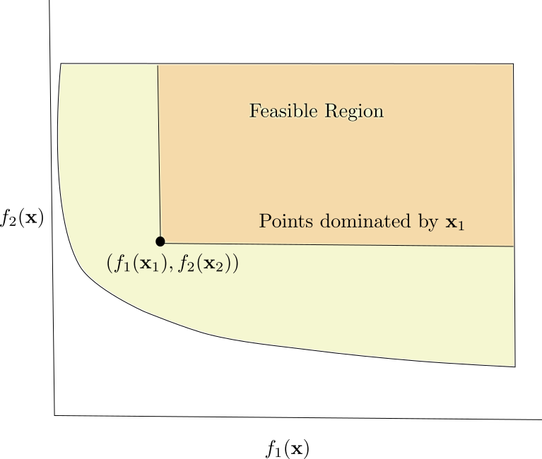
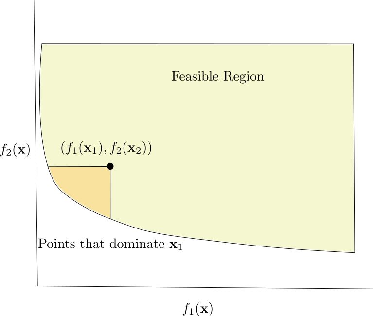
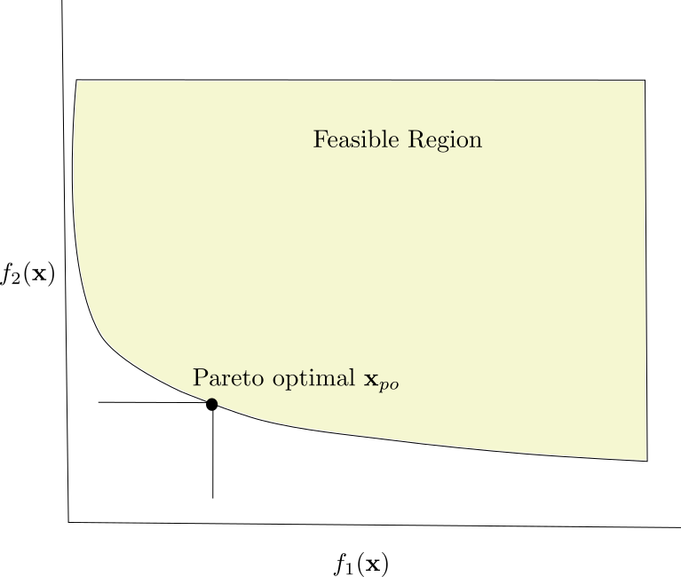
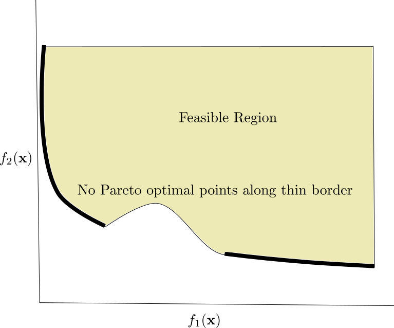
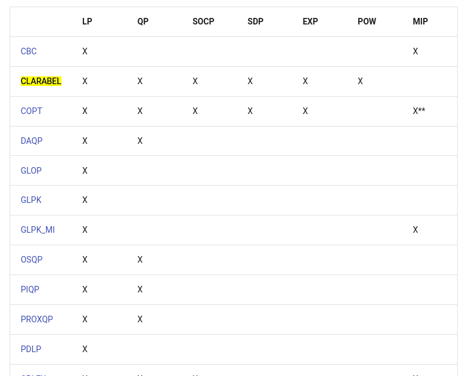

## Week Summary

- Topic this week is convex optimization problems
- Chapter 4.1, 4.2, 4.7 (we've sort of covered some of it)
- Chapters 4.3-4.6 mostly useful for examples on first read (skim)
- [Read about solvers](https://www.cvxpy.org/tutorial/solvers/index.html) 
- Lab 5 available
- Keep your eyes open for projects


## Before we start, `log-concave`

- Variety of generalizations of convexity
  - quasiconvex/quasiconcave
  - convexity w.r.t. a generalized inequality
- For Stats and ML, `log-concavity` is very important
- $f(x)$ is `log-concave` if $\log(f(x))$ is concave
  - Requires $f(x) > 0$
- There is also log-convexity, but doesn't arise

## Stats Examples

- Many probability density functions are `log-concave`:
  - Normal distribution: $\log(e^{-x^2}) = -x^2$
  - Exponential distribution $\log(e^{-\alpha x}) = -\alpha x$
  - All from exponential family:
  $$ p(x|\theta) = \exp\left(\sum_{i=1}^s\nu_i(\theta)T_i(x) - A(\theta)\right)h(x) $$
  

## Stats Examples

- Incomplete list:




## Marginalization/Partial Integration

- If $f(\mathbf{x},\mathbf{y})$ is `log-concave`, then so is:
$$
g(\mathbf{x}) = \int \mathbf{dy} f(\mathbf{x},\mathbf{y})
$$
- $p(\mathbf{x},\mathbf{y})$ is `log-concave` then so is 
$p(\mathbf{x}) = \int\mathbf{dy} p(\mathbf{x},\mathbf{y})$


## Convolution

- Addition of two random variables is done by convolution:
- $z = x+y$
$$
p_{z}(z) = \int dx p_x(x)p_y(z-x) = p_x * p_y (z)
$$
- Convolution of two log-concave functions is log-concave

## Cumulative Distribution Functions

- CDF is probability random variable less than $x$:
$$
F(x) = \int_{-\infty}^x dx'p(x')
$$
- This is log-concave if $p$ is log-concave
- Also true for multidimensional CDF


## Properties of `log-concave`

- Products of `log-concave` are `log-concave`
  - $f(\mathbf{x})g(\mathbf{x})$
- Sums are not (but are for log-convex)
- Alternate definition: $f(x)$ is `log-convex` if:
$$
f(\theta x + (1-\theta)y) \geq f(x)^{\theta} f(y)^{1-\theta}
$$
- More technical: Moment and cumulant generating functions of log-concave density are log-concave


## Example: Manufacturing Yield

- You have a factory manufacturing some product
  - Bicycles, Wheels, Aluminum Rods, Magnets for MRI machines, etc
- Each completed item is described by a set of parameters $\theta$
  - The roundness of the wheels
  - Thickness of bicycle tubes
  - Strength of rods/magnets
- There is a set $S$ which describes acceptable items, $\theta\in S$ is item is well made

## Manufacturing Yield

- Suppose that your factory tries to build items with a target set of paramters $x$
- Randomness/Imprecision causes manufactured items to 
deviate from target according to probability distribution:
$$
p(\theta = x + w ) = p(w)
$$
  
- Then yield is defined as fraction of items within tolerances:
$$
Y(x) = \int dw I(S,w+\theta) p(w)
$$

## Manufacturing Yield

- Suppose you want to achieve a certain yield
- If $S$ is convex, and $p$ log-concave, then consider:
$$
C = \{x | Y(x) \geq \alpha \} = \{x | \log(Y(x)) \geq \log(\alpha) \}
$$
- C is a convex set (super-level set of a convex function)


## Optimization Lingo

- Covered some already
  - *feasible* points satisfy constraints
  - *optimal value* $p^{\star}$ is tightest lower bound objective
  - *optimal point* is $\mathbf{x}$ where $f(\mathbf{x}) = p^{\star}$
- Some not:
  - *infeasible*: We say $p^{\star}=\infty$ if we can't find a single feasible point
  - *unbounded below*: We say $p^{\star} = -\infty$ if objective doesn't have lower bound
  
## Implicit Constraints

- Domain of objective $f$ and constraint functions is included implicitly in constraints
- i.e. $\min_{x} f(x) = x\log(x)$ has implicit constraint $x > 0$
- If no explicit constraints problem is called unconstrained

## Slack or Active Inequality Constraints

- Consider:
$$
\min_{\mathbf{x}} f(\mathbf{x}) \\
g_i(\mathbf{x}) \leq 0 
$$
- Let $x_{\mathrm{opt}}$ be optimal point
- If $g_i(x_{\mathrm{opt}}) < 0$ inequality $i$ is slack
- If $g_i(x_{\mathrm{opt}}) = 0$ inequality $i$ is active


## Transforming Optimization Problems

- We say that two (not necessarily convex) optimization problems are equivalent if we have a way to calculate the optimum of one problem from the solution of another problem
 
  - **Monotone Transformation of Objective**
  - **Invertible Transformation of variables**
  - Partial Minimization
  - Elimination of Equality Constraints
  - Introduction of Slack Variables


## Transformation by monotone

-  Transformation by monotone increasing function $h$
$$
\mathrm{argmin}_{x} h(f(x)) = \mathrm{argmin}_{x} f(x)
$$
- `log` is standard example
  - `ML` problems only convex once you take the `log`

  
## Transform the variables

- Suppose we have a one-to-one transformation $x_i = \{\phi_i(\mathbf{z})\}$
- Then can substitute directly into objective and constraints:
$$
\min_{\mathbf{z}} f(\phi(\mathbf{z})) \\
g_i(\phi(\mathbf{z})) \leq 0 \\
h_j(\phi(\mathbf{z})) = 0
$$

## Transform the variables

- Suppose you have a bilinear objective or constraint
$$
xy \leq \alpha
$$
- Take `log` (monotone):
- $\log(x) + \log(y)\leq \log(\alpha)$
- $z_1 = \log(x)$,\quad $z_2 = \log(y)$, 
- Leads to $z_1+z_2\leq\log(\alpha)$

## Example: Geometric Programming

- **monomial**: $f(\mathbf{x}) = cx_1^{a_1}x_2^{a_2}\cdots x_n^{a_n}$
- **posynomial**: sum of monomials
- Geometric Program:
$$
\min_{\mathbf{x}} f_0(\mathbf{x}) \\
g_i(\mathbf{x}) \leq 1,\quad h_j(\mathbf{x}) = 1
$$
- $f$, $g_i$ posynomials, $h_j$ monomials

## Geometric Programming

- Can transform to convex problem by:
$y_i = \log(x_i)$, taking $\log$ of objectives and constraints:
$$
\min_{\mathbf{y}} \hat{f_0}(\mathbf{y}) = \log\left(\sum_k e^{\mathbf{a}_{0k}^T\mathbf{y}+b_{0k}} \right) \\
\hat{g_i}(\mathbf{y}) = \log\left(\sum_k e^{\mathbf{a}_{ik}^T\mathbf{y}+b_{ik}} \right) \\
\mathbf{h}_k^T\mathbf{y} + d_i = 0 
$$


## Partial Minimization

- You can minimize with respect to some of the variables
$$
\min_{x,y} f(x,y) = \min_x \hat{f}(x),
$$
- where $\hat{f}(x) = \min_y f(x,y)$
- Constraints at each step depend on $x$
- Can be life-saver, also preserves convexity


## The other transformations

- Mostly useful for making fast algorithms
- Eliminating linear equality constraints by solving matrix equation
- Eliminating linear inequalities with slack variables
- Switching to epigraph form


## Multicriterion Optimization

- Often you need to balance multiple competing objectives:
  - For example, if you are building a car, you might care 
about minimizing the cost and maximizing the crash test rating or the reliability
  - If you are investing, you want to maximize the return, but minimize the chance of a catastrophic loss
  - If you are taking a political position, you want to appeal to the needs of different groups with distinct opinions


## Multicriterion Optimization

$$
\min_{\mathbf{x}} \left(f_1(\mathbf{x}),f_2(\mathbf{x}),\cdots,f_n(\mathbf{x}\right)) \\
g_i(\mathbf{x}) \leq 0,\quad h_j(\mathbf{x}) = 0
$$
- Feasible $x$ that minimizes all objectives is an optimal point
- Generally impossible
  - If possible objectives are called **non-competing**


## Pareto Optimal

- Consider a feasible point $\mathbf{x}_1$
- $\mathbf{x}_1$ dominates $\mathbf{x}_2$ if at least matches $\mathbf{x}_2$ on all objectives:
$$
f_i(\mathbf{x}_1)\leq f_i(\mathbf{x}_2)
$$
- and beats it on one $f_j(\mathbf{x}_1) < f_j(\mathbf{x}_2)$
- Two cars that are identical except one is cheaper
- A point $\mathbf{x}$ is **Pareto optimal** if it is dominated by no other points
- You can make a case for a Pareto optimal points


## Pareto Front

- Graph the competing objective functions



## Pareto Front

- Dominated points are above and to right of focal point



## Pareto Front

- Focal point dominated by points down and left




## Pareto Front

- Pareto Front is Pareto Optimal points



## Pareto Front

- Boundary not necessarily a Pareto front




## Scalarization

- Can add multiple objectives up to create a standard optimization problem
$$
\min_{\mathbf{x}} \sum_k \lambda_k f_k(\mathbf{x})
$$
- $\lambda_k$ convert between each objective function to the same units and define trade-offs
- Always finds a Pareto Optimal point


## Ridge Regression Trade Off

```{python}
import cvxpy as cp
import numpy as np
import matplotlib.pyplot as plt
def loss_fn(X, Y, beta):
    return cp.pnorm(X @ beta - Y, p=2)**2

def regularizer(beta):
    return cp.pnorm(beta, p=2)**2

def objective_fn(X, Y, beta, lambd):
    return loss_fn(X, Y, beta) + lambd * regularizer(beta)

def mse(X, Y, beta):
    return (1.0 / X.shape[0]) * loss_fn(X, Y, beta).value
  
def generate_data(m=100, n=20, sigma=5):
    "Generates data matrix X and observations Y."
    np.random.seed(1)
    beta_star = np.random.randn(n)
    # Generate an ill-conditioned data matrix
    X = np.random.randn(m, n)
    # Corrupt the observations with additive Gaussian noise
    Y = X.dot(beta_star) + np.random.normal(0, sigma, size=m)
    return X, Y

m = 100
n = 20
sigma = 5

X, Y = generate_data(m, n, sigma)
X_train = X[:50, :]
Y_train = Y[:50]
X_test = X[50:, :]
Y_test = Y[50:]

beta = cp.Variable(n)
lambd = cp.Parameter(nonneg=True)
problem = cp.Problem(cp.Minimize(objective_fn(X_train, Y_train, beta, lambd)))

lambd_values = np.logspace(-2, 3, 50)
train_errors = []
test_errors = []
beta_values = []
for v in lambd_values:
    lambd.value = v
    problem.solve()
    train_errors.append(mse(X_train, Y_train, beta))
    test_errors.append(mse(X_test, Y_test, beta))
    beta_values.append(beta.value)
    
norm_beta_vec = np.array([np.linalg.norm(vec)**2 for vec in beta_values])  
plt.plot(norm_beta_vec,train_errors)
plt.title("Pareto Surface for Ridge Regression")
plt.xlabel("Norm of Coefficients")
plt.ylabel("Mean Square Error")


```


## Ridge Regression Trade Off

```{python}
#| echo: true
#| eval: false

for v in lambd_values:
    lambd.value = v
    problem.solve()
    train_errors.append(mse(X_train, Y_train, beta))
    test_errors.append(mse(X_test, Y_test, beta))
    beta_values.append(beta.value)
    
norm_beta_vec = np.array([np.linalg.norm(vec)**2 for vec in beta_values])  
plt.plot(norm_beta_vec,train_errors)
plt.title("Pareto Surface for Ridge Regression")
plt.xlabel("Norm of Coefficients")
plt.ylabel("Mean Square Error")


```

## `CVX` Solvers

- Just like other software packages, `CVX` has a number of different solvers
- Three free solvers: `SCS`, `CLARABEL`, `OSQP`
- `SCS` is the in-house solver (Splitting Conic Solver)
- `OSQP` from Oxford, does LP and QP
- `CLARABEL` from Oxford specializes in Second Order Cone Programs

## Choosing a Solver

- CVX can pick by default
- Or you can specify

```{python}
#| echo: true
#| eval: false

import CVYPY as cvx
cvx.solve(solver="CLARABEL", 
verbose=False, 
gp=False, qcp=False,
requires_grad=False, 
enforce_dpp=False, 
ignore_dpp=False, **kwargs)¶


```

## Not all Solvers can Solve all Problems



## Warm Start

- If you are solving many versions of the same problem, `CVX` by default caches results of computation and uses them as starting point
- Leads to a big speed up


## Other Solvers I've Used

- `MOSEK` commercial nonlinear solver, some universities have a license/possible to get academic license
- `GUROBI` fastest for linear programming
- `GLPK` solver of last resort in some python packages when your `MOSEK` license isn't working


## Thanks!