## Week Summary

-   Working on grading....
-   This week: definition and examples of convex functions
-   Next week: How to construct convex functions
-   Reading: Section 3.1, `CVX` tutorials
-   Lab 4 available

## What is a convex function?

-   Start with function $f:\, \mathbb{R}^N\to\mathbb{R}$
-   Graph of $f$ is below line between any two points on graph:
    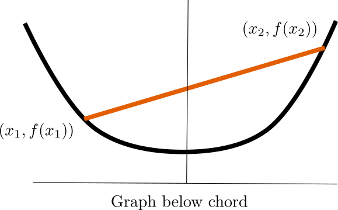

## What is a convex function?

$$
f(\theta \mathbf{x}_1 + (1-\theta)\mathbf{x}_2) \leq \theta f(\mathbf{x}_1) + (1-\theta)f(\mathbf{x}_2)
$$


## Concave

-   $f$ is concave if $-f$ is convex
-   $f$ curves down instead of up 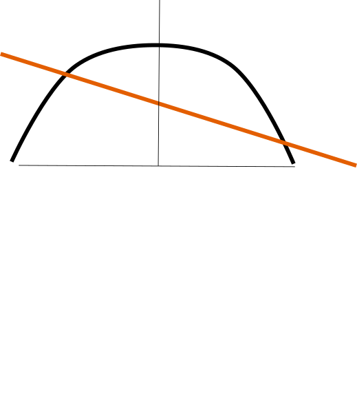

## Strict Concavity

-   Equalty only at endpoints, i.e. for $\theta \neq 0, 1$: $$
    f(\theta \mathbf{x}_1 + (1-\theta)\mathbf{x}_2) \leq \theta f(\mathbf{x}_1) + (1-\theta)f(\mathbf{x}_2)
    $$ 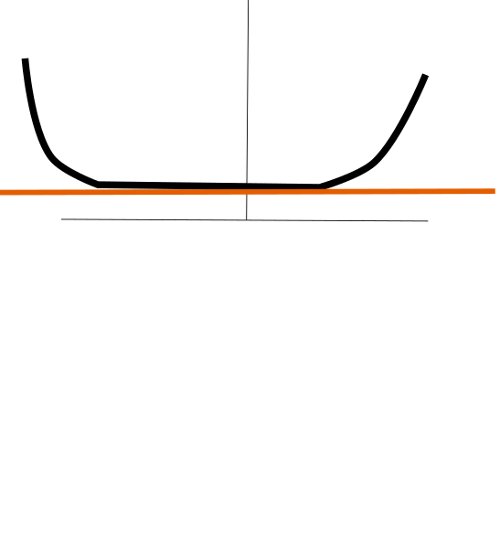

## Graph in Higher Dimensions

-   `graph` of a function $f: \mathbf{dom}(f)\to\mathbb{R}$:
    $$G(f) = \{(\mathbf{x},f(\mathbf{x}))\,|\, \mathbf{x}\in\mathbf{dom}(f)\}$$
-   1D: $(x,y=f(x))$, familiar graph
-   2D: $(x,y,z=f(x,y))$, 3D surface/landscape
-   3D+: $\left(x_1,x_2,x_3,...,x_n,z=f(x_1,x_2,x_3,...,x_n)\right)$
    -   Hypersurface

## Tangent Lines

-   Graph lies above tangent lines/planes/hyperplanes

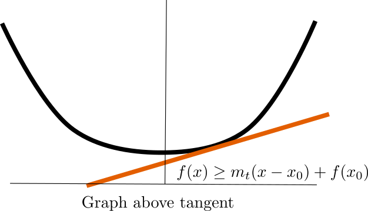

## Local to Global Info

-   Tangent line is a local property

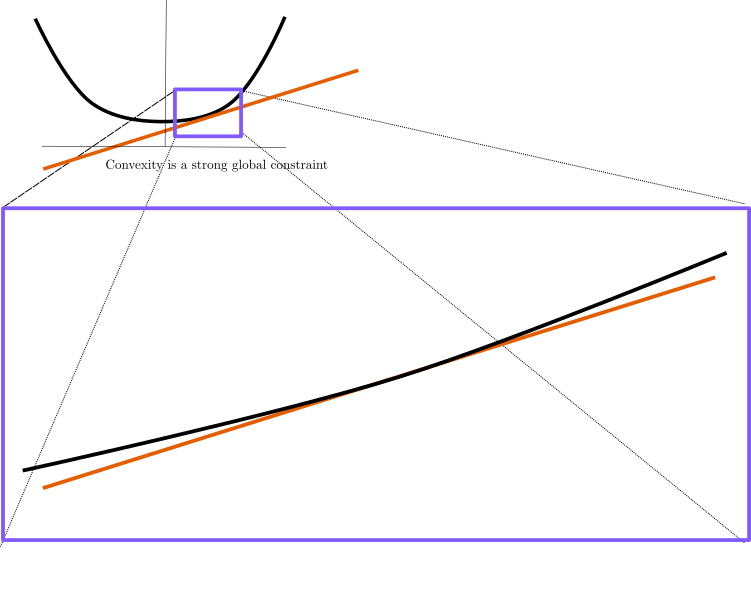

## Local to Global Info

-   But for Convex gives global information!

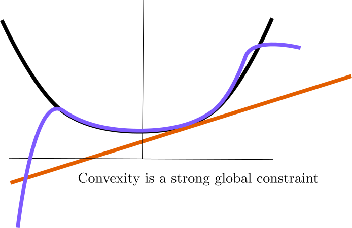

## Local Min is Global Min

-   Local minimum implies flat tangent 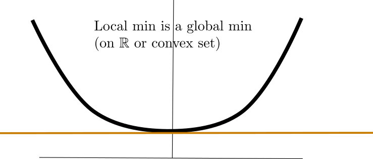

## What if there is no single tangent?

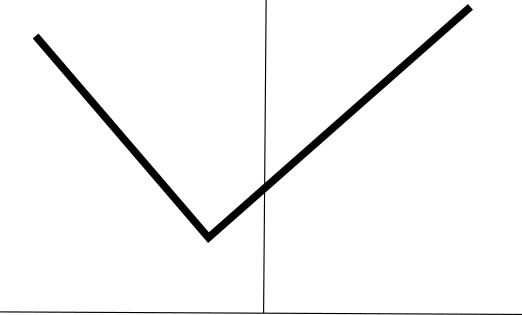

-   Slightly different argument is needed

## Local Min is a Global Min

-   Take $f:\,\mathbb{R}^2\to\mathbb{R}$
-   Assume there is a local min that isn't the global min

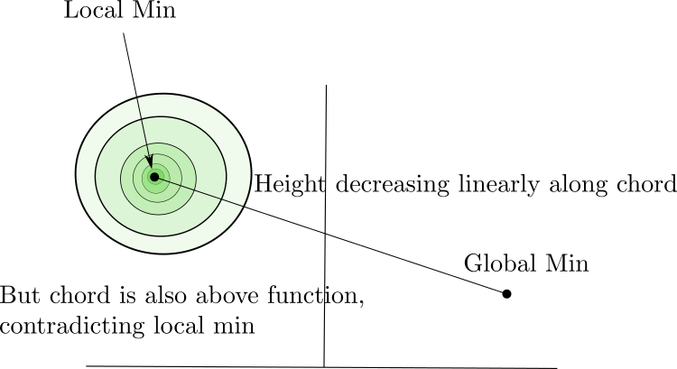

## Examples: Affine

-   Affine $f(\mathbf{x}) = \mathbf{c}^T\mathbf{x} + \mathbf{d}$
-   Both convex and concave

## Examples: Power Functions

-   Power Functions: $f(x) = x^{\alpha}$
    -   Convex for $\alpha\geq 1$ on $\mathbb{R}_+$

```{python}
import numpy as np
import matplotlib.pyplot as plt

xvec = np.linspace(0,1.3,100)
yvec2 = xvec**2
yvec3 = xvec**3
yvec4 = xvec**4

plt.plot(xvec,yvec2,label = '$y=x^2$')
plt.plot(xvec,yvec3,label = '$y=x^3$')
plt.plot(xvec,yvec4,label = '$y=x^4$')
plt.title("Convex Power Functions")
plt.legend()

```

## Examples: Power Functions

-   Power Functions: $f(x) = x^{\alpha}$
    -   Concave for $0<\alpha\leq 1$ on $\mathbb{R}_+$

```{python}


xvec = np.linspace(0,1.3,100)

yvec2 = xvec**(0.5)
yvec3 = xvec**(0.333)
yvec4 = xvec**(0.25)

plt.plot(xvec,yvec2,label = '$y=x^{1/2}$')
plt.plot(xvec,yvec3,label = '$y=x^{1/3}$')
plt.plot(xvec,yvec4,label = '$y=x^{1/4}$')
plt.title("Concave Power Functions")
plt.legend()

```

## Examples: Power Functions

-   Power Functions: $f(x) = x^{\alpha}$
    -   Convex for $\alpha\leq 0$ on $\mathbb{R}_{++}$

```{python}

xvec = np.linspace(0,1.3,100)


yvec2 = 1/xvec
yvec3 = 1/(xvec**(2))
yvec4 = 1/(xvec**(3))


plt.plot(xvec,yvec2,label = '$y=x^{-1}$')
plt.plot(xvec,yvec3,label = '$y=x^{-2}$')
plt.plot(xvec,yvec4,label = '$y=x^{-3}$')
plt.title("Convex Power Functions")
plt.ylim(0,10)
plt.legend()

```

## Examples: $|x|^{\alpha}$

-   $f(x) = |x|^{\alpha}$ is convex on $\mathbb{R}$ for $\alpha\geq 1$

```{python}

xvec = np.linspace(-1.1,1.1,100)


yvec2 = abs(xvec)**1
yvec3 = abs(xvec)**2
yvec4 = abs(xvec)**3


plt.plot(xvec,yvec2,label = '$y=|x|^{1}$')
plt.plot(xvec,yvec3,label = '$y=|x|^{2}$')
plt.plot(xvec,yvec4,label = '$y=|x|^{3}$')
plt.title("Powers of $|x|$")
plt.legend()

```

## Examples: $e^{\alpha x}$

-   $e^{\alpha x}$ is convex for any $\alpha$

```{python}

xvec = np.linspace(-1.1,1.1,100)


yvec2 = np.exp(xvec)
yvec3 = np.exp(-xvec)
yvec4 = np.exp(2*xvec)


plt.plot(xvec,yvec2,label = '$y=e^{x}')
plt.plot(xvec,yvec3,label = '$y=e^{-1}$')
plt.plot(xvec,yvec4,label = '$y=e^{2x}$')
plt.title("Exponentials")
plt.ylim(0,3)
plt.legend()

```

## Examples: Rectified Linear Unit

-   $\max(0,x)$ is convex
-   $\min(0,x)$ is concave

```{python}
#| fig-width: 6
#| fig-height: 4

xvec = np.linspace(-1.1,1.1,100)


yvec2 = np.array([max(0,x) for x in xvec])
yvec3 = np.array([min(0,x) for x in xvec])

plt.plot(xvec,yvec2,label = '$y=\max(0,x)$')
plt.plot(xvec,yvec3,label = '$y=\min(0,x)$')
plt.title("ReLU")
plt.legend()

```

## Examples: `log` and entropy

-   $f(x) = \log(x)$ is concave on $\mathbb{R}_{++}$
-   $f(x) = -x\log(x)$ is concave on $\mathbb{R}_{+}$

```{python}
#| fig-width: 6
#| fig-height: 4

xvec = np.linspace(0,2,100)

yvec2 = np.log(xvec)
yvec3 = -xvec*np.log(xvec)


plt.plot(xvec,yvec2,label = '$y=log(x)$')
plt.plot(xvec,yvec3,label = '$y=xlog(x)$')
plt.title("log and entropy")
plt.legend()
plt.ylim(-3,1)

```

## Examples: Norms

-   All norms are convex on $\mathbb{R}^N\to\mathbb{R}$
    $$ \|\mathbf{x}\| = \left(\sum_i x_i^2\right)^{1/2} , \|\mathbf{x}\|_p = \left(\sum_i x_i ^p\right)^{1/p} \\
    \|\mathbf{x}\|_{\infty} = \max(x_1,x_2,...,x_n)
    $$

-   Sum of squares also $\|\mathbf{x}\|^2 = \mathbf{x}^T\mathbf{x}$

## Lasso and Sparse Regression

-   Consider Least Squares Problem

$$
\min_{\mathbf{x}} \|A\mathbf{x}-\mathbf{b}\|^2
$$

-   Suppose $\mathbf{x}$ has many entries
-   $A$ could even be wide
-   You only want to use a few features
-   Your data may have outliers

## Lasso and Sparse Regression

-   Apply the following penalty:

$$
\min_{\mathbf{x}} \|A\mathbf{x}-\mathbf{b}\|^2 + \lambda \sum_i |x_i|
$$

-   Equivalent to a norm:

$$
\min_{\mathbf{x}} \|A\mathbf{x}-\mathbf{b}\|^2 + \lambda\|\mathbf{x}\|_1
$$

## Lasso and Sparse Regression

-   We will learn that adding convex functions preserves convexity
-   Lasso regularization of convex problem also convex
-   Has a tendency to produce robust solutions with sparse coefficients
    $\mathbf{x}$

## Softmax and Geometric Mean

-   $\log\left(\sum_{i=1}^n e^{x_i}\right)$ is convex
    -   This is a smoothed maximum function
-   $\left(\Pi_{i=1}^n x_i\right)^{1/n}$
    -   Geometric mean

## First and Second Order Conditions

-   First Order Condition: $f$ is convex if and only if graph lies above
    all tangent lines
-   Second Order Condition: $f$ is convex if and only if the Hessian is
    positive semi-definite at all points in (convex) domain $$
    \left(\nabla^2{f}\right)_{ij} = \frac{\partial^2 f}{\partial x_i \partial x_j} \succeq 0
    $$

## Second Order Condition

-   Show that $f(x) = e^{\alpha x}$ is convex
-   Take first derivative:
    -   $f'(x) = \alpha e^{\alpha x}$
-   Take second derivative:
    -   $f''(x) = \alpha^2 e^{\alpha x}$
-   $f''(x) \geq 0$, so $f$ is convex
-   Also implies sum of convex is convex

## Quadratic over Linear {.smaller}

-   $f(x,y) = \frac{x^2}{y}$,
    $\mathbf{dom}(f) = \mathbb{R}\times\mathbb{R}_{++}$
-   Start taking derivatives $$
    \nabla f = \begin{bmatrix} \frac{2x}{y} & -\frac{x^2}{y^2} \end{bmatrix}^T
    $$

$$\nabla^2 f = \begin{bmatrix} \frac{2}{y} & -\frac{2x}{y^2} \\
-\frac{2x}{y^2} & \frac{2x^2}{y^3} \end{bmatrix}
$$

-   Positive semidefinite because $\mathrm{det}(\nabla^2 f)\geq 0$ and
    $Tr(\nabla^2 f) > 0$

## Restriction to Line

-   $f:\mathbb{R}^n\to\mathbb{R}$ is convex if and only if it is convex
    when restricted to every single line in $\mathbb{R}^n$
-   $g(t) = f(\mathbf{b}+t\mathbf{v})$ is convex for all vectors
    $\mathbf{v}$, $\mathbf{b}$

## Epigraph

-   $\mathbf{epi}(f)$ is set of points above the graph of $f$ $$
    \{(\mathbf{x},z)\,| \mathbf{x}\in\mathbf{dom}(f),\, z\geq f(\mathbf{x})\}
    $$ 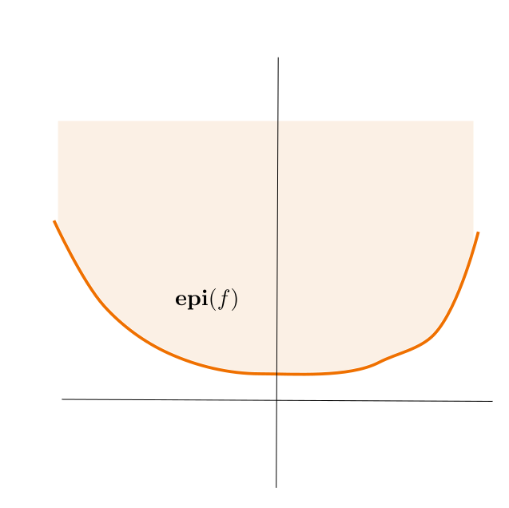{width="50%"}

## Epigraph

-   $f$ is convex if and only if $\mathbf{epi}(f)$ is a convex set
-   Allows for construction of more convex sets
-   $f$ is concave if and only if $\mathbf{sub}(f)$ is a convex set
-   This is convex: $$
    \{(x,y)| \log(x) \leq y \ \leq e^{\alpha x}\}
    $$

## Sub/Super Level Sets

-   Solution set of inequality defines sub:
    $$\mathbf{sub}_{\alpha}(f) = \{\mathbf{x}| f(\mathbf{x}\leq \alpha)\}$$
-   Super-level set has oppositve inequality
-   $\alpha$-sublevel sets of a convex function are convex
-   $\alpha$-superlevel sets of a concave function are convex

## Jensen's Inequality (Project?)

-   Useful result in probability and statistics:
-   If $f$ is a convex function and $x$ a random variable, then: $$
    \mathrm{E}[f(x)]\geq f(\mathrm{E}[x])
    $$
-   Because expectation is $\sum_i p_i x_i$, convex combination of
    values of $x$

## Jensen's Inequality

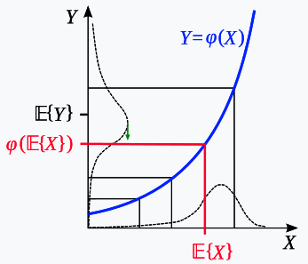

## Convexity/Concavity important in life

::::: columns
::: {.column width="50%"}
{width="70%"}
:::

::: {.column width="50%"}
{width="70%"}
:::
:::::

## Jensen and Fragility

-   Suppose something in your life is random
-   Consider your payoff function $f(x)$
-   If your $f$ is convex, Jensen says randomness helps you
-   Your Outcome = $\mathrm{E}[f(x)]$ better than outcome of average
    $f(\mathrm{E}[x])$
-   If your payoff is concave, Jensen says randomness hurts you

## Car Traffic Example

::::: columns
::: {.column width="50%"}
-   Few cars, drive speed limit
-   Cars above threshold, speed drops
-   Expected Traffic is 30 cars
-   Expected Time 65 minutes
:::

::: {.column width="50%"}
```         
| Cars | Time       |
|------|------------|
| 1    | 30 minutes |
| 10   | 30 minutes |
| 20   | 30 minutes |
| 30   | 40 minutes |
| 40   | 1 hour     |
| 50   | 1.5 hours  |
| 60   | 3 hours    |
```
:::
:::::

## Jensen and Fragility

-   Convex payouts are called anti-fragile
-   Concave payouts are called fragile
-   Many times in life we don't can't fully quantify the risks we face
-   But sometimes we can control the outcome for ourselves should
    something bad happen
-   Moral- make your payouts convex if you can

## Thanks!
